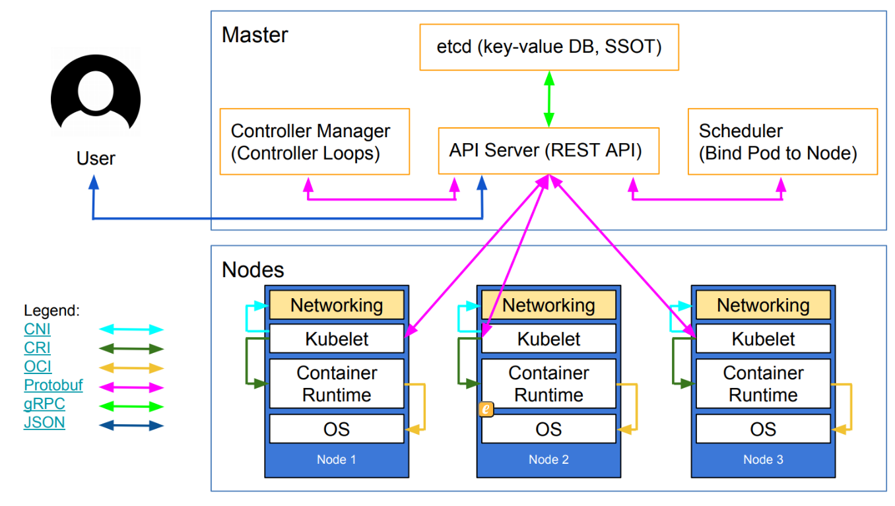
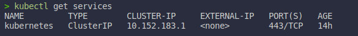
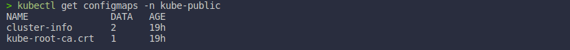
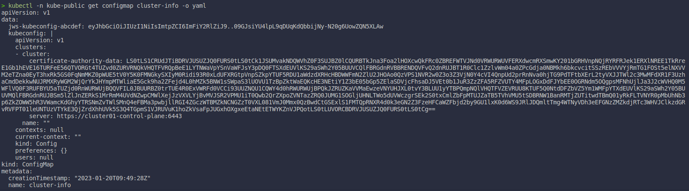

* **Resources**:
  * **Slide**: [https://slides.kubernetesmastery.com](https://slides.kubernetesmastery.com/)

# Section 2. The What and Why of Kubernetes
* K8s distributions:
  * Cloud-Managed distros: AKS, GKE, EKS, DOK,...
  * Self-managed distros: RedHat OpenShift, Docker Enterprise, Rancher, Canonical. Charmed, OpenSUSE Kubic.
  * Vanilla installers: kubeadm, kops, kubicorn,...
  * Local dev/test: Docker Desktop, minukube, microK8s
  * CI testing: kind
  * Special builds: Rancher k3s

* K8s concepts:
  * K8s is a container management system.
  * It runs and manages containerized applications on a cluster (one or more servers).
  * Often this is simply called "container orchestration".
  * Sometimes shortened to Kube or K8s.

# Section 3: Kunernetes architecture

* `shpod`: for a consistent K8s experience...
  * `shpod` provides a shell running in a pod on the cluster.
  * It comes with many tools pre-installed (helm, stern, curl, jq,...)
  * These tools are used in many exercises in these slides.
  * `shpod` also give you shell completion and a fancy prompt.
  * Create it with:
    ```bash
    kubectl apply -f https://k8smastery.com/shpod.yaml
    ```
  * Attach to shell with:
    ```bash
    kubectl attach --namespace=shpod -ti shpod
    ```
  * After finishing course:
    ```bash
    kubectl delete -f https://k8smastery.com/shpod.yaml
    ```
# Section 5. First contact with Kubectl
* Get all the nodes in the cluster:
  ```bash
  kubectl get no/node/nodes
  ```
  
  * To give more info about the nodes
    ```bash
    kubectl get nodes -o -wide
    ```
    
  * Let's have some YAML
    ```bash
    kubectl get nodes -o yaml
    ```
    
    
* Using `kubectl` and `jq`
  * Show the capacity of all our nodes as a stream of JSON objects:
    ```bash
    kubectl get nodes -o json | jq ".items[] | {name:.metadata.name} + .status.capacity"
    ```
    

* For a comprehensive overview, we can use `describe` instead of `get`, but you need to know the node name.
  ```bash
  kubectl describe node <node_name>
  ```
  

* `kubectl api-resources` command: list all the resources in the cluster. We will discuss these in more detail later.
  ```bash
  kubectl api-resources
  ```
  

* Exploring types and definitions
  * We can view the definition for a resource type with:
    ```bash
    kubectl explain <type>
    kubecel explain node # get all
    ```
    * Type names:
      * The most common resource names have three forms:
        * **singular** (e.g: `node`, `service`, `deployment`)
        * **plural** (e.g: `nodes`, `services`, `deployments`)
        * **short** (e.g: `no`, `svc`, `deploy`)
      * Some resources do not have a short name.
      * `endpoints` only have a plural form _(because even a single `endpoints` resources is actually a list of endpoints)_.
  * We can view the definition of a field in a resource, for instance:
    ```bash
    kubectl explain node.spec
    ```
  * Or get the list of all fields and sub-fields:
    ```bash
    kubectl explain node --recursive
    ```

## 5.1. Kubectl get
More `get` commands:
* **Services**:
  * A **service** is a stable endpoint to connect to "something" _(in the initial proposal, they were called "portals")_.
  * **Example 1**: List the services on our cluster with one of these commands:
    ```bash
    kubectl get services # [or svc]
    ```
    

* **Listing running containers**:
  * Containers are manipulated through **pods**.
  * A **pod** is a group of containers:
    * running together _(on the same node)_.
    * sharing resources _(RAM, CPU; but also network, volumes)_.
  * **Exercise 1**: List pods on our cluster.
    ```bash
    kubectl get pods
    ```
    
      > * Currently, we do not have anything, we will see it later.

## 5.2. Kubectl Namespace Basics
### 5.2.1. Namespaces
* **Namespaces** allows us to segregate resources.
* Namespaces are used to filter the view.
* To list the namespaces on the cluster, use one of these commands:
    ```bash
    kubectl get namespaces
    kubectl get namespace
    kubectl get ns
    ```
* **Exercice 1**: List the namespaces on your cluster.
    ```bash
    kubectl get ns
    ```
    

### 5.2.2. Accessing namespaces
* By default, `kubectl` uses the `default` namespace.
* We can see resources in all namespaces with `--all-namespaces`.
* To list the pods in all namespaces, use one of these commands:
    ```bash
    kubectl get pods --all-namespaces
    kubectl get pods -A
    ```
    

### 5.2.3. What are all these control plane pods?
* `etcd` is our etcd server.
* `kube-apiserver` is the API server.
* `kube-controller-manager` and `kube-scheduler` are other control plane components.
* `coredns` provides DNS-based service discovery.
* `kube-proxy` is the (per-node) component managing port mappings and such.
* `<net_name>` is the optional (per-node) component managing the network overlay.
* The `READY` column indicates the number of containers in each pod.
* **Note**: this only shows containers, you will see host services.
* **Also note**: you many see different namespaces depending on setup.

### 5.2.4. Scoping another namepsace
* We can also look at a different namespace (other than `default`).
* To list only the pods in the `kube-system` namespace, use one of these commands:
    ```bash
    kubectl get pods --namespace=kube-system
    kubectl get pods -n kube-system
    ```
    

### 5.2.5. Namespaces and other `kubectl` commands
* We can use `-n`/`--namespace` with almost every `kubectl` command.
    * Example:
        ```bash
        kubectl create --namespace=X
        ```
        * to create something in namespace `X`.
* We can use `-A`/`--all-namespaces` with most commands that manipulate multiple objects.
    * Example:
        * `kubectl delete` can delete resources across multiple namespaces.
        * `kubectl label` can add/remove/update labels across multiple namespaces.

## 5.3. Kubernetes Newer Namespaces
### 5.3.1. What about `kube-public`?
* `kube-public` is created by our installer and **used to security bootstrapping**.
* To list the pods in the `kube-public` namespace:
    ```bash
    kubectl -n kube-public get pods
    ```
    

### 5.3.2. Exploring `kube-public`
* The only interesting object in `kube-public` is a `ConfigMap` named `cluster-info` _(about `ConfigMap` we will talk later)_.
* You can think of `ConfigMap` as configuration files that then you can get later in your apps.
* To list `ConfigMap` objects in the `kube-public` namespace:
    ```bash
    kubectl -n kube-public get configmaps
    ```
    

* To inspect the `cluster-info`, use the command:
    ```bash
    kubectl -n kube-public get configmap cluster-info -o yaml
    ```
    

### 5.3.3. What about `kube-node-lease`?
* The `kube-node-lease` namespace contains one `Lease` object pernode.
* **Node leases**  are a new way to implement **node heartbeats** _(node regularly pinging to control plane to say "I'm alive!")_.
* For more details, see **KEP-0009** or the **node controller documentation**.
