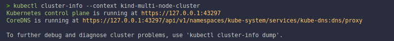
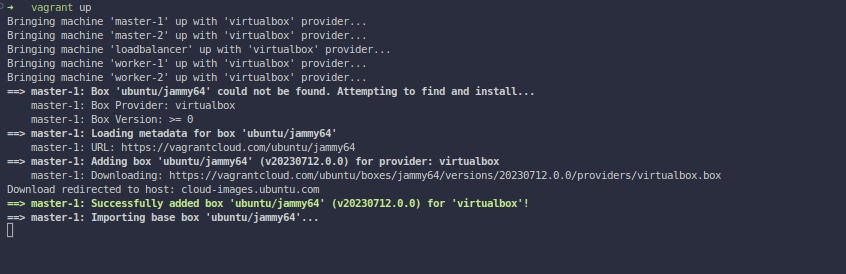
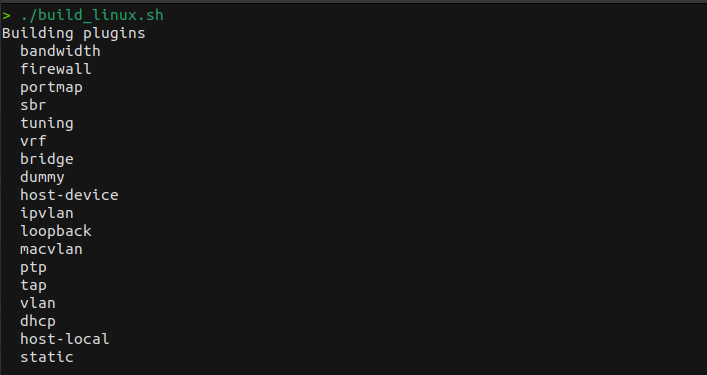
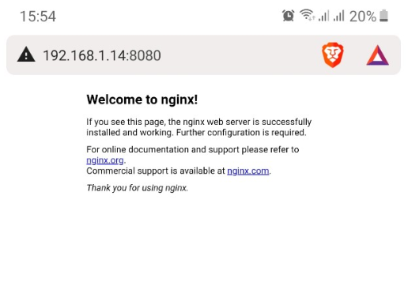
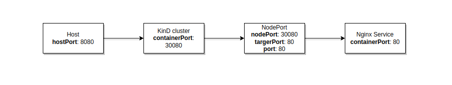
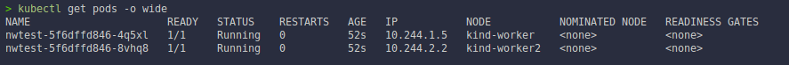
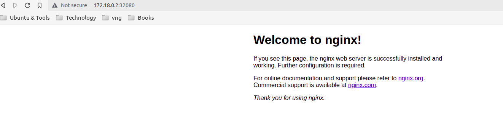
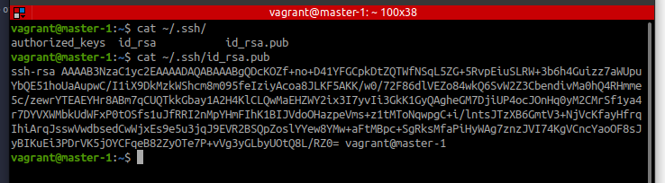
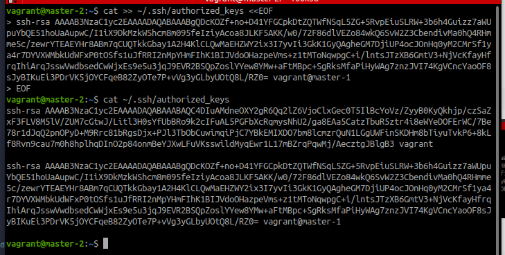
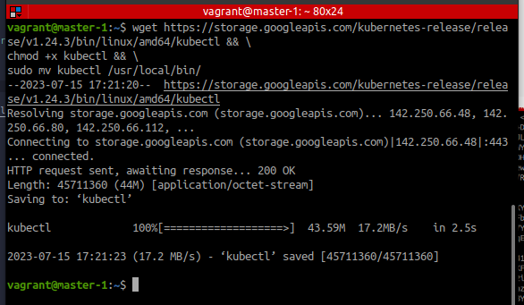

[_↩ Back to `main` branch_](https://github.com/cuongpiger/cloud)

###### References
- Youtube - [https://youtube.com/playlist?list=PL2We04F3Y_41jYdadX55fdJplDvgNGENo](https://youtube.com/playlist?list=PL2We04F3Y_41jYdadX55fdJplDvgNGENo)
- Github - [https://github.com/mmumshad/kubernetes-the-hard-way](https://github.com/mmumshad/kubernetes-the-hard-way)

<hr>

# 1. The design

- Deploys 5 VMs   with the name `kubernetes-ha-*`:
  - 2 masters
  - 2 workers
  - 1 load balancer
- Set's IP addresses in the range `192.168.5`.
- Add's a DNS entry to each of the nodes to access internet.
- Install's Docker on the nodes.

## 1.1. Up the VMs
- Using the `vagrant up` command to up the VMs.
  ```bash
  cd ./kubernetes-the-hard-way/vagrant
  vagrant up
  ```
  

- The below image is the 5 VMs up and running in VirtualBox.
  

- Using the command `vagrant status` to check the VMs' status.
  

- Use the command `vagrant ssh master-1` to ssh into the VM `master-1`.
  

- In the VM `master-1`, use the command `ip a` to check the IP address of the VM.
  

# 2. Install the client-tools
## 2.1. Config the `ssh` keypair
- In the VM `master-1`, generate the SSH key pair.
  ```bash
  ssh-keygen
  ```
  

- `cat` the public SSH keypair
  ```bash
  cat ~/.ssh/id_rsa.pub
  ```
  

- Copy the public SSH keypair to the other VMs.
  ```bash=
  vagrant ssh master-2

  $ cat >> ~/.ssh/authorized_keys <<EOF
  <paste the public SSH keypair here>
  EOF
  ```
  

  - Repeat the above steps for the VMs `worker-1`, `worker-2`, and `loadbalancer`.

## 2.2. Install `kubectl`
- Install `kubectl` on the VM `master-1`.
  ```bash=
  wget https://storage.googleapis.com/kubernetes-release/release/v1.24.3/bin/linux/amd64/kubectl && \
  chmod +x kubectl && \
  sudo mv kubectl /usr/local/bin/
  ```
  