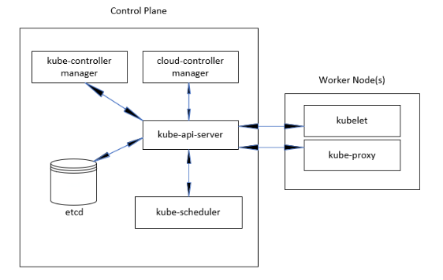
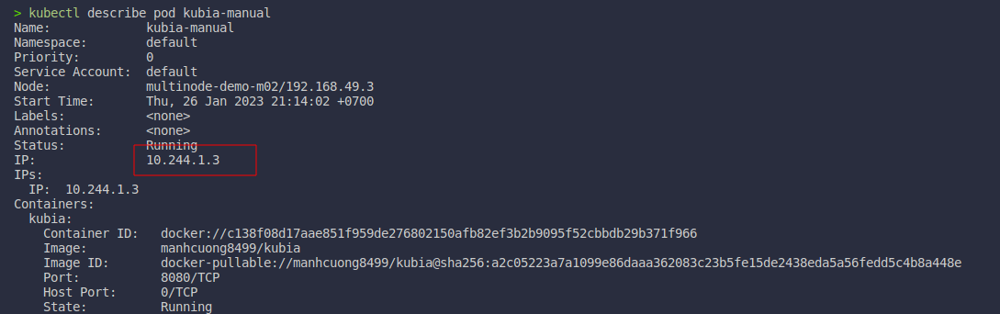

**Resources**:
* **Source code** [https://github.com/PacktPublishing/Kubernetes-and-Docker-The-Complete-Guide](https://github.com/PacktPublishing/Kubernetes-and-Docker-The-Complete-Guide) 


# Chapter 4. Deploying K8s using KinD
## 4.1. Creating a KinD Cluster
### 4.1.1. Creating a simple cluster
* Create a quick single-node cluster with only one control plane node.
  ```bash
  kind create cluter
  ```
  * By the default, the KinD create the cluster with the prefix is `kind-<cluster name>`.
* Check the cluster info.
  ```bash
  kubectl cluster-info --context kind-kind
  ```

* Get all nodes inside the cluster.
  ```bash
  kubectl get nodes -o wide
  ```

### 4.1.2. Delete a cluster
* Delete a cluster (do not need to include the prefix `kind-` in the `<cluster name>`).
  ```bash
  kind delete cluster --name <cluster name>
  ```

### 4.1.6. Creating a custom KinD cluster
* Use the file `cluster01-kind.yaml`.
  ```bash
  kind create cluster --name cluster01 --config ./cluster01-kind.yaml
  ```

### 4.1.7. Install Calico
* Install Calico.
  ```bash
  kubectl apply -f https://docs.tigera.io/archive/v3.25/manifests/calico.yaml
  ```

* Check everything is running.
  ```bash
  kubectl get all -n kube-system
  ```

### 4.1.8. Install an Ingress controller
```bash
kubectl apply -f https://raw.githubusercontent.com/kubernetes/ingress-nginx/main/deploy/static/provider/kind/deploy.yaml
kubectl apply -f https://raw.githubusercontent.com/kubernetes/ingress-nginx/main/deploy/static/provider/baremetal/deploy.yaml
kubectl patch deployments -n ingress-nginx ingress-nginx-controller -p '{"spec":{"template":{"spec":{"containers":[{"name":"controller","ports":[{"containerPort":80,"hostPort":80},{"containerPort":443,"hostPort":443}]}]}}}}'
```

## 4.2. Reviewing the KinD cluster
### 4.2.1. KinD storage objects
* Get a CSInodes object.
  ```bash
  kubectl get csinodes
  ```

# Chapter 5. K8s bootcamp
## 5.1. Technical requirements
## 5.2. An overview of K8s components
* The image below shows how the K8s components interact with each other.
  

## 5.3. Exploring the control plane
* Many prodyction installations of K8s use a cluster with multiple control plane nodes. (often greater than 3 nodes).
### 5.3.1. The K8s API server
* The first component need to understand is the `kube-apiserver`.
* Every request that comes into a cluster goes through this component.
  


### 5.3.2. The etcd database
* Only store entire data/information about the cluster.

### 5.3.3. kube-scheduler
* Schedule the pods to the nodes. Whenever a Pod is started in a cluster, the API server receives the requests and decided where to run the workload.

## 5 6. Introducing K8s objects
### 5.6.1. K8s manifests
* The files that we will use to create K8s objects are refered to as `manifests`.
* A manifest can be created using YAML or JSON, most manifests use YAML.

### 5.6.2. What are K8s objects?
* To get the list of K8s objects, use the below command:
  ```bash
  kubectl api-resources
  ```
### 5.6.3. Reviewing K8s objects
#### 5.6.3.1. ConfigMaps
* Store data in key-value pairs, providing a way to keep your configuration seperate from your application.
* ConfigMaps may contain data from a literal values, files, or directories.
* To create a ConfigMap object, use the below command:
  ```bash
  kubectl create configmap <key> <value>
  ```

* To create a ConfigMap from a file, use the below command:
  ```bash
  kubectl create configmap <config-name> --from-file=<file-path>
  ```

* To get all the ConfigMaps resources, use the below command:
  ```bash
  kubectl get configmaps
  ```
#### 5.6.3.2. Endpoints
* An endpoint map a service to a Pod or Pods. 

#### 5.6.3.3. Events
* Events are used to record information about the state of the cluster.

#### 5.6.3.4. RresourceQuotas
* Use to share a K8s cluster between multiple teams.

# Chapter 6. Services, Load Balancing, and External DNS
## 6.2. Exposing workloads to requests
### 6.2.1. Understanding how services work
