* Course: [https://www.udemy.com/course/docker-mastery/](https://www.udemy.com/course/docker-mastery/)

# Section 1 to 3:
## 1. Quickly to run Docker
* Go to this page to run Docker.
  * [https://labs.play-with-docker.com](https://labs.play-with-docker.com/)
## 2. Some popular commands
|Command|Description|
|-|-|
|`docker version`|Get the information of installed docker on your machine|

## 3. Install docker on your Linux system quickly, run this command
```bash
curl -fsSL https://get.docker.com -o get-docker.sh && sh get-docker.sh
```
* Use this command to grant permission when run command `docker ps` failure
```bash
sudo usermod -a -G docker $USER
# sudo chmod 666 /var/run/docker.sock
```

## 4. Login to docker
* Firstly need to login in the website [https://hub.docker.com](https://hub.docker.com/)
* Then run this command to login
```bash
docker login
```
# Section 4. Creating and Using Containers like a Boss
## 1. Check Our Docker Install and Config
|Commands|Description|
|-|-|
|`docker version`|Check your versions and that docker is working.|
|`docker info`|Give some information, such as amount of containers is running, paused, or stopped,... amount of images|
|`docker`|Get the guidelines of commands, flags,... in docker|

### 1.1. Brief
* Check version of our docker CLI and engine.
* Create an **Nginx** (web server) container.
* Learn common container management commands.
* Learn Docker networking basics.

### 1.2. Notes
* There is two style to run commands in docker:
  * [old style] `docker <command> (options)`
  * [new style] `docker <command> <subcommand> (options)`

<hr>

## 2. Starting a Nginx Web Server
|Commands|Description|
|-|-|
|`docker container run --publish 80:80 nginx`|Run **Nginx** server on port **80** of host machine.|
|`docker container run --publish 8080:80 --detach nginx`|Run **Nginx** server on port **8080** of host machine in the background.|
|`docker container ls`|List all the running containers.|
|`docker container stop <container-id>`|Stop contaner which have ID `<container-id>`.|
|`docker container ls -a`|Get all the containers in host machine *(include of **running**, **stopped**, or **exited**)*.|
|`docker container run --publish 80:80 --detach --name webhost nginx`|Run **Nginx** server and named it `webhost` on port 80 of host machine.|
|`docker container logs webhost`|Show the logs of container `webhost`.|
|`docker container top webhost`|List all processes that are running inside container `webhost`.|
|`docker container --help`|Get all the **sub-commands** that docker support for the `command`, such as: `kill`, `logs`, etc...|
|`docker container rm <container-id 1> <container-id 2>`|Remove `<container-id 1>` and `<container-id 2>` out of the docker on host machine. **Note**: _you can not remove running containers_.|
|`docker container rm -f <container-id 1> <container-id 2>`|Remove `<container-id 1>` and `<container-id 2>` without regards to their status _(**running**, **stopped**, or **exited**)_ out of the docker on host machine|
### 2.1. Brief
* **Images** vs **Container**
* `run`/`stop`/`remove` containers.
* Check container logs and processes.

### 2.2. Notes
* **Important**: if using **Docker Toolbox**, type the IP Address `http://192.168.99.100`.
* Docker's default image **registry** is **Docker Hub** _[https://hub.docker.com](https://hub.docker.com)_.

<hr>

## 3. Debrief: What happens when we run a container
### 3.1. Notes:
* These steps will show you how a container is created and run.
  * Step 1: Looks for that image locally in image cache, does not find anything.
  * Step 2: Then looks in remote image repository _(Default to Docker Hub)_.
  * Step 3: Downloads the latest version of the image _(`nginx:latest vby defualt`)_.
  * Step 4: Creates new container based on that image and prepares to start.
  * Step 5: Gives it a virtual IP on a private network inside docker engine.
  * Step 6: Opens up port 80 on host and forwards to port 80 in container.
  * Step 7: Starts container by using the `CMD` in the image Dockerfile.

<hr>

## 4. Container VS. VM: It's just a process
|Commands|Description|
|-|-|
|`docker run --name mongo -d mongo`|Run mongo db in container and then named it `mongo` in docker.|
|`docker top mongo`|Get all the running processes inside container `mongo`.|
|`docker stop mongo`|Stop the container `mongo`|
|`ps aux`|Get all the running processes on your host machine.|
|`ps aux \| grep mongo`|Get all the running processes that contain keyword **mongo** in their name.|

### 4.1. Notes
* Containers are not **Mini VMs**.
  * They are just processes running on your host OS.
  * Limited to what resources they can access.
  * Exit when process stops.

* For example for these above concepts:
  * Run mongoDB inside docker container.
    ```bash
    docker run --name mongo -d mongo
    ```
  * Run `top` command to check processes that are running in container `mongo`.
    ```bash
    docker top mongo
    ```
    * We will see the column `PID`, `PID` is just the process ID of the specific process that is running inside container `mongo`.
      

  * To stop the running container `mongo`, use the command:
    ```bash
    docker stop mongo
    ```
  * Run `ps aux` command to check processes that are running on your host machine.
    
      
  * Use `ps aux | grep mongo` to get the process that contains `mongo` in its name.
    

  * To start the stopped container `mongo`, use the command:
    ```bash
    docker start mongo
    ```

<hr>

## 5. Assignment: Manage Multiple Containers

|Commands|Description|
|-|-|
|`docker container run -d -p 3306:3306 --name db -e MYSQL_RANDOM_ROOT_PASSWORD=yes mysql`|Run **MySQL** service inside docker container|
|`docker container logs db 2>&1 | grep GENERATED`|Get generated password of container `db`.|
|`docker container run -d --name webserver -p 8080:80 httpd`|Run `httpd` as docker container.|
|`docker container run -d --name proxy -p 80:80 nginx`|Run `nginx` as container.|
### 5.1. Notes:
* Run a **Nginx** server on port **80:80**.
* Run a **MySQL** on port **3306:3306**.
* Run a **HTTPD** server on port **8080:80**.
* Run all of them with the **detached** mode.
* Run all of them with the **name** mode.
* When running mysql, use `--env` option (or `-e`) to pass `MYSQL_RANDOM_ROOT_PASSWORD=yes` to the container.

### 5.2. Answers:
* Run mysql container:
  ```bash
  docker container run -d -p 3306:3306 --name db -e MYSQL_RANDOM_ROOT_PASSWORD=yes mysql
  ```
* Use this command below to see the password of mysql:
  ```bash
  docker container logs db 2>&1 | grep GENERATED
  ```
  
* Run `httpd` container as container.
  ```bash
  docker container run -d --name webserver -p 8080:80 httpd
  ```

* Run `nginx` as container.
  ```bash
  docker container run -d --name proxy -p 80:80 nginx
  ```

* Check all the above containers are running.
  ```bash
  docker container ls
  ```
  

* Using `curl localhost` to check `nginx` is running.
  ```bash
  curl localhost
  ```
  
  
  ```bash
  curl localhost:8080
  ```
  

* Stop the all above running containers.
  ```bash
  docker container stop db webserver proxy
  ```
  

* And then remove them
  ```bash
  docker container rm db webserver proxy
  ```
  

## 6. What's Going On in Containers: CLI process monitoring
|Commands|Description|
|-|-|
|`docker container top <container>`|Get all the process list in one container|
|`docker container inspect <container>`|Get details of one container configuration|
|`docker container stats [<container>]`|Get real-time performance stats of all/specific container(s)|

### 6.1. Notes:
* Run **Nginx** as container.
  ```bash
  docker container run -d --name nginx nginx
  ```

* Run **MySQL** as container.
  ```bash
  docker container run -d --name mysql -e MYSQL_RANDOM_ROOT_PASSWORD=yes mysql
  ```

* Get all the process list in container `mysql`.
  ```bash
  docker container top mysql
  ```
  

* Get details of container `mysql`.
  ```bash
  docker container inspect mysql
  ```
  

* Monitor the all containers.
  ```bash
  docker container stats
  ```
  

## 7. Getting a shell inside containers: No Need for SSH
|Commands|Description|
|-|-|
|`docker container run -it`|Start new container **interactively**|
|`docker container exec -it`|Run additional command in existing container|
|`docker container start -ai proxy`|Start again a stopped container and then open bash shell|

### 7.1. Notes:
* Run **Nginx** as container and then open **bash shell**.
  ```bash
  docker container run -it --name proxy nginx bash
  ```
  

* To start again a stopped container and then open **bash shell**.
  ```bash
  docker container start -ai proxy
  ```
  

* To interact with shell of a running container, for example `mysql` container.
  ```bash
  docker container exec -it mysql bash
  ```
  

* Distribution of linux:
  * Alpine: very small, less than 5MB.

## 8. Docker Networks: Concepts for Privte and Public Comms in Containers
|Commands|Description|
|-|-|
|`docker container port webhost`|Get port of the container `webhost`|
|`docker container inspect --format '{{ .NetworkSettings.IPAddress }}' webhost`|Get the IPAddress of container `webhost`.|

### 8.1. Notes:
* Docker networks defaults:
  * Each container connected to a private virtual network **bridge**.
  * Each virtual network routes through NAT firewall on host IP.
  * All containers on a virtual network can talk to each other without `-p`.
  * Best practice is to create a new virtual network for each app:
    * Network `my_web_app` for **MySQL** and **PHP/Apache** containers.
    * Network `my_api` for **Mongo** and **NodeJS** containers.
  * "Batteries included, but removable"
    * Defaults work well in many, but easy to swap out parts to customize it.
  * Make new virtual networks.
  * Attach containers to more then one virtual network (or none).
  * Skip virtual networks and use **host IP** (--net=host).
  * Use different Docker networks driver to gain new abilities.
  * For local dev/testing, networks usually **"just work"**.

* Run `nginx` container.
  ```bash
  docker container run -p 80:80 --name webhost -d nginx
  ```

* Get the port of `nginx` container.
  ```bash
  docker container port webhost
  ```
  

* Get the IP Address con container **webhost**.
  ```bash
  docker container inspect --format '{{ .NetworkSettings.IPAddress }}' webhost
  ```
  

* How virtual networks work in containers
  

## 9. Docker Networks: CLI Management of Virtual Networks
|Commands|Description|
|-|-|
|`docker network ls`|List all the virtual networks|
|`docker network inspect <network>`|Get details of one virtual network|
|`docker network create --driver <driver> <network>`|Create a new virtual network depending on speficic `--driver`|
|`docker network connect <network> <container>`|Connect a container to a virtual network|
|`docker network disconnect <network> <container>`|Disconnect a container from a virtual network|

### 9.1. Notes:
* List all the virtual networks.
  ```bash
  docker network ls
  ```
  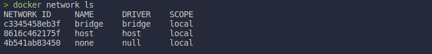

  * Kinds of virtual networks:
    * `bridge`: default virtual network which is **NAT**'ed behind the Host IP.
    * `host`: it gains performance by skipping virtual networks and attaching the container to the host interface but sacrifices security of container model.
    * `none`: it removes eth0 and only leaves you with localhost interface in the container.
* **Network driver** is built in or 3rd party extensions that give you virtual network features.
* Create your apps so fronend/backend sit on **same Docker network** because they inter-communication never leaves the host.
* All externally exposed ports closed by default.
* You must manually expose via `-p`, which is better default security.
* Later on, we will discuss about Swarm and Overlay networks.
* Get details of virtual network `bridge`.
  ```bash
  docker network inspect bridge
  ```
  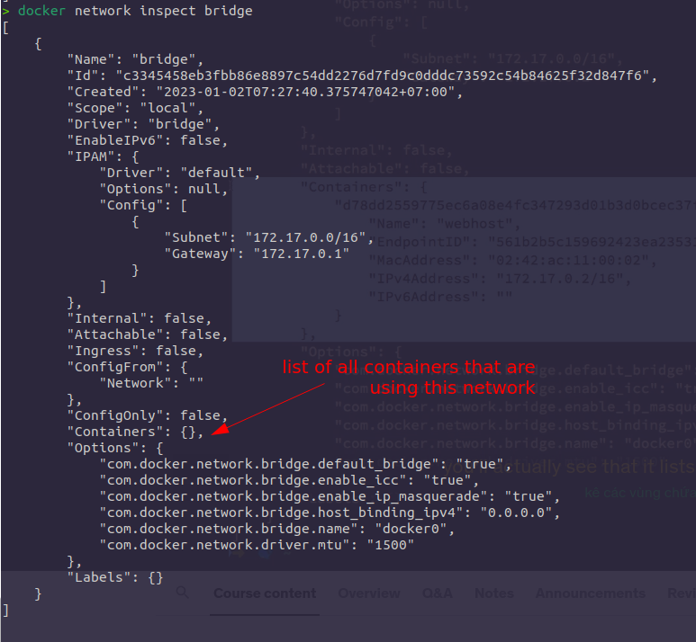

* Create a new virtual network `my_app_net` depending on `bridge` driver.
  ```bash
  docker network create my_app_net
  ```
  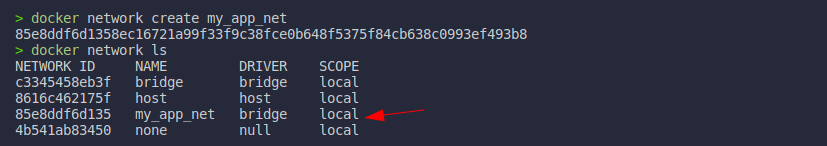

* Create a new `nginx:alphine` container using the `my_app_net` virtual network.
  ```bash
  docker container run -d --name new_nginx --network my_app_net nginx:alpine
  ```
  * Inspect the virtual network `my_app_net`.
    ```bash
    docker network inspect my_app_net
    ```
    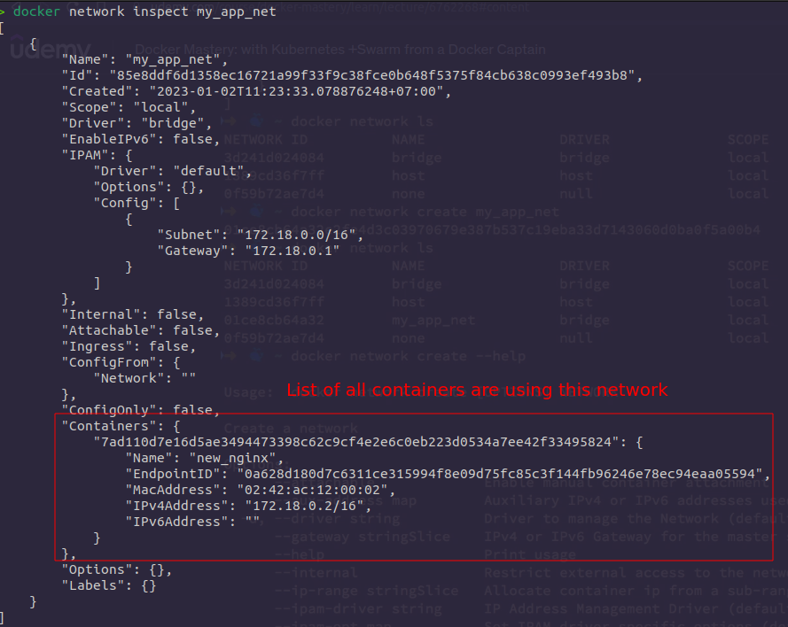

* Run `webhost` container and then connect it to the virtual network `my_app_net` as a **NIC**.
  ```bash
  docker container run -d --name webhost --network my_app_net nginx
  docker network connect my_app_net webhost
  docker network inspect my_app_net
  ```
  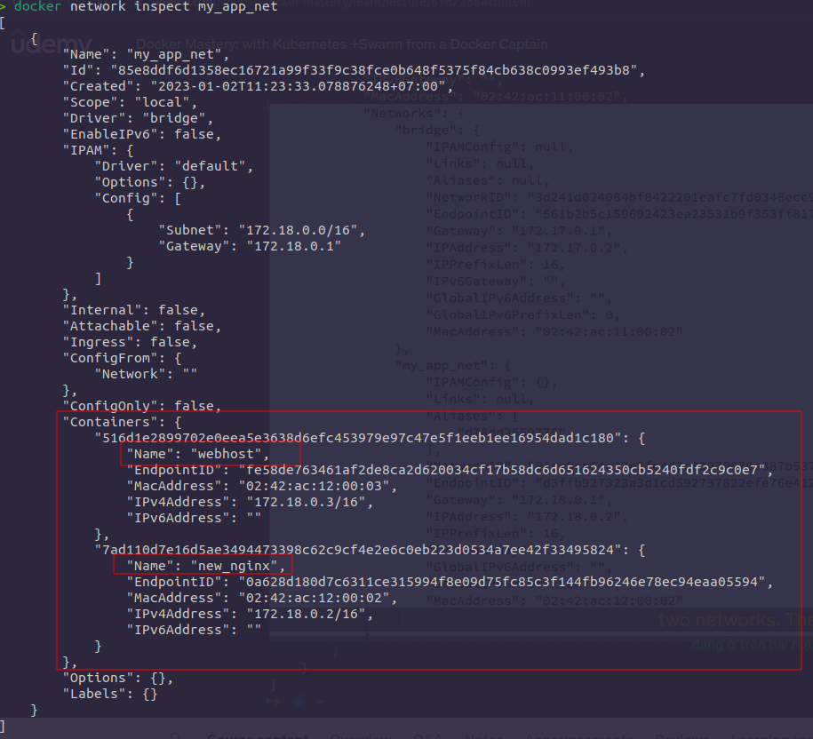

* Inspect network config in container `webhost`
  ```bash
  docker container inspect webhost
  ```
  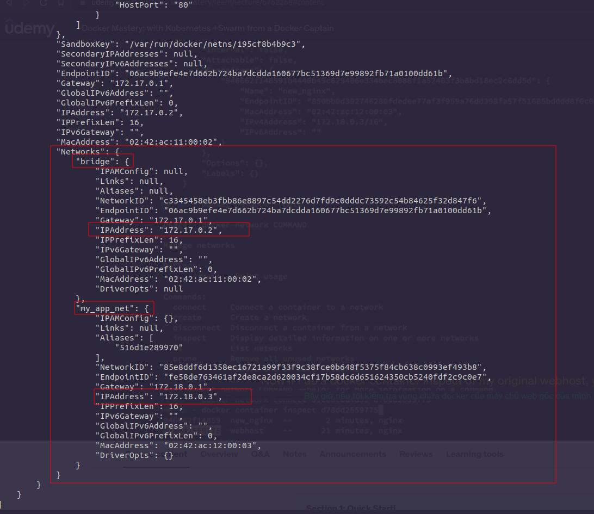

* Disconnect container `webhost` from virtual network `my_app_net`.
  ```bash
  docker network disconnect my_app_net webhost
  docker network inspect my_app_net
  ```
  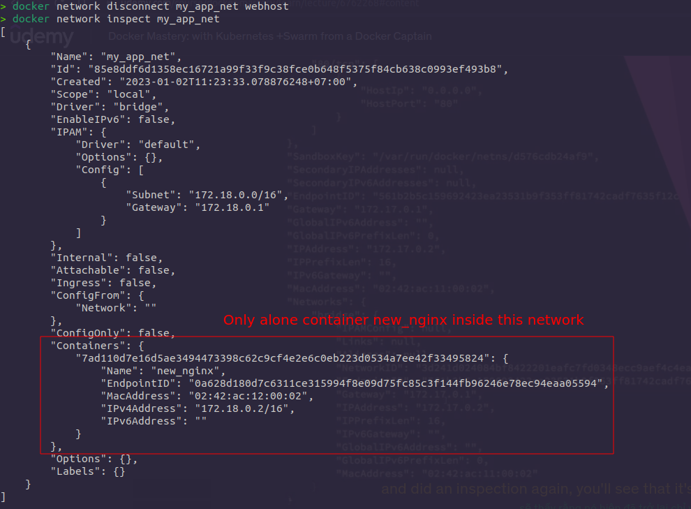

## 10. Docket Networks: DNS and how containers find each other
### 10.1. Brief:
* Understand how DNS is the key to easy inter container comms.
* See how it works by default with custom networks.
* Learn how to use `--link` to enable DNS on default `bridge` network.

### 10.2. Notes:
* **Forget IP's**: static IP's and using IP's for talking to containers is an anti-pattern. You need to use **DNS** to avoit it.
* **Docker DNS** - docker daemon has a built-in DNS server that containers use by default.
* Docker defaults the **hostname** to the container's name, but you can also set aliases.
* For example. We have 2 running `nginx` containers `new_nginx` and `webhost` in virtual network `my_app_net`.
  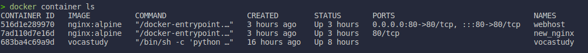

* Now, let create a new `nginx` container and then attach it to the virtual network `my_app_net`.
  ```bash
  docker container run -d --name my_nginx --network my_app_net nginx:alpine
  ```

* Inspect the virtual network `my_app_net`. We have 2 running `nginx` containers that are `new_nginx` and `my_nginx`.
  ```bash
  docker network inspect my_app_net
  ```
  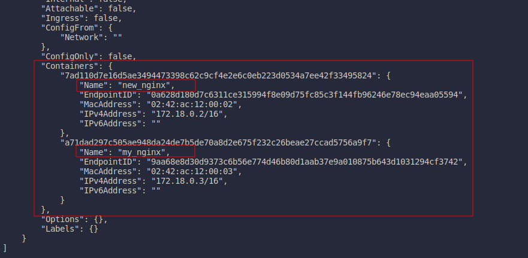

* Now, we can `ping` signal from container `my_nginx` to container `new_nginx` by using the container's name.
  ```bash
  docker container exec -it my_nginx ping new_nginx
  ```
  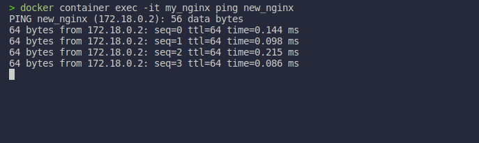
  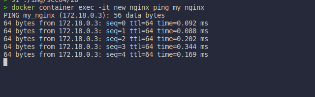

* **Note**: There is a big disadvantage of network `bridge` is that it does not support DNS by default. So, we need to use `--link` to enable DNS on default `bridge` network if you want to communicate between containers.

## 11. Assignment: Using containers for CLI testing
### 11.1. Assignment 1 - requirements:
* Use different Linux distro containers to check `curl` cli tool version.
* Use two different terminal windows to start bash in both `centos:7` and `ubuntu:14.04` using `-it`.
* Learn the `docker container --rm` option so you can save cleanup.
* Ensure `curl` is installed and on latest version for that distro:
  * `ubuntu`: `apt-get update && apt-get install curl`
  * `centos`: `yum update curl`
* Check `curl --version`.

### 11.2. Assignment 1 - solution:
* Run `centos:7` container and then start bash in it.
  ```bash
  docker container run -it --rm centos:7 bash
  # inside container
  yum update curl
  curl --version
  ```

* Run `ubuntu:14.04` container and then start bash in it.
  ```bash
  docker container run -it --rm ubuntu:14.04 bash
  # inside container
  apt-get update && apt-get install curl
  curl --version
  ```

## 12. Assignment: DNS round robin test
### 12.1. Assignment 2 - requirements:
* Create a new virtual network (defualt bridge driver).
* Create two containers from `elasticsearch:2` image.
* Research and use `--network-alias search` when creating them to give them an additional DNS name to respond to.
* Run `alpine nslookup search` with `--net` to see the two containers list for the same DNS name.
* Run `centos curl -s search:9200` with `--net` multiple times until you see both "name" fields show.

### 12.2. Assignment 2 - solution
* Create a new virtual network (defualt bridge driver).
  ```bash
  docker network create dude
  ```

* Run 2 `elasticsearch` containers with the same alias.
  ```bash
  docker container run -d --net dude --net-alias search elasticsearch:2
  docker container run -d --net dude --net-alias search elasticsearch:2
  ```

* Run `nslookup` with `--net dude` to see the two containers list for the same DNS name. If the result is like the picture below, your action is correct until now
  ```bash
  docker container run --rm --net dude alpine /bin/sh

  # inside the above container
  apk update
  apk add bind-tools
  nslookup search
  ```
  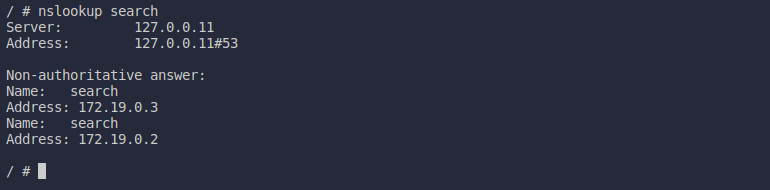

* Then, using `curl` to get initial data from elasticsearch, like this:
  ```bash
  docker container run --rm --net dude alpine /bin/sh

  # inside the above container
  apk update
  apk add curl
  curl -s search:9200
  curl -s search:9200
  ```
  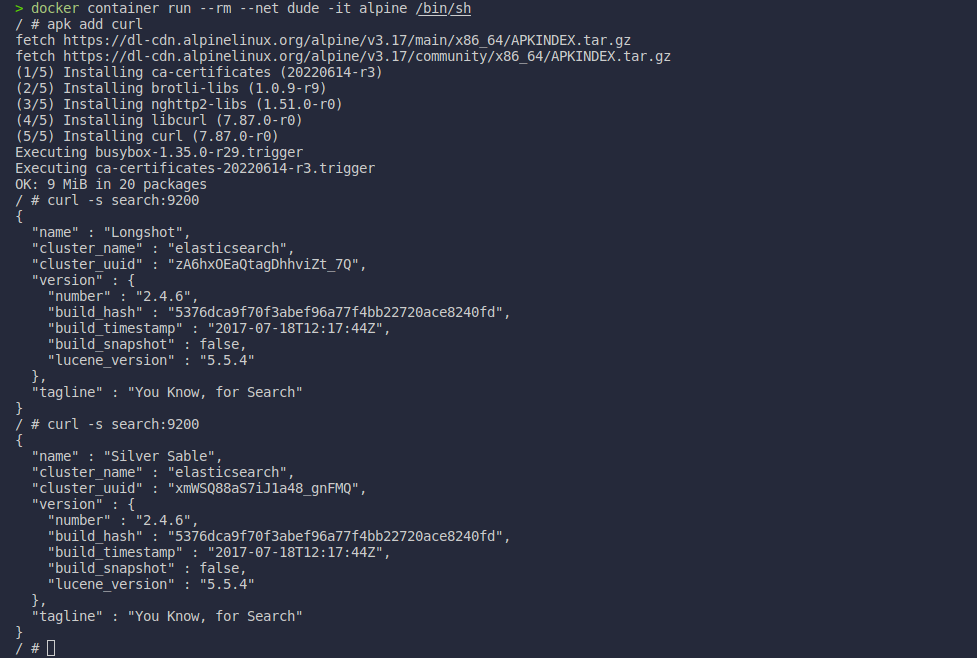

* Because of running 2 `elasticsearch` containers on the same network `dude`, so every you run `curl -s search:9200` you will get the result like this:
  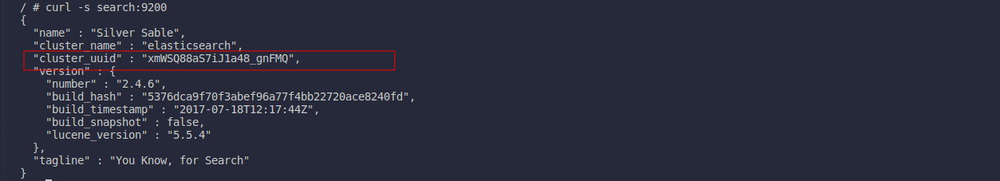
  * The field `cluster_uuid` is generated for each container, so it is different. So if you have $n$ `elasticsearch` container, you will get $n$ different `cluster_uuid` field.
  * Depending on the `cluster_uuid` field, you can know which container providing the specific responses.

# Section 5. Containers Images, Where to find them and how to build them
**Brief**:
* All about images, the building blocks of containers.
* What is in an image (and what isn;'t)
* Using Docker hub registry.
* Managing our local image cache.
* Building our own images.
## 1. What's In an image (and What isn't)
* App binaries and dependencies.
* Metadata about the image data and how to run the image.
* Official definition: "An image is an ordered collection of root filesystem changes and the corresponding execution parameters for use within a container runtime."
* Not a complete OS. No kernel, kernel modules (e.g drivers)
* Small as one file (your app binary) like a golang static binary.
* Big as a Ubuntu distro with apt, and Apache, PHP, and more installed.

## 2. The Mighty Hub: using Docker Hub registry images
### 2.1. Brief:
* Basics of docker hub
* Find official and other good public images
* Donwload images and basics of images tags

## 3. Images and Their layers: Discover the Image Cache
### 3.1. Brief:
* Image layers
* Union file system
* `history` and `inspect` commands.
* Copy on write concept.

### 3.2. Notes
* Get all the downloaded images.
  ```bash
  docker image ls
  ```

* Get the history of image `nginx`. This command wil show layers of changes made in image.
  ```bash
  docker image history nginx
  ```
  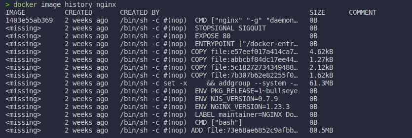


* To get detailed information about an image, use inspect command.
  ```bash
  docker image inspect nginx
  ``` 

* Finally, **images**:
  * Are made up of file system changes and metadata.
  * Each layer is uniquely identified and only stored once on a host.
  * This saves storage space on host and transfer time on push/pull.
  * A container is just a single read/write layer on top of image.
  * `docker image history` and `insect` commands can teach us how the image was built.

## 4. Image Tagging and Pushing to Docker Hub
### 4.1. Brief:
* Know what container and images are in docker.
* Understand image layer basics.
* Understand Docker Hub basics.
* All anout image tags.
* How to upload to Docker Hub.
* Image ID vs. Tag.

### 4.2. Notes
* Login to your Docker Hub account.
  ```bash
  docker login
  ```
* **More info**: using `docker logout` to log out current account.
* Retag the official `nginx` image into your own image.
  ```bash
  docker image tag nginx manhcuong8499/nginx
  ```

* Upload image to docker hub with tag `latest`.
  ```bash
  docker image push manhcuong8499/nginx
  ```
* **More info**: the docker config file is at this path `~/.docker/config.json`
  

* Customize your image tag and then push it to Docker hub
  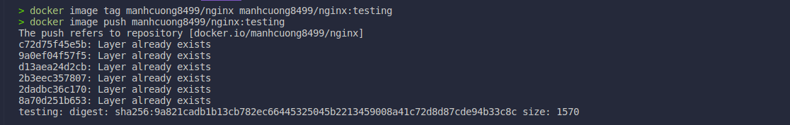

* Go to Docker Hub to see your image with its variants.
  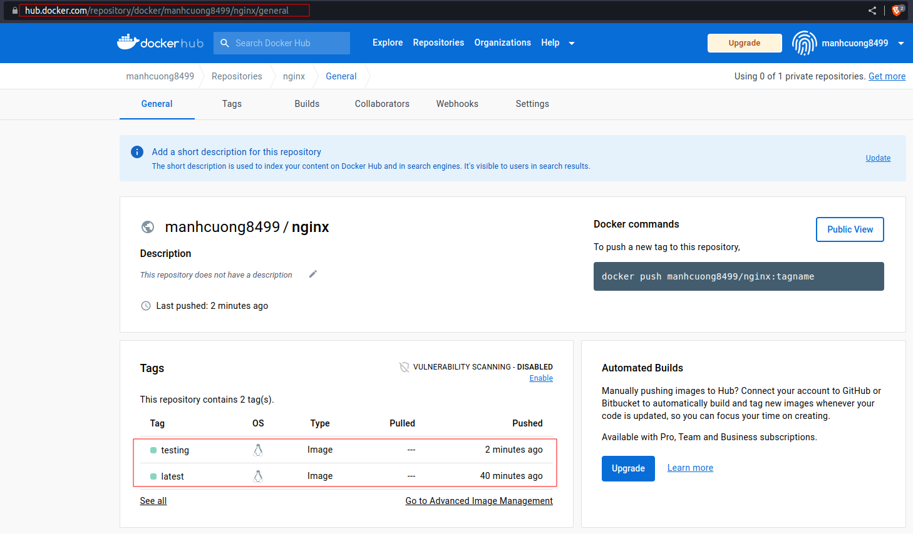

* You also change the visibility of the image inside the tab **Settings** like the way of Github.
  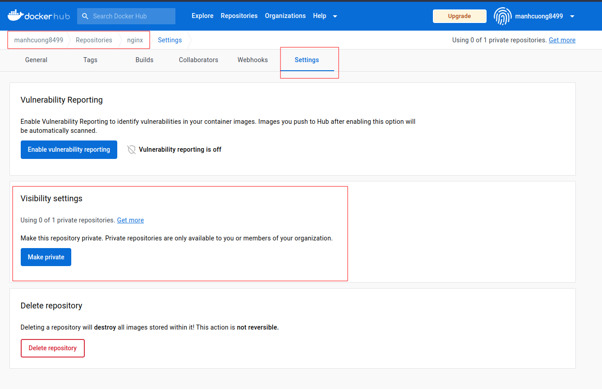

## 5. Building images: The Dockerfiles Basics
* To build an image from docker file, use the command.
  ```bash
  docker build -f <docker file>
  ```
  * The `-f` flag is used to specify the path to the docker file.

* The instructions:
  * `FROM`: the base image.
  * `ENV`: set environment variables. For example:
    ```dockerfile
    ENV token 1234456
    ```
  * `RUN`: run shell script
  * `EXPOSE`: expose port
  * `CMD`: run specific commands when the container is started.

## 6. Building images: Running Docker Builds
* Build image from this [Dockerfile](./resources/udemy-docker-mastery-main/dockerfile-sample-1/Dockerfile)
  ```bash
  cd resources/udemy-docker-mastery-main/dockerfile-sample-1/
  docker image build -t customnginx .
  ```

## 7. Building Images: Extending Official Images
* In this section, we will be given 2 files, including a dockerfile and an index.html file. Let use the docker to build your own image.
* The source code for this section was stored in directory [dockerfile-sample-2](./resources/udemy-docker-mastery-main/dockerfile-sample-2/)
* **Note**: In this dockerfile, we do not specify the `CMD` instruction, because of is in the base image (it means `FROM` instruction), it included a `CMD` instruction before, so we need not specify it again.
  ```bash
  cd ./resources/udemy-docker-mastery-main/dockerfile-sample-2/
  docker image build -t nginx-with-html .
  ```
* Tagging the above-generated image with a new tag.

## 8. Assignment: Build your own Dockerfile and Run Containers From it
* Dockerfiles are part process workflow and part art
* Take existing Node.js app and Dockerize it.
* Make dockerfile built it, test it and then push it to Docker Hub, finnaly run it.
* Expect this to be iterative, rarely do I get it right the first time.
* Details in [this directory](./resources/udemy-docker-mastery-main/dockerfile-assignment-1/).
* Use the Alpine version of the official `node` 6.x image.
* Expected result is web site at `http://localhost`
* Tag and push to your docker hub account free.
* Remove your image from local cache, run again from hub.

### 8.1. Solution
* Firstly, I need to build this Dockerfile into my own image.
  ```bash
  docker image build -t testnode .
  ```

* After the above phase is done successfully, I run the below commands to run it as a container.
  ```bash
  docker container run --rm -p 80:3000 testnode
  ```
  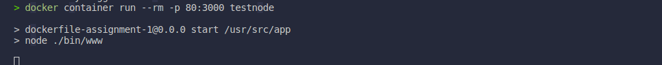

* This is your result when visiting [http://localhost](http://localhost).
  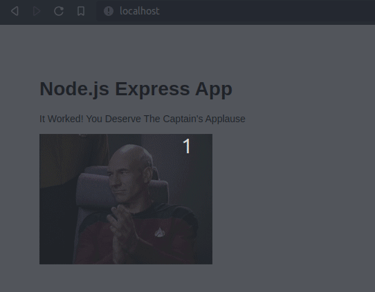

* Now tag for the `testnode` image.
  ```bash
  docker image tag testnode manhcuong8499/testing-node
  ```

* Finally, push it to Docker Hub.
  ```bash
  docker image push manhcuong8499/testing-node
  ```

* Check if this image exists on Docker Hub.
  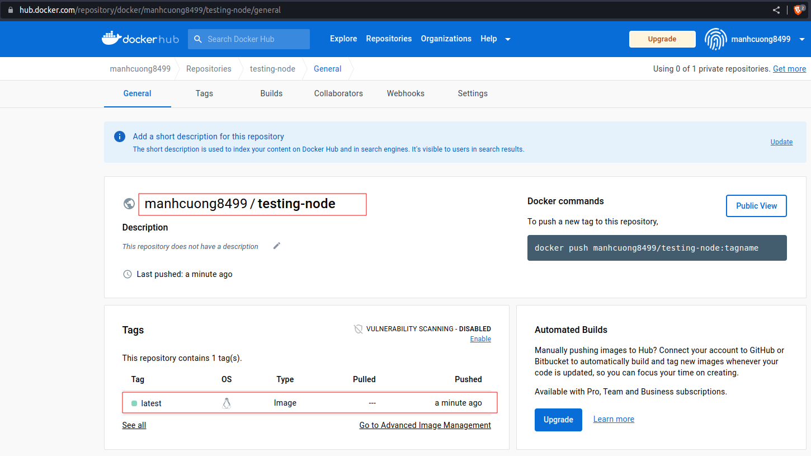

* Now remove this image from local cache.
  ```bash
  docker image rm manhcuong8499/testing-node
  ```

* Now run the `manhcuong8499/testing-node` again which pulls this image from Docker Hub.
  ```
  docker container run --rm -p 80:3000 manhcuong8499/testing-node
  ```
  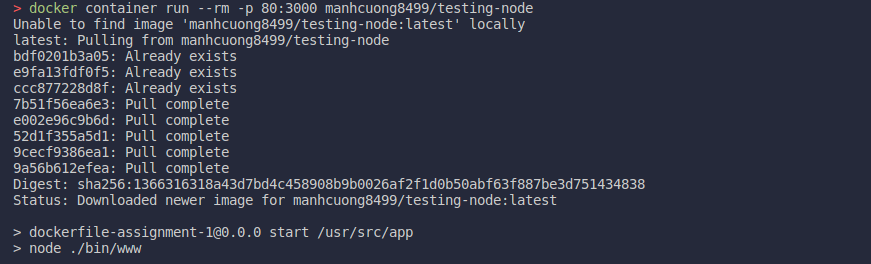

* Check if everything is working well on your browser.
  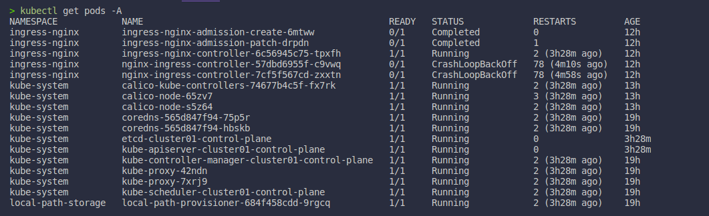

## 9. Using `prune` to keep your Docker system clean
* `docker image prune` to clean up just **dangling** images.
* `docker system prune` to clean up everything.
* The big one is usually `docker image prune -a` which will remove all images you**'re not using**. Use `docker system df` to see space usage.

<hr>

# Section 6. Container lifetime & Persistent data: Volumes, Volumes, Volumes
## 1. Container Lifetime & Persistent Data
### 1.1. Section Overview:
* Defining the problem of persistent data.
* Key concepts with containers: immutable, ephemeral.
* Learning and using Data Volumes.
* Learning and using Bind Mounts.

### 1.2. Notes
* Container Lifetime & Persistent Data
  * Containers are usually immutable and ephemeral.
  * **Immutable infrastructure**: only re-deploy containers, never change.
  * This is the ideal scenario, but what about databases, or unique data?
  * Docker give us features to ensure these "**seperation of concerns**".
  * This is known as "**persistent data**".
  * Two ways: **Volumes** and **Bind Mounts**.
    * **Volumnes**: make special location outside of container UFS.
    * **Bind Mounts**: link container path to host path.

## 2. Persisten data: Data volumes
### 2.1. Notes:
* `VOLUME` command in Dockerfile.
* Firstly, let pull `MySQL` image from Docker Hub.
  ```bash
  docker image pull mysql
  ```
* Then, inspect the `mysql` image.
  ```bash
  docker image inspect mysql
  ```
  
  * At here, we can see that the `mysql` image has a `VOLUME` instruction. It is currentlt binding to `/var/lib/mysql` directory of the container.

* Run `mysql` container.
  ```bash
  docker container run --name mysql -e MYSQL_ALLOW_EMPTY_PASSWORD=True -d mysql
  ```

* To check if the container is using the volume, use the command.
  ```bash
  docker container inspect mysql
  ```
  
  * We can see the container `mysql` is referencing to the volume directory on the host (it means `d9839...`). And it also referencing to the directory `/var/lib/mysql` in the container.

* To list all volumes on the host machine, use the command.
  ```bash
  docker volume ls
  ```
  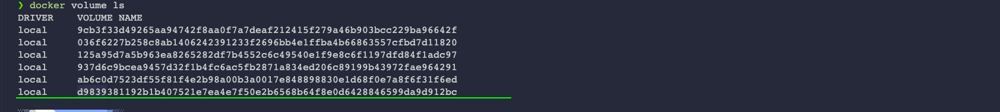
  * Use the above command to list all the available volumes on the host machine. We can see the volume (it means directory `d9839...`) that the `mysql` container is referencing.

* We also inspect a volume. Let inspect the volume `d9839...`.
  ```bash
  docker volume inspect d9839
  ```
  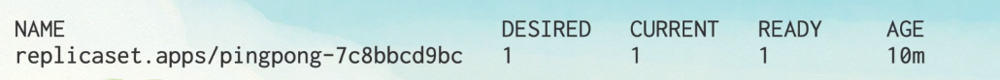
  * We can see the volume `d9839...` is referencing to the directory `/var/lib/docker/volumes/d9839.../_data` on the host machine.

* **Note**:
  * If you are using Windows or Linux to run Docker, you can not access the above directories on the host machine. Because these directories are created by Docker Engine and are not accessible by the host machine.
  * Remember in the case of Windows, or macOS machines, the Docker Engine is running inside a VM, so you can not access the directories on the host machine.

* When you remove a container, docker will **only remove the container, not the volume**.
* Whatever you run a new container, Docker will create a new volume for it. But the volume name is too hard to remember. So we also specify name for the volume when we run a new container with flag `-v`, like this:
  ```bash
  docker container run --name mysql -e MYSQL_ALLOW_EMPTY_PASSWORD=True -d -v mysql-db:/var/lib/mysql
  ```

* Now when we inspect the `mysql` container, we can see the volume name is `mysql-db`.
  ```bash
  docker container inspect mysql
  ```
  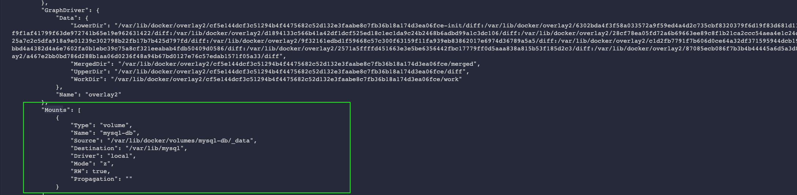
  * and the volume of `mysql` container has been not changed.
  

* Get the list of all volumes to check
  ```bash
  docker volume ls
  ```
  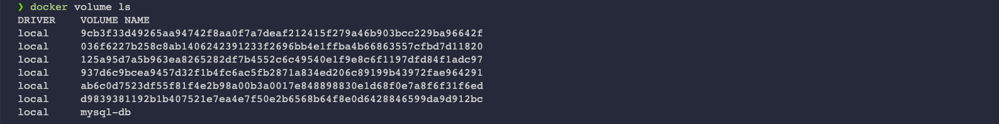

* But when we create a new instance of `mysql` container, we can also use the volume `mysql-db` that we created before.
  ```bash
  docker container run --name mysql2 -e MYSQL_ALLOW_EMPTY_PASSWORD=True -d -v mysql-db:/var/lib/mysql mysql
  ```

* Now we can see the volume `mysql-db` is used by two containers. And docker will not create a new volume for `mysql2` container.

* We also create a volume before you run a container. Let create a volume `mysql-db2`.
  ```bash
  docker volume create mysql-db2
  ```

## 3. Shell differences for Path Expansion
* Each shell may do this differently.
  * PowerShell: `${pwd}`
  * cmd.exe (aka **Command Prompt**): `%cd%`
  * Linux, macOS, bash, sh, zsh, and Window Docker Toolbox: `$(pwd)`

## 4. Persistent Data: Bind Mounting
* Maps a host file or directory to a container file or directory.
* Basically just two locations pointing to the same file(s).
* Again, skip UFS, and host files overwrote andy in container.
* **Can not use in Dockerfile**, **must be at `container run` command**, for example:
  * macOS/Linux:
    ```bash
    docker container run -v /usr/cuongdm/stuff:/path/container ...
    ```
  * Windows:
    ```bash
    docker container run -v //c/users/cuongdm/stuff:/path/container ...
    ```

* Now, let's practice the above guidelines:
  * Let change directory to `dockerile-sample-2`.
    ```bash
    cd resources/udemy-docker-mastery-main/dockerfile-sample-2
    cat Dockerfile
    ```
  * Here, I have an `index.html` file and I want to bind and mount it to the container when I run Nginx container.
    ```bash
    docker container run -d -p 80:80 --name nginx -v $(pwd):/usr/share/nginx/html nginx
    ```
  * And this is the result, we can see the `index.html` file is bind and mount to the container.
    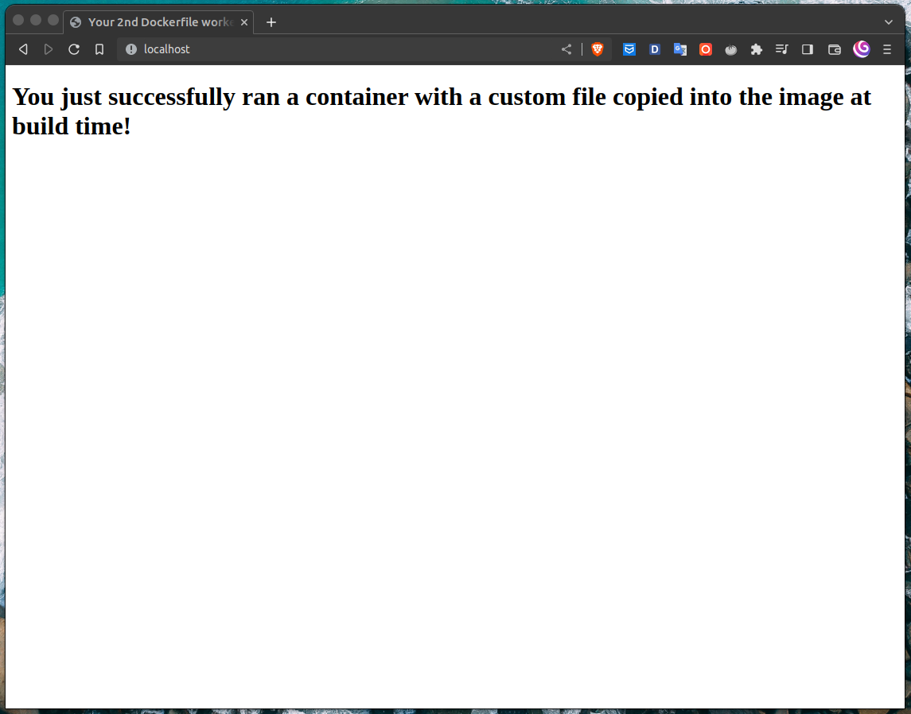

* Now let's go inside the inside `nginx` container.
  ```bash
  docker container exec -it nginx bash
  # inside the container
  cd /usr/share/nginx/html
  ls -a
  ```
* Inside the `nginx` container, we can see the Dockerfile of us, nginx default image will not have this file.
  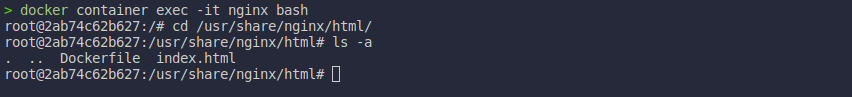

* Now let's open a new terminal and create a new file inside the directory `dockerfile-sample-2` and write some text to it.
  ```bash
  touch testme.txt
  echo "It is me CuongDM" > testme.txt
  ```

* Now let's go back to the browser, and visit this URL [http://localhost/testme.txt](http://localhost/testme.txt).
  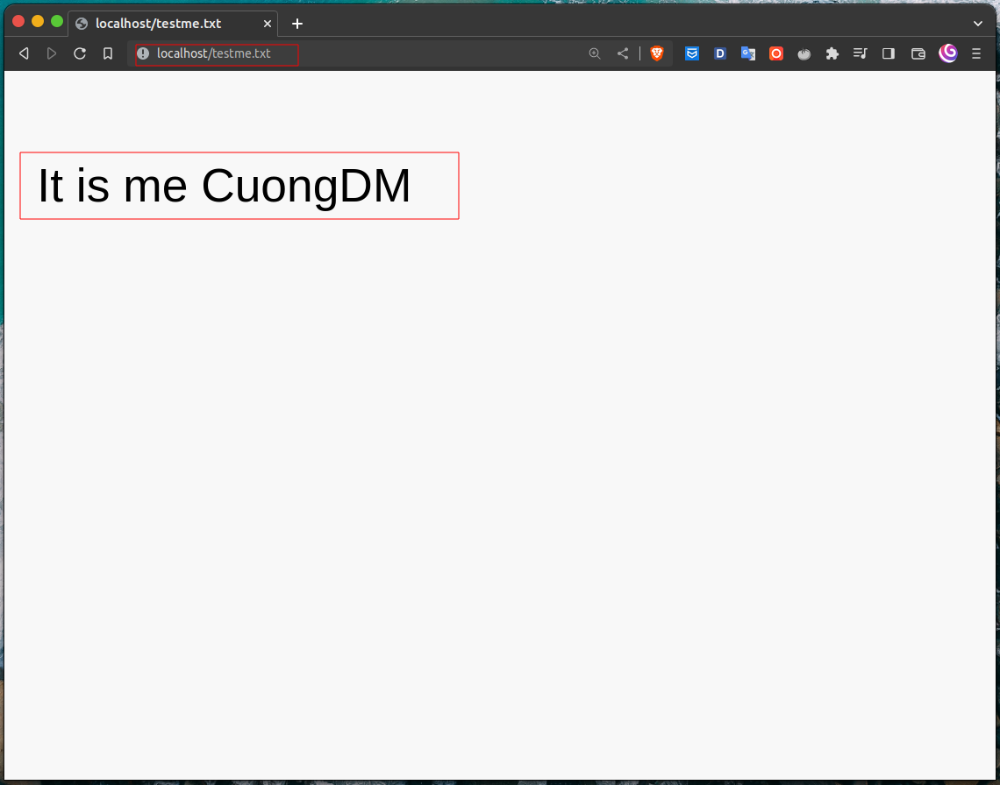

  * You can see, I do not have any modification on the `nginx` container, but I can access the file `testme.txt` that I created on the host machine.

## 5. Assignment: Database Upgrades with Named Volumes
* Database upgrade with containers.
* Create `postgres` container with named volume **psql-data** using versiopn **9.6.1**
* Use Docker Hub to learn `VOLUME` path and versions needed to run it.
* Check logs, stop container.
* Create a new `postgres` container with same named volume using **6.2.2**.
* Check logs to validate.

### 5.1. Solution
* Run the `postgres:9.6.1` container which names it `psql`.
  ```bash
  docker container run -d --name psql -v psql:/var/lib/postgresql/data postgres:9.6.1
  docker container logs -f psql  # the -f flag means use to keep watching
  ```

* And then we can stop `psql` container.
  ```bash
  docker container stop psql
  ```

* Check if `psql` volume is still there.
  ```bash
  docker volume ls
  ```
  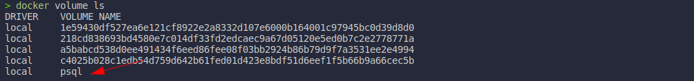

* Now run the `postgres:9.6.2` container which names it `psql2` on the same volume of `psql` container.
  ```bash
  docker container run -d --name psql2 -v psql:/var/lib/postgresql/data postgres:9.6.2
  docker container logs -f psql2
  ```
  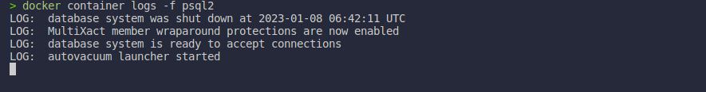

* Now we can stop the `psql2` container.
  ```bash
  docker container stop psql2
  ```

* And check the volume `psql` is still there and there is nothing any volume is created.
  ```bash
  docker volume ls`
  ```
  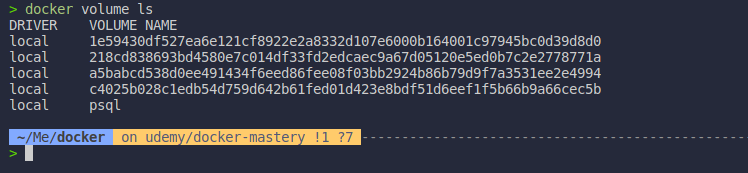

## 6. Assignment: Edit code running in containers with bind mounts
* Use a JekyII "Static site generator" to start a local web server.
* Do not have to be web developer: this is example of bridging the gap between local file access and apps running in containers.
* Source code is in [bindmount-sample-1](./resources/udemy-docker-mastery-main/bindmount-sample-1/)
* Container detects changes with host files and updates web server.
* Start container with `docker run -p 80:4000 -v $(pwd):/site bretfisher/jekyll-serve`.
* Refresh our browser to see changes.
* Change the file in `_posts\` and refresh browser to see changes.

### 6.1. Solution
* Let's change directory to `bindmount-sample-1`.
  ```bash
  cd resources/udemy-docker-mastery-main/bindmount-sample-1
  ```

* Run **Jekyll** container.
  ```bash
  docker run -p 80:4000 -v $(pwd):/site bretfisher/jekyll-serve
  ```
  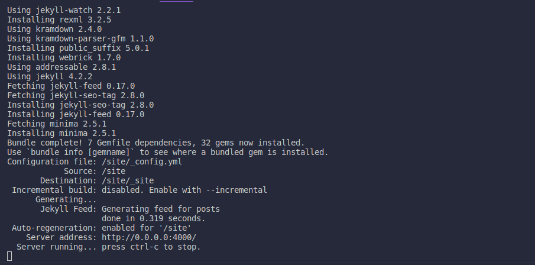
  * You can see your Jekyll container is running.

* Now open your browser to visit [http://localhost/jekyll/update/2020/07/21/welcome-to-jekyll.html](http://localhost/jekyll/update/2020/07/21/welcome-to-jekyll.html)
  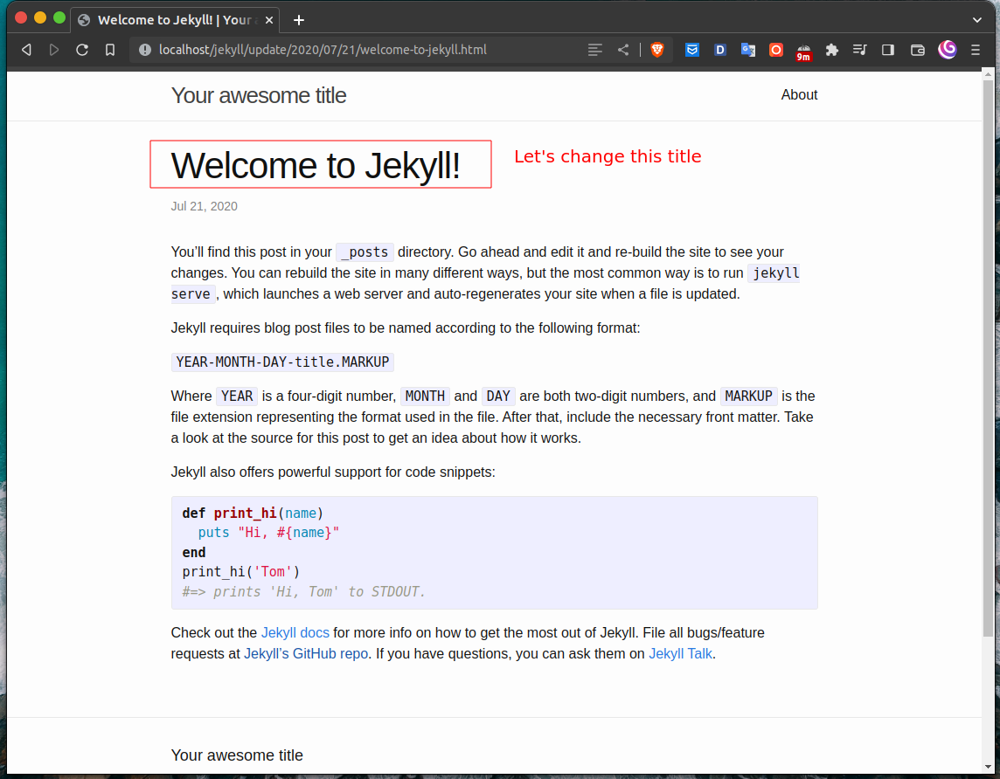

* Go to the directory `bindmount-sample-1/_posts/` and edit the title of the file `2020-07-21-welcome-to-jekyll.md`.
  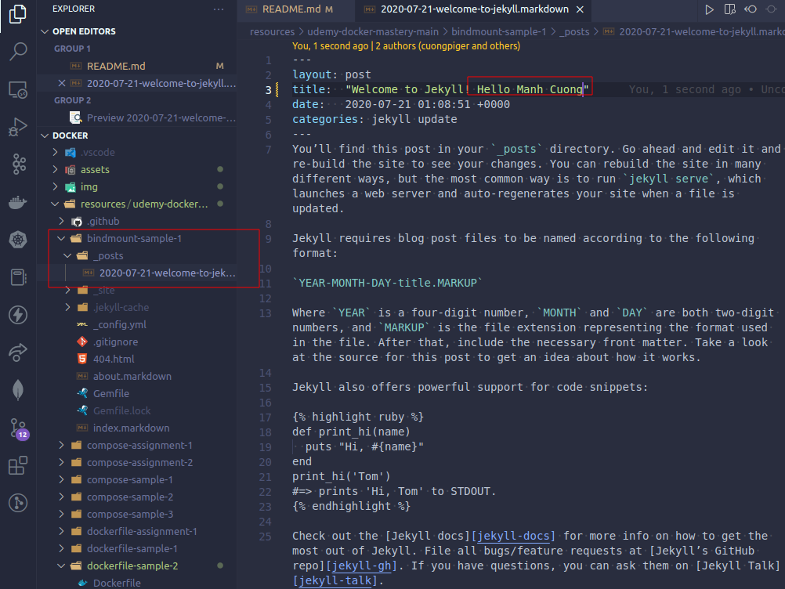

* Then back to the browser and refresh the page.
  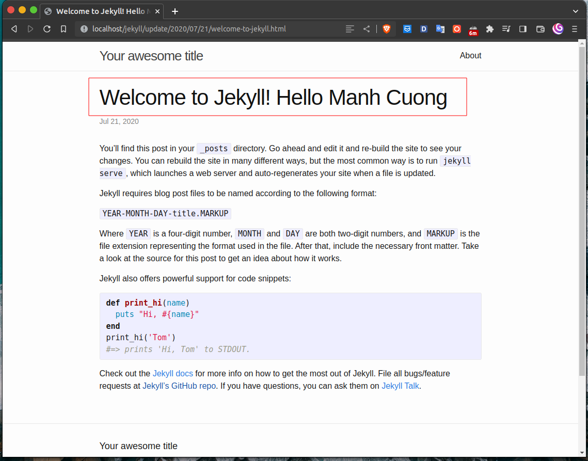
  * You can see, Docker also detect that we have changed the file and update the web server.
    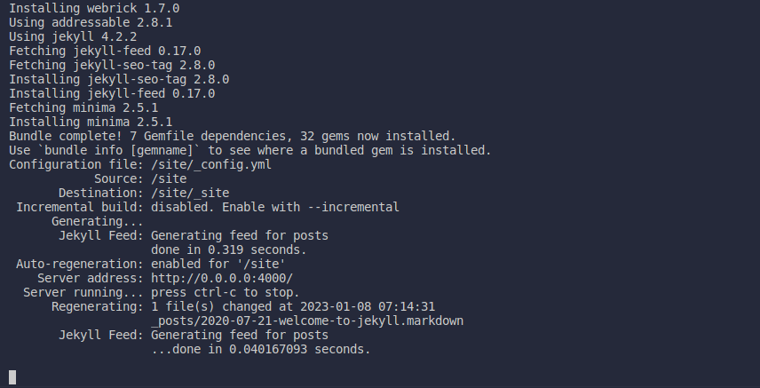

# Section 7. Making it easier with Docker Compose: Tye Multi-Container Tool
## 1. Docker Compose and The `docker-compose.yml` file.
* Why: 
  * Configure relationships between containers
  * Save our docker container run settings in easu-to0-read file.
  * Create one-liner developer environment startips.
* Comprised of 2 separate but related things.
  1. YAML-formatted file that describes our solution options for:
    * containers
    * networks
    * volumes
  2. A CLI tool `docker-compose` used for local/dev/test automation with those YAML files.

* `docker-compose.yml` file.
  * Compose YAML format has it's own versions: 1, 2, 2.1, 3, 3.1.
  * YAML file can be used with `docker-compose` command for local docker automation or...
  * With `docker` directly in production with Swarm (as of v1.13).
  * `docker-compose.yml` is default filename, but any can be used with `docker-compose -f`.

## 2. Trying out basic compose commands
* Firstly, move to the directory `compose-sample-2`.
  ```bash
  cd resources/udemy-docker-mastery-main/compose-sample-1
  docker compose up
  docker compose up -d # run in background
  ```

* To get the log of the container that were run by docker-compose.
  ```bash
  docker compose logs
  docker compose logs -f # keep watching CTRL + Z to stop
  ```

* Use `docker compose --help` to see all the commands.
* To get all the running containers that were run by docker-compose.
  ```bash
  docker compose ps
  ```

* To get all the processes that were run by docker-compose.
  ```bash
  docker compose top
  ```

## 3. Assignment: Writing a compose file
* Build a basic compose file for a Drupal content management system website. Docker Hub is your friend.
* Use the `drupal` image along with the `postgres` image.
* Use `ports` to export Drupal on 8080 so you can [http://localhost:8080](http://localhost:8080)
* Be sure to set `POSTGRES_PASSWORD` environment variable for postgres.
* Walk though Drupal setup via browser.
* Tip: Drupal assumes DB is localhost, but it is service name.
* Extra credit: Use volumes to store Drupal unique data.

### 3.1. Solution
* Remember, whenever you use volume in any service, you also need to specify it in the volumes instruction in Dockerfile.
* Firstly, move to the directory `compose-assignment-2`.
  ```bash
  cd resources/udemy-docker-mastery-main/compose-assignment-2
  docker compose up
  ```
  * This is the result screen after running the above commands successfully.
    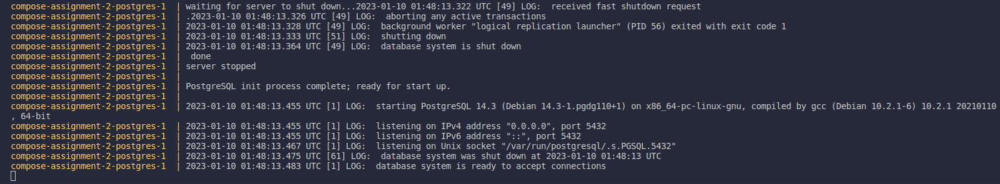
  * Go to [http://localhost:8080](http://localhost:8080)
    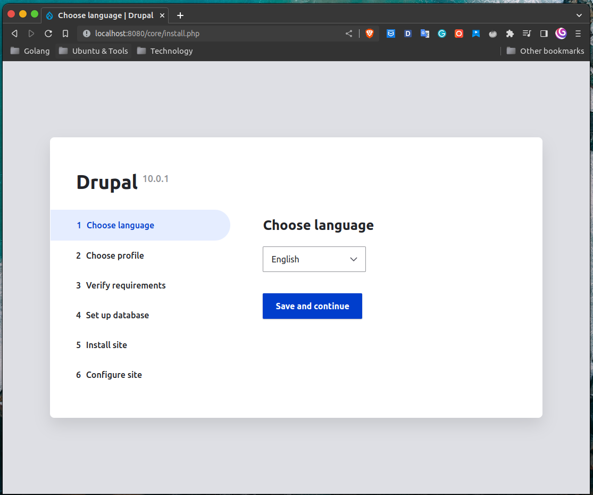
  * Setup.
    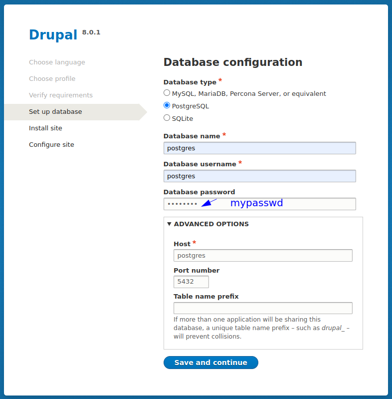
    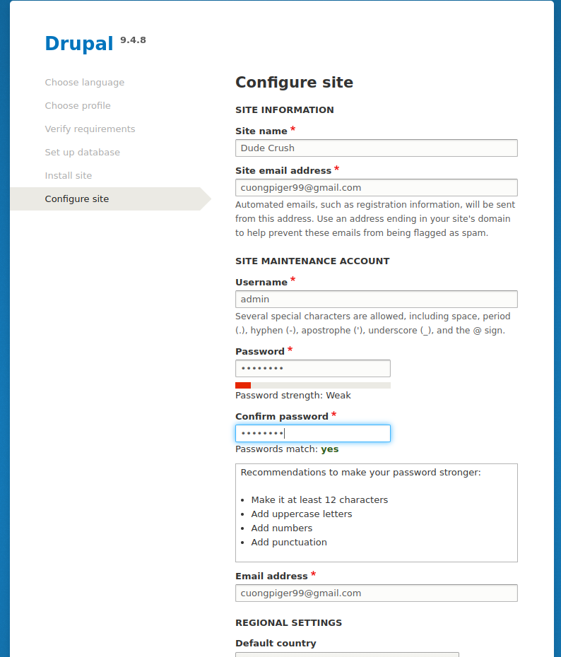
    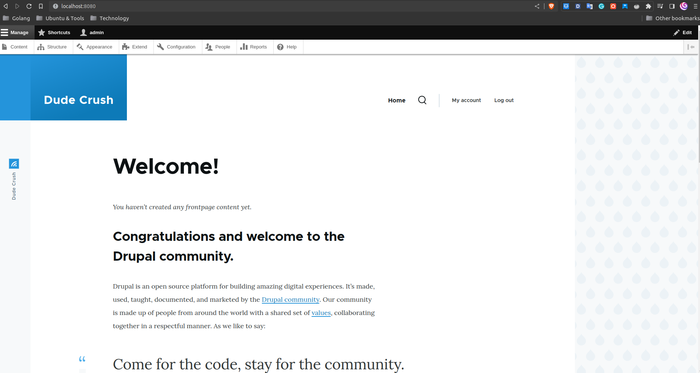

## 4. Adding Image Building to Compose Files
### 4.1. Using compose to build
* Compose can also build your custom images.
* Will build them with `docker compose up` if not found in cache.
* Also rebuild with `docker compose build`.
* Great for complex builds that have lots of vars or build args.

### 4.2. Example
* Firstly, move to the directory [compose-sample-3](./resources/udemy-docker-mastery-main/compose-sample-3/)
  ```bash
  cd resources/udemy-docker-mastery-main/compose-sample-3
  ```
* Remember, sometimes you do not need to specify the `CMD` instruction in your Dockerfile, because every image in docker has on by default.

* Now, let's run `docker compose up` command.
  ```bash
  docker compose up -d
  ```
  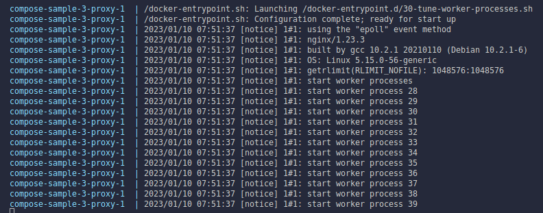

* When we specify the `build` and `image` instructions in `docker-compose.yml` file, if we run docker compose, docker will create a new image and name it based on the `image` instruction. In this case, docker will create a new image called `nginx-custom`, the image that we have specified in `docker-compose.yml` file, run `docker image ls` to check.
  ```bash
  docker image ls
  ```
  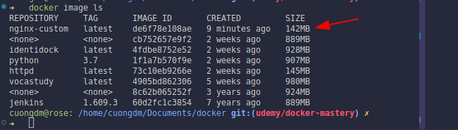

* Now, visit [http://localhost](http://localhost).
  

* And because we are using **bind mount**, we can absolutely modify the content at the host machine, and then the container will automatically update.
* Now, we can use `docker compose down` command to stop entire the running containers.
  ```bash
  docker compose down
  ```

* When we run `docker compose down` command, docker only stop the all running services that we specified in `docker-compose.yml` file, but it does not remove the images that we have created. To remove the images, we can use `docker compose down --rmi local` command.
  ```bash
  docker compose down --rmi local
  ```

## 5. Assignment: Compose for Image Building
* Building custom `drupal` image for local testing.
* Compose is not just for developers. Testing apps is easy/fun.
* Maybe your learning Drupal admin, or are a software tester.
* Start with Compose file from previous assignment.
* Make your `Dockerfile` and `docker-compose.yml` in dir `compose-assignment-3`.
* Use the `drupal` image along with the `postgres` image as before.
* Use `README.md` in that image for details.

### 5.1. Solution
* Change to directory [compose-assignment-3](./resources/udemy-docker-mastery-main/compose-assignment-3/)
  ```bash
  cd resources/udemy-docker-mastery-main/compose-assignment-3
  ```

* Run by docker compose
  ```bash
  docker compose up -d
  ```

* Stop and remove all.
  ```bash
  docker compose down
  ```

# Section 8. Swarm Intro and Creating a 3-Node Swarm Cluster
## 1. Swarm Mode: Built-In Orchestration
### 1.1. Containers everywhere = New Problems
* How do we automate container lifecycle?
* How can we easily scale out/in/up/down?
* How can we ensure our containers are re-created if they fail?
* How can we replace containers without downtime (blue/green deploy)?
* How can we control/track where containers get started?
* How can we create cross-node virtual networkss?
* How can we ensure only trusted servers run our containers?
* How can we store secrets, keys, passwords and get them to the right container (and only that container)?

### 1.2. Swarm Mode: Built-in Orchestration
* Swarm Mode is a clustering solution built inside Docker.
* Not related to Swarm "classic" for pre-1.12 versions.
* Added in 1.12 (Summer 2016) via SwarmKit toolkit.
* Enahanced in 1.13 (January 2017) via Stacks and Secrets.
* Not enabled by default, new commands once enabled:
  * `docker swarm`
  * `docker node`
  * `docker service`
  * `docker stack`
  * `docker secret`

* About Docker Swarm, the below image is a simple Swarm:
  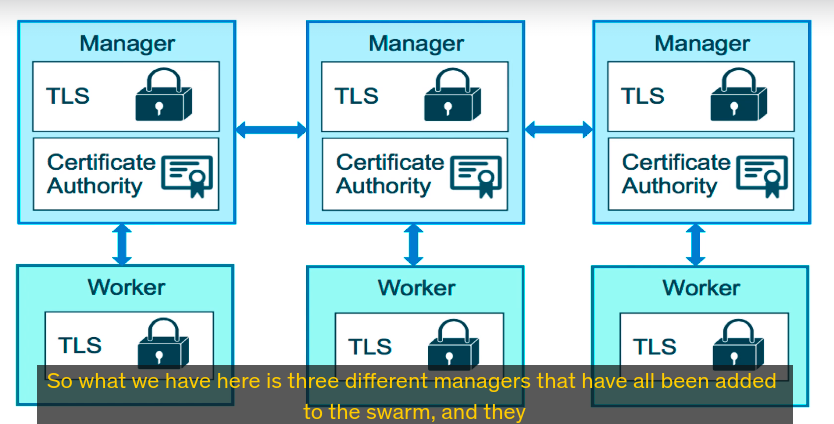
  * Manager Nodes:
    * They actually have a database locally on them known as the **Raft Database**.
    * **Raft Database** stores their configuration and gives them all the information they need to have to be authority inside a Swarm.
    * Following the above image, the Swarm includes 3 manager nodes. And they all keep a copy of that database and encrypt their traffic in order to ensure integrity and guarantee the trust that they are able to manage this Swarm securely.
  * Worker nodes:
    * Each one of these would be a virtual machine, or physical host, running some distribution of Linux or Windows server.
    * The above image shows how they are actually all communicating over what we call the Control Plane, which is how orders get sent around the Swarm, partaking actions.

* In a little bit more complicated view:
  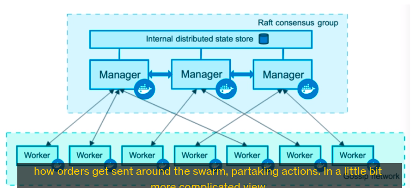
  * We have this **Raft consensus database**, that is replicated again amongst all the nodes.
  * The managers issue orders down to the workers
  * **Internal distributed state store**: this is also called **Raft Database**.
  * The managers themselves can also be workers. Of course, you can demote and promote workers and managers into the two different roles.
  * When you think of a manager, typically think of a worker with permissions to control the Swarm.

* The disadvantage of `docker container run` command is that it exactly runs only one container when it has been executed. So if we want to run 3 Nginx containers at the same time by only one command, the original docker run command can not do that.
* In Swarm, it replaces the Docker run command, and allows us to add extra features to our containers when we run it, such as replicas to tell us how many of those it wants to run, and those are known as **tasks**.
  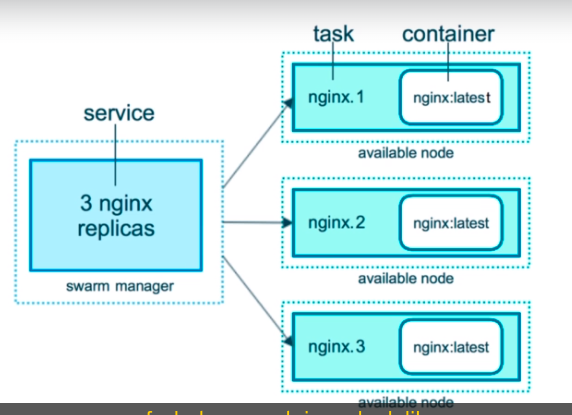
  * Following the above image, a single service can have multiple tasks, and **each one of those tasks will launch a container**.
  * The above image, we have created a service using docker service create to spin up an Nginx service using the Nginx image like we have done several times before.
  * But we have told it that we would like three replicas. So it will use the manager nodes to decide where in the Swarm to place those. By default, it tries to spread them out. So each node would get its own copy of the nginx container up to the three replicas that we told it we need it.

* This is a quick and basic understanding of how the managers work and what they are doing in the background.
  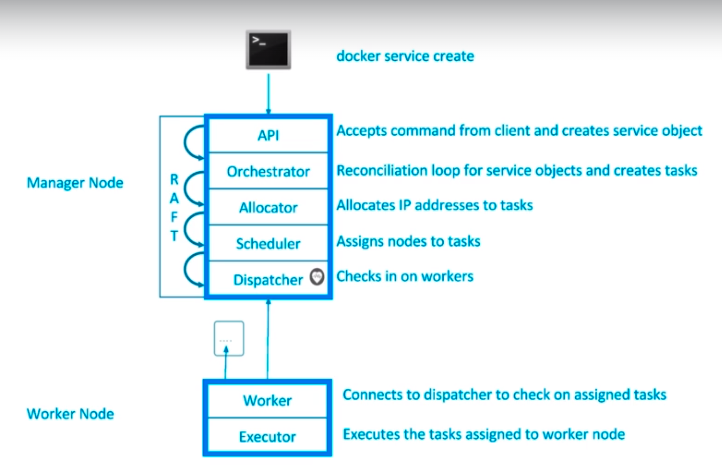
  * There is actually a totally new Swarm API here that has a bunch of background services, such as the **scheduler**, **dispatcher**, **allocator** and **orchestrator**, that help make the decisions around what the workers should be executing at any given moment.
  * The workers are constantly reporting to the managers and asking for new work.
  * The managers are constantly doling out new work and evaluating what you have told them to do against what they are actually doing.

## 2. Create Your First Service and Scale it Locally
* To check Swarm is active or not, use the below command:
  ```bash
  docker info
  ```
  * By default, Swarm is **inactive**:
    

* To enable Swarm, use the below command:
  ```bash
  docker swarm init [--advertise-addr 127.0.0.1]
  ```
  * By default, Swarm is **active**:
    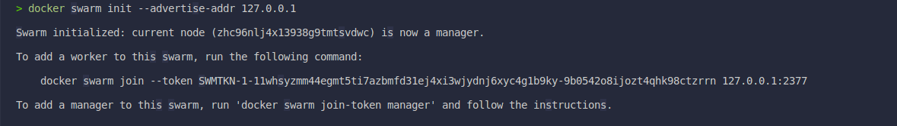
    * So what just happened?
      * Lots of PKI and security automation
        * Root Signing Certificate created for our Swarm.
        * Certificate is issued for first Manager node.
        * Join token are created.
      * Raft database created to store root CA, configs and secrets
        * Encrypted by default on risk (1.13+)
        * No need for another key/value sysrem to hold orchestration/secrets
        * Replicates logs amongst Managers via mutual TLS in "control plane".

* After we initialized a Swarm successfully, we can list all the cluster nodes by the below command:
  ```bash
  docker node ls
  ```
  * The below image shows the result:
    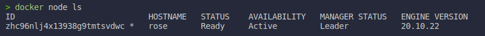

* Now, let's move on `service` command, `service` in a Swarm replaces the `docker run`. When we start talking about **a cluster**, we do not care so much about individual nodes. We do not actually probably name them.

* Now let's create a new service using `docker service` with `alpine` image.
  ```bash
  docker service create alpine ping 8.8.8.8
  ```
  * The command above create a service using `alpine` image and then `ping` to Google DNS (it means `8.8.8.8`).

* To get all running services in the cluster, use the below command:
  ```bash
  docker service ls
  ```
  * The below image shows the result:
    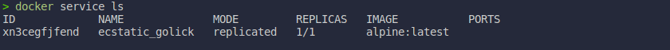

* The `docker service ls` only shows the running services on the host to us, we can not know about their containers of them. To discover that, we can use the below command:
  ```bash
  docker service ps <service name|id>
  ```
  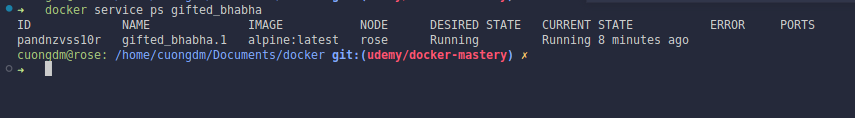
  * We can see there is a container called `gifted_bhabha.1` is currently running.
  * We can use `docker container ls` to check.
    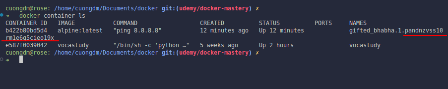
    * There is also a container with the same name, but following behind is the **service ID** _(the red underline)_ of the cluster that currently hosts this container.

* Now we will **scale up** this service to 3 replicas.
  ```bash
  docker service update <service ID|Name> --replicas 3
  ```
  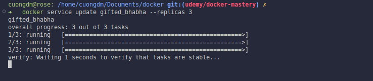
  * Now let's check the above action is correct.
    ```bash
    docker service ls
    docker service ps <service ID|name>
    docker container ls
    ```
    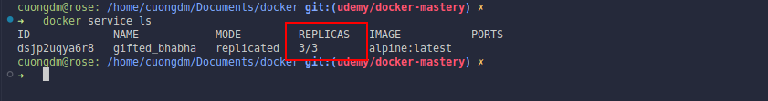
    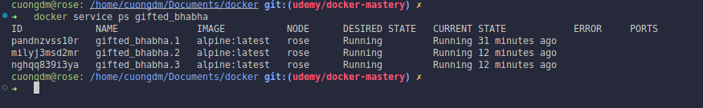
    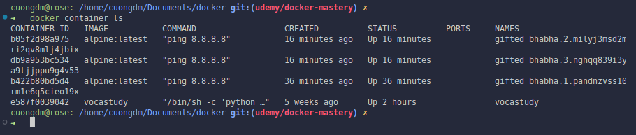

* So, what happens if I try to stop or remove one in three of the above running containers?
  ```bash
  docker container rm -f gifted_bhabha.1.pandnzvss10rm1e6q5cieo19x
  ```
  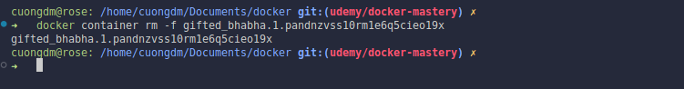
  * The above container is removed successfully. Let's check again:
    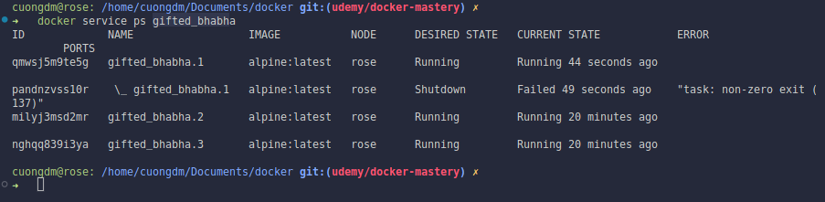
    ```bash
    docker service ps gifted_bhabha
    ```
    
      * We can see, now we have 4 containers running, and the one we just removed is now in the process of being **shutdown**. This help to ensure that we always have the number of replicas that we have asked for.

* So to remove the above service, use these commands to deleve and check, everything worked correctly.
  ```bash
  docker service rm gifted_bhabha
  docker service ls
  docker container ls
  ```
  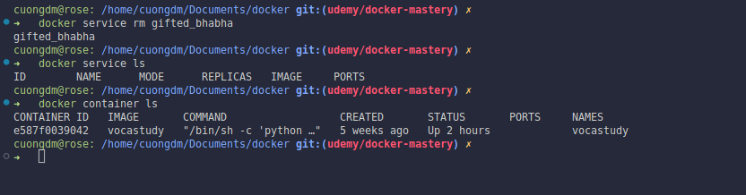

## 3. Creating a 3-Node Swarm Cluster
### 3.1. Creating 3-Node Swarm: Host Options
* **Option A**: [https://labs.play-with-docker.com](https://labs.play-with-docker.com/).
  * Only needs a browser, but resets after 4 hours.
* **Option B**: `docker-machine`, or `multipass` _(using `snap` to install it)_ + **Virtual Box**.
  * Free and runs locally, but requires a machine with 8GB memory.
* **Option C**: Digital Ocean + Docker install.
  * Most like a production setup, but costs $5-10/node/month while learning.
  * Use my referral code in section resources to get $10 free.
* **Option D**: Roll your own
  * `docker-machine` can provision machines for Amazon, Azure, DO, Google, etc.
  * Install docker anywhere with [https://get.docker.com](https://get.docker.com/)


### 3.2. Solution
* In this case, I use `multipass` to set up my cluster. Firsly run the three node.
  ```bash
  multipass launch --name node1 docker
  multipass launch --name node2 docker
  multipass launch --name node3 docker
  ```
* Then check all these virtual machines are running.
  ```bash
  multipass list
  ```
  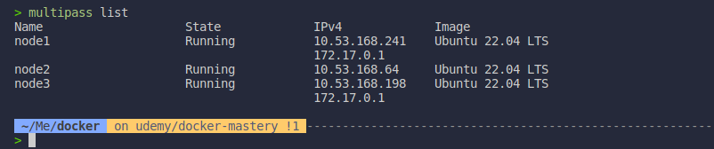

* To check these virtual machines can communicate to each other, use ping command inside the shell of these virtual machines.
  ```bash
  multipass shell node1  # opening the shell of node1 to interactive

  # inside node1's shell
  ping node2  # take your look to see what is happening
  ping node2
  ```

* Now open all the shell of 3 virtual machines.
  ```bash
  multipass shell node1
  multipass shell node2
  multipass shell node3
  ```

* Now let's initialize Swarm all 3 nodes.
  ```bash
  docker swarm init --advertise-addr <ip-node1> # node1
  ```
  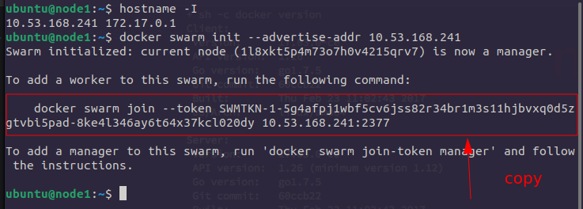

* Now let's copy the generated `docker swarm ...` command in the above image to `node2` and `node3`.
  ```bash
  docker swarm join --token SWMTKN-1-5g4afpj1wbf5cv6jss82r34br1m3s11hjbvxq0d5zgtvbi5pad-8ke4l346ay6t64x37kcl020dy 10.53.168.241:2377 # node2
  docker swarm join --token SWMTKN-1-5g4afpj1wbf5cv6jss82r34br1m3s11hjbvxq0d5zgtvbi5pad-8ke4l346ay6t64x37kcl020dy 10.53.168.241:2377 # node3
  ```
  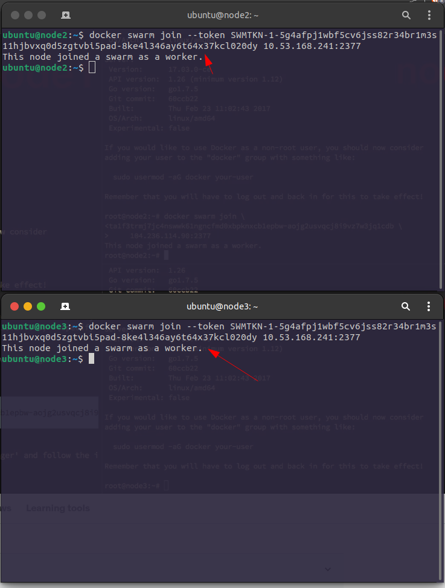
    * Now `node2` and `node3` are workers of the leader `node1`.

* Now back to the shell of `node1` and check `node2` and `node3` are joined to the cluster.
  ```bash
  docker node ls # node1
  ```
  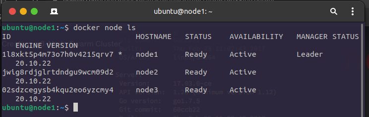

* Now set role for `node2` into **the manager node**.
  ```bash
  docker node update --role manager node2 # node1
  docker node ls # node1
  ```
  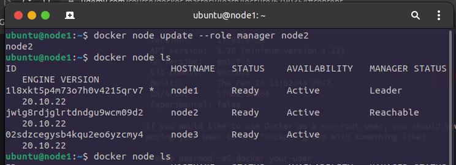

* Now if you want to generate a new token for a new node to join the cluster as **manager** or **worker** roles, use the below command:
  ```bash
  # inside node1's shell
  docker swarm join-token manager # for manager node
  docker swarm join-token worker # for worker node
  ```
  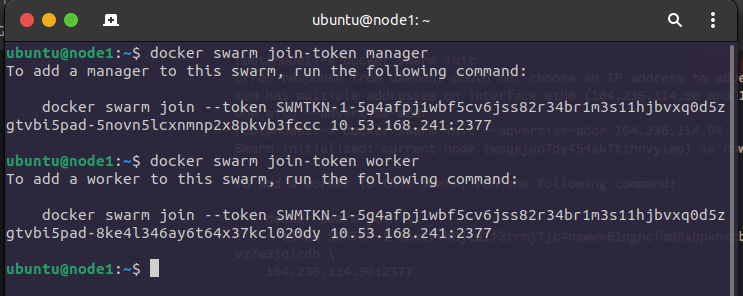

* Currently `node3` join to the cluster as **worker** node, so let's `node3` leave the cluster and then use the token to join to the cluster as **manager** node.
  ```bash
  docker swarm leave # node3
  docker swarm join --token SWMTKN-1-5g4afpj1wbf5cv6jss82r34br1m3s11hjbvxq0d5zgtvbi5pad-5novn5lcxnmnp2x8pkvb3fccc 10.53.168.241:2377 # node3
  ```
  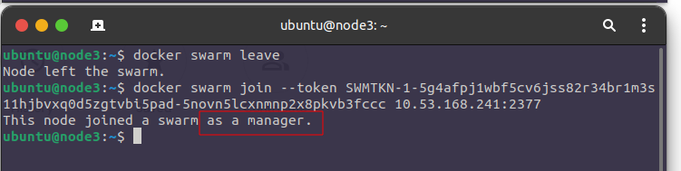

* Check again at `node1`.
  ```bash
  docker node ls  # node1
  ```
  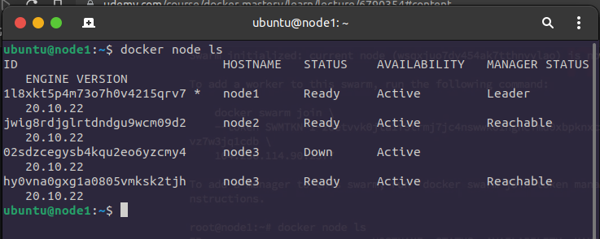

* Now let's create a `alpine` service and then `ping` to Google DNS.
  ```bash
  # node1
  docker service create --replicas 3 alpine ping 8.8.8.8
  ```
  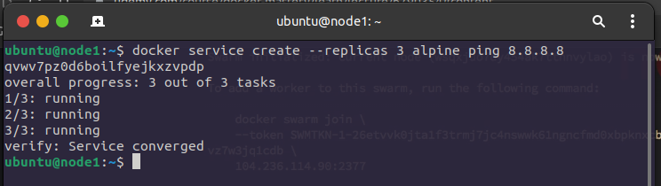

* Check service is actually running.
  ```bash
  docker service ls
  docker service ps <service name|id>
  ```
  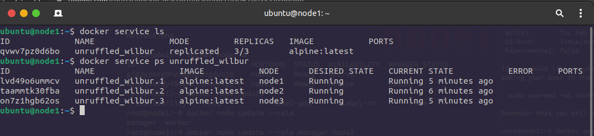

* We also check the specific node in the cluster.
  ```bash
  # node1
  docker node ps
  docker node ps node2
  ```
  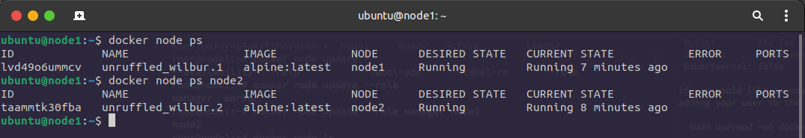

# Section 9. Swarm basic features and How to Use them in Your workflow
## 1. Scaling Out with Overlay Networking
### 1.1. Overlay Multi-Host Networking
* Just choose `--driver overlay` when creating network.
  * `--driver overlay` is basically creating a Swarm-wide **bridge network** where the containers across hosts on the same virtual network can access each other.
* For container-to-container traffic inside a single Swarm.
* Optional IPSec (AES) encryption on network creation.
* Each service can be connected to multiple networks.
  * E.g: front-end, back-end.

### 1.2. Example
* Create three virtual machines using `multipass`.
  ```bash
  multipass launch --name node1 docker
  multipass launch --name node2 docker
  multipass launch --name node3 docker
  ```
  
* Get the IP-Address of these nodes:
  * Node 1
    ```bash
    # host terminal
    multipass shell node1

    # inside the node1's shell
    docker swarm init --advertise-addr <IP-Address>
    ```
    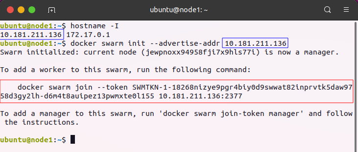

* Connect `node2` and `node3` to Swarm that `node1` is **leader**:
  * Node 2
    ```bash
    multipass shell node2
    docker swarm join --token <worker token>
    ```
  * Node 3
    ```bash
    multipass shell node3
    docker swarm join --token <worker token>
    ```
* Set `node2` and `node3` as **manager nodes** in the cluster (ensure that `node1` and `node3` have been in the swarm).
  * Node 1
    ```bash
    docker node update --role manager node2
    docker node update --role manager node3
    ```


* Now, create a `overlay` virtual network.
  * Node 1
    ```bash
    docker network create --driver overlay mydrupal
    ```
    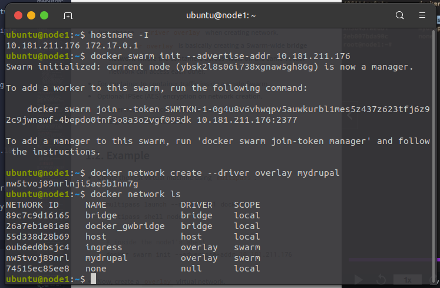

* Now, create a `postgres` service and names it `psql`
  * Node 1
    ```bash
    docker service create --name psql --network mydrupal -e POSTGRES_PASSWORD=mypass postgres:15.1
    docker service ls
    ```
  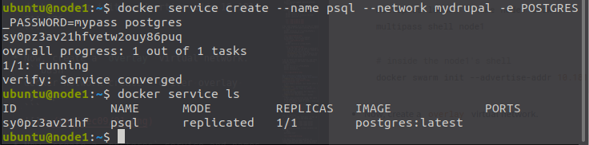

* Check `psql` service on `node1`.
  * Node 1
    ```bash
    docker service ps psql
    ```
    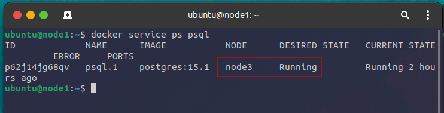
    * The `psql` is currently running on `node3`. Let's move on shell of `node3` to get the logs of `psql` service.

* Get the logs of container on `node3` which is running `psql` service.
  * Node 3
    ```bash
    docker container ls
    docker container logs psql.1.p62j14jg68qv2fgwcsk9qffug
    ```
    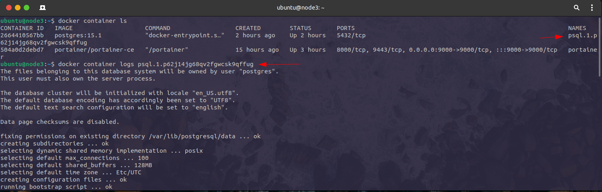

* Now let's run `drupal` service using **overlay virtual network** `mydrupal`.
  * Node 1
    ```bash
    docker service create --name drupal --network mydrupal -p 80:80 drupal:9.3.13
    docker service ls
    ```
    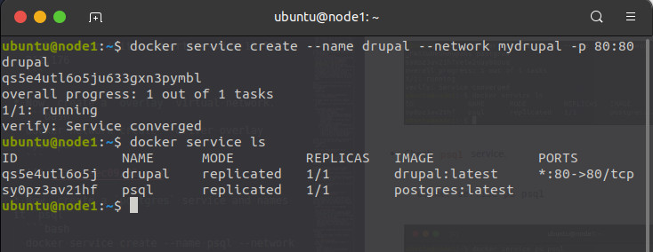

* Check `drupal` service.
  * Node 1
    ```bash
    docker service ps drupal
    ```
    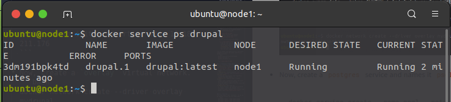
      * It is currently running on `node1`.

* Now let's check the IPAddress of `drupal` service on `node1`, `node2`, and `node3`.
  ```bash
  hostname -I
  ```
  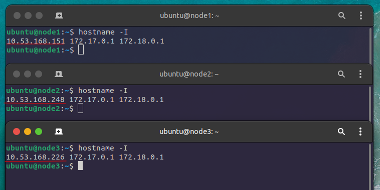
  * The IPAddress of `drupal` service is running on [http://10.53.168.151:80](http://10.53.168.151:80), [http://10.53.168.248:80](http://10.53.168.248:80), and [http://10.53.168.226:80](http://10.53.168.226:80). You can go to visit any URL of them.
  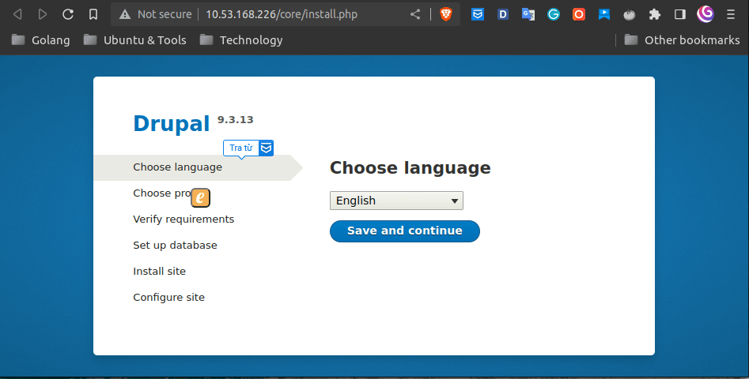
  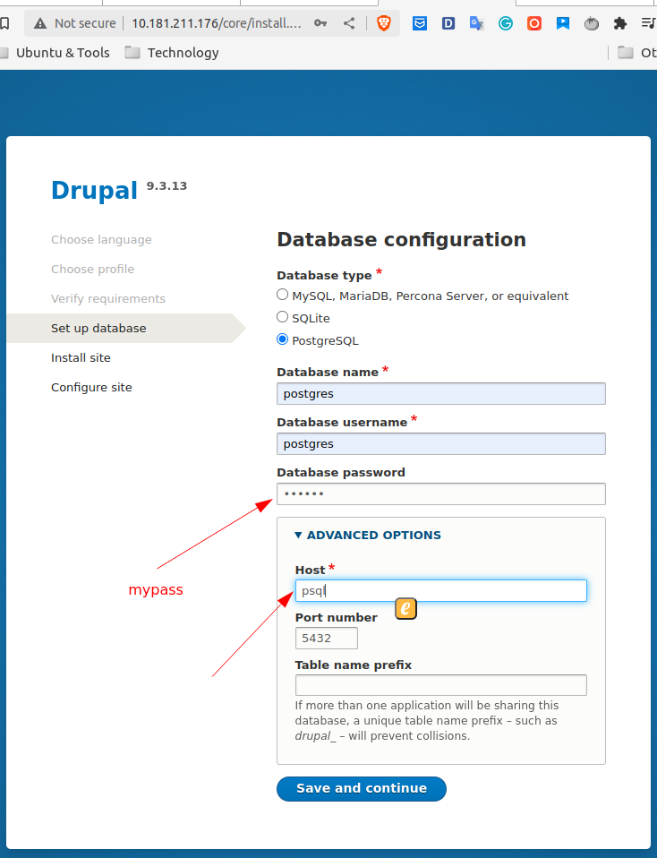
  * After all the setting was configured, we get this page.
  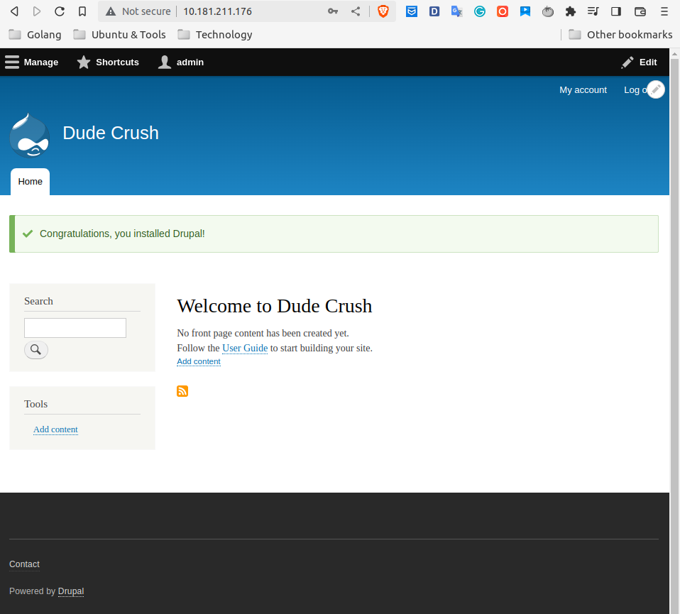

* But there is a minor problem here, I have three nodes, so how do I know which node it is going to be on and which port I need to make sure that my DNS points to when I create this website name?