**Resources**:
  * **Source code**: [https://github.com/luksa/kubernetes-in-action](https://github.com/luksa/kubernetes-in-action)

# Chap 2. First steps with Docker and K8s
## 2.2. Setting up a K8s cluster
* [Optional] Run the cluster in **KinD**:
  ```bash
  kind create cluster --name k8s-playground --config resources/me/config.yaml

  # verify the installation succeeded
  docker container ls

  minikube start --nodes 2 -p multinode-demo
  ```

* List all clusters in Minikube:
  ```bash
  minikube profile list
  ```
### 2.2.1. Running a local single-node K8s cluster with Minikube
* Installing Minikube using the below command:
  ```bash
  curl -Lo minikube https://storage.googleapis.com/minikube/releases/latest/minikube-linux-amd64 && chmod +x minikube && sudo mv minikube /usr/local/bin/

  # verify the installation succeeded
  minikube version
  ```

* Starting a K8s cluster with Minikube:
  ```bash
  minikube start
  ```
  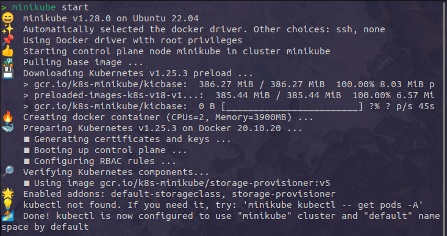

* Installing Kubectl using the below command:
  ```bash
  curl -LO "https://dl.k8s.io/release/$(curl -L -s https://dl.k8s.io/release/stable.txt)/bin/linux/amd64/kubectl" && chmod +x kubectl && sudo mv kubectl /usr/local/bin/

  # verify the installation succeeded
  kubectl version --short
  kubectl cluster-info
  ```
  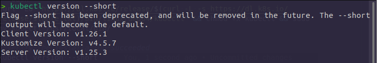
  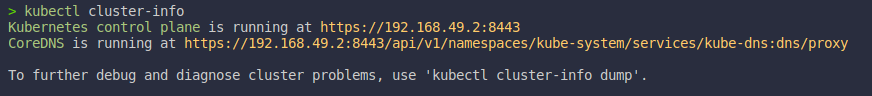

### 2.2.2. Using a hosted K8s cluster with Google K8s Engine
* Setting up a Google Cloud Project and downloading the necessary client binaries:
  * Following this instruction to get started: [https://cloud.google.com/container-engine/docs/before-you-begin](https://cloud.google.com/container-engine/docs/before-you-begin).
  * After that, you can install `kubectl` tool in `gcloud` by the below command:
    ```bash
    gcloud components install kubectl
    ```
* Creating a K8s cluster with 3-nodes:
  ```bash
  gcloud container clusters create kubia --num-nodes 3 --machine-type f1-micro --zone asia-northeast1-a
  ```

## 2.3. Running our first app on K8s
### 2.3.1. Deplying your Node.js app
* Prepare `manhcuong8499/kubia` image:
  ```bash
  cd resources/me/chap02/kubia
  docker build -t kubia .
  docker tag kubia manhcuong8499/kubia
  docker push manhcuong8499/kubia
  ```

* Deloy kubia app in K8s:
  ```bash
  kubectl run kubia --image=manhcuong8499/kubia --port=8080
  ```

#### 2.3.1.1. Introducing Pods
* Listing all pods in the cluster:
  ```bash
  kubectl get pods
  ```
  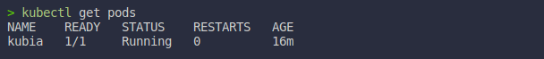

* To see more information about the pods, use the `describe` command:
  ```bash
  kubectl describe pod kubia
  ```
  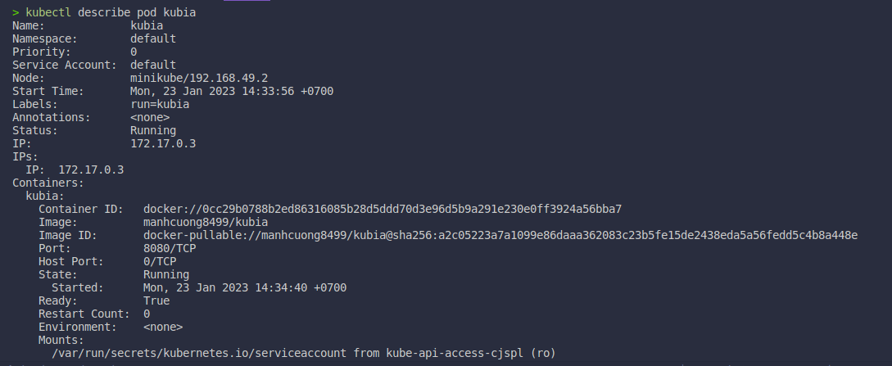

### 2.3.2. Accessing your web application
* Tell K8s expose the `kubia` app to the outside world by creating a service object:
  ```bash
  kubectl expose pod kubia --type=NodePort --name kubia-http
  ```
  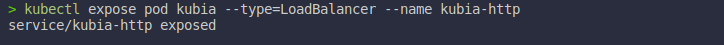

* Listing all services in the cluster:
  ```bash
  kubectl get services
  ```
  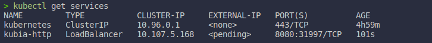

* Get IP-Address:
  ```bash
  minikube service kubia-http --url
  ```
  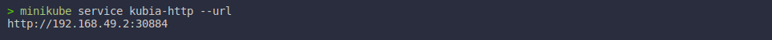

* Testing the app:
  ```bash
  curl http://192.168.49.2:30884
  ```
  

### 2.3.3. Horizontally scaling the application
* Create kubia service:
  ```bash
  kubectl create deployment kubia --image=manhcuong8499/kubia
  ```
  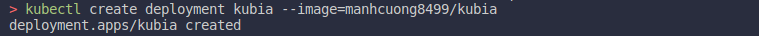

* Get replication controller:
  ```bash
  kubectl get replicasets
  ```
  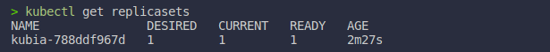
  * The `DISIRED` column shows the number of replicas that we want to have.

* To scale up the number of replicas of your pod, you need to change the desired replica count on the replication controller:
  ```bash
  kubectl scale deployment kubia --replicas=3
  ```
  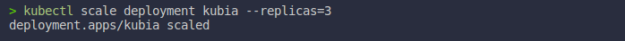

* Verify the number of pods:
  ```bash
  kubectl get all
  ```
  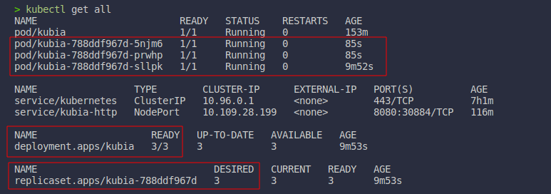

* Get the IP-Address of the service:
  ```bash
  minikube service -p multinode-demo --all
  ```
  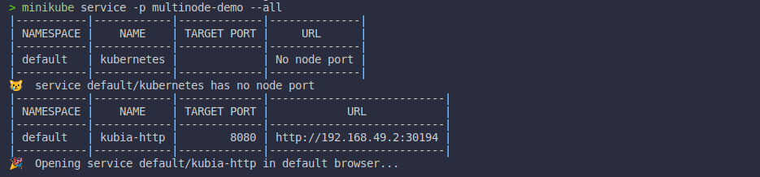

* Testing:
  ```bash
  curl <url>
  ```
  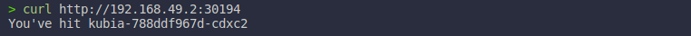

# Chapter 3. Pods: running containers in K8s
## 3.1. Creating pods from YAML or JSON descriptors
### 3.1.1. Examining a YAML descriptor of an existing pod
* Three important sections are found in almost all K8s resources:
  * `metadata`: Includes the name, namespace, labels, and other information about the pod.
  * `spec`: Contains the actual description of the pod's contents, such as the pod's containers, volumes, and other data.
  * `status`: Contains the current information about the running pod, such as what condition the pod is in, the description and status of each container, and the pod's internal IP and other basic info.

### 3.1.2. Creating a simple YAML descriptor for a pod
* When you implement a descriptor, you can use the `kubectl explain` command to get more information about the fields that you can use in the descriptor:
  ```bash
  kubectl explain pod.spec
  kubectl explain pods
  ```
### 3.1.3. Using `kubectl create` to create the pod
* To create the pod from your YAML file:
  ```bash
  kubectl create -f resources/me/chap03/kubia-manual.yaml
  ```
  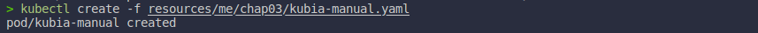

* Verity:
  ```bash
  kubectl get all
  ```
  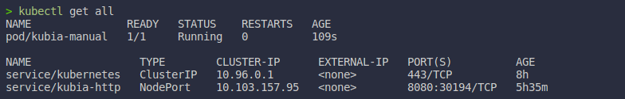

### 3.1.4. View application logs
* To view the logs of a container in a pod, use the `kubectl logs` command:
  ```bash
  kubectl logs kubia-manual
  ```
  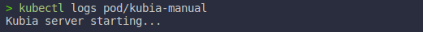

* If you have multiple pods running on the same app, use this command to view the logs of a specific container in a specific pod:
  ```bash
  kubectl logs kubia-manual -c kubia
  ```
  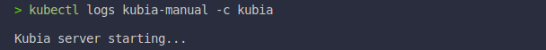

### 3.1.5. Sending requests to the pod
* To forward your machine's local port 8888 to port 8080 of your `kubia-manual` pod:
  ```bash
  kubectl port-forward kubia-manual 8888:8080
  ```
  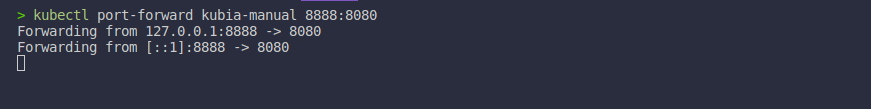
  * The port forwarder is running and you can connect to your pod through the local port.

* Try sending requests to the forwarded port:
  ```bash
  curl localhost:8888
  ```
  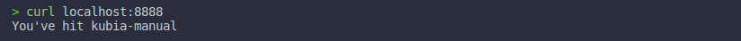

## 3.2. Organizing pods with labels
### 3.2.1. Specifying labels when creating a pod
* See the file [kubia-manual-with-labels.yaml](./resources/me/chap03/kubia-manual-with-labels.yaml) to understand. Now run this app.
  ```bash
  kubectl create -f resources/me/chap03/kubia-manual-with-labels.yaml
  ```
  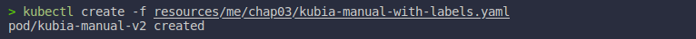

* List all available labels:
  ```bash
  kubectl get pods --show-labels
  ```
  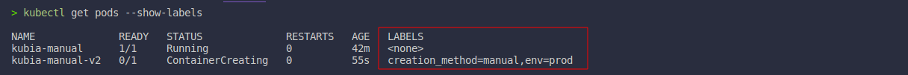

* List all pods with a specific label:
  ```bash
  kubectl get pods -l creation_method=manual --show-labels
  kubectl get pods -L creation_method,env --show-labels  # create a new column following the labels
  ```
  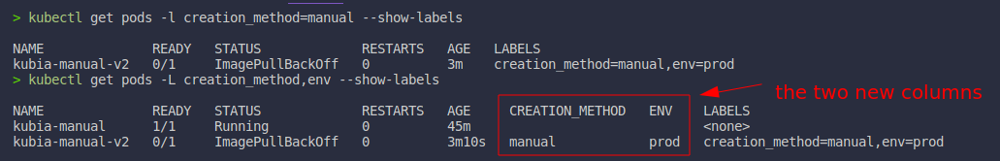

### 3.2.2. Modifying labels on existing pods
* Assign label `creation_method=manual` to the `kubia-manual` pod:
  ```bash
  kubectl label pod kubia-manual creation_method=manual
  kubectl get pods --show-labels
  ```
  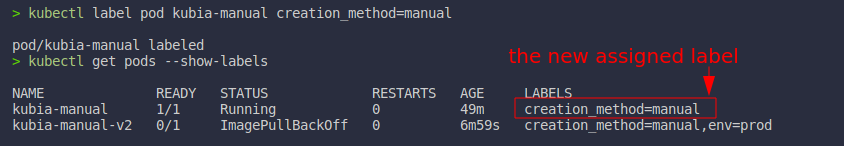

## 3.3. Listing subset of pods through labal selectors
* Get all the pods that `creation_method` equal to `manual`:
  ```bash
  kubectl get pods -l creation_method=manual --show-labels
  ```
  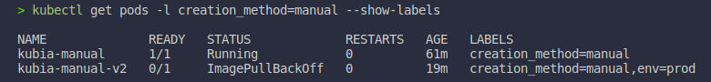

* List all pods that include the `env` label, whatever its value is:
  ```bash
  kubectl get pods -l env --show-labels
  ```
  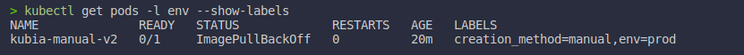

* And those that do not have the `env` label:
  ```bash
  kubectl get pods -l '!env' --show-labels
  ```
  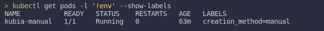

* Similarly, you could also match pods with the following label selectors:
  * `creation_method!=manual` to select pods with the `creation_method` label with any value other than `manual`.
  * `env in (prod,devel)` to selects pods with the `env` label set to either `prod` or `devel`.
  * `env notin (prod,devel)` to select pods with the `env` label set to any value other than `prod` or `devel`.

## 3.4. Using labels and selectors to constrain pod scheduling
* Use can use the field `nodeSelector` to specify the nodes you want to deploy your pods.

## 3.5. Anootating pods
* Annotation helps you to add more metadata to your pods, such as company name, version, bla bla bla.
  ```bash
  kubectl annotate pod kubia-manual mycompany.com/someannotation="foo bar"
  kubectl describe pod kubia-manual
  ```
  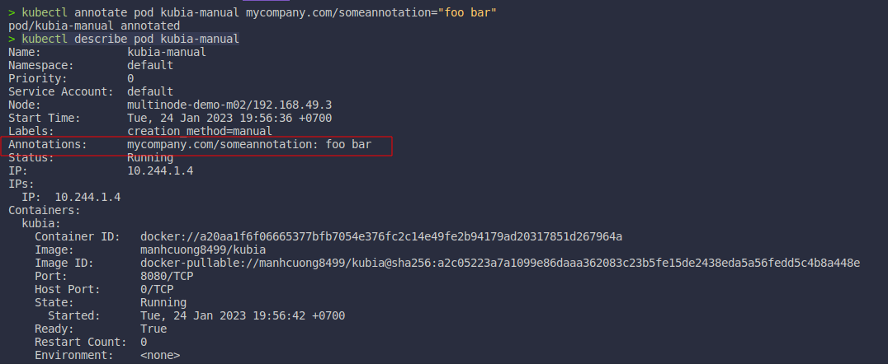

## 3.6. Using namespaces to group resources
* Get all current namespaces:
  ```bash
  kubectl get ns
  ```
  

* Get all pods of namespace `kube-system`:
  ```bash
  kubectl get pods --namespace kube-system
  ```
  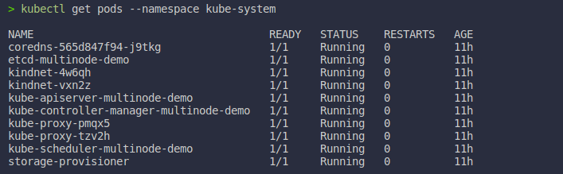

### 3.6.1. Creating a namespace
* Creating a namespace from YAML file:
  ```bash
  kubectl create -f resources/me/chap03/custom-namespace.yaml
  kubectl get ns
  ```
  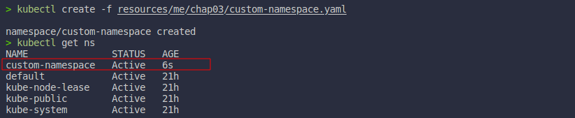

* Creating a namespace from command line:
  ```bash
  kubectl create namespace custom-namespace-2
  ```
  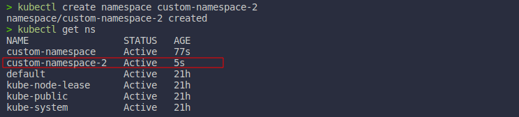

* To create resources in the namespace you have created, use the command:
  ```bash
  kubectl create -f resources/me/chap03/kubia-manual.yaml --namespace custom-namespace
  kubectl get all -n custom-namespace
  ```
  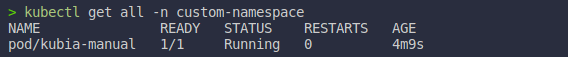

* To switch to different namespace, use the command:
  ```bash
  kubectl config set-context --current --namespace custom-namespace
  kubectl config view | grep namespace # get current namespace
  ```
  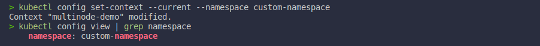

## 3.7. Stopping and removing pods
* Delete a pod by name
  ```bash
  kubectl delete pod kubia-manual
  ```

* Delete pods using label selectors
  ```bash
  kubectl delete pods -l creation_method=manual
  ```

* Delete pods by deleting the whole namespace
  ```bash
  kubectl delete ns custom-namespace
  ```

* Delete all pods in a namespace, while keeping the namespace
  ```bash
  kubectl delete pods --all
  ```

* Delete all resources in a namespace:
  ```bash
  kubectl delete all --all
  ```

# Chapter 4. Replication and other controllers: deploying managed pods
## 4.1. Keep pods healthy
### 4.1.1. Introducing liveness probes
* K8s can probe a container using one of the three mechanisms:
  * An **HTTP GET** probe performs an HTTP GET request on the container's IP address, a port and path you specify. If the probe receives a response, and the response code does not represent an error (in other words, if the HTTP response code is 2xx or 3xx), the probe is considered successful. If the server returns an error response code or if it does not respond at all, the probe is considered a failure and the container will be restarted as a result.
  * A **TCP socket** probe tries to open a TCP connection to the specified port of the container. If the connection is established successfully, the probe is successful. Otherwise, the container is restarted.
  * An **EXEC** probe executes an arbitrary command inside the container and checks the command's exit status code. If the status code is 0, the probe is successful. All other codes are considered failures.

### 4.1.2. Creating an HTTP-based liveness probe
* In `liveness` you need to specify the field `livenessProbe` in the `YAML` config file.
* Create `manhcuong8499/kubia-unhealthy` image:
  ```bash
  cd resources/me/chap04/kubia-unhealthy
  docker build -t kubia-unhealthy .
  docker tag kubia-unhealthy manhcuong8499/kubia-unhealthy
  docker push manhcuong8499/kubia-unhealthy
  ```
* Run our app:
  ```bash
  kubectl create -f resources/me/chap04/kubia-liveness-probe.yaml
  kubectl get pods kubia-liveness
  ```

* When you want to figure out why the previous container terminated, you can use the command:
  ```bash
  kubectl describe pod kubia-liveness
  ```
  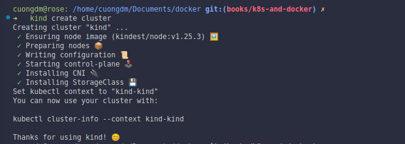

### 4.1.3. Configuring additional properties if the liveness probe.
* You can tell to K8s to wait a period of time before starting to probe the container, see the file and take a deep dive to field `initialDelaySeconds` of file [kubia-liveness-probe-initial-delay.yaml](./resources/me/chap04/kubia-liveness-probe-initial-delay.yaml)

## 4.2. Introducing ReplicationControllers
* A **ReplicationController** is a K8s resource that ensures its pods are **always kept running**.
* Look at the below image to find out how it works:
  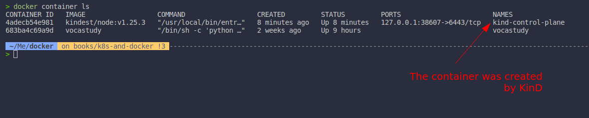

* A **ReplicationController**'s job is to make sure that an exact number of pods always matches its labels selector. It will work like the below image:
  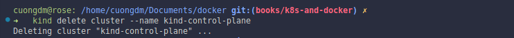

### 4.2.1. Understanding the three parts of a ReplicationController
* A **ReplicationController** has **three essential parts**:<br>
  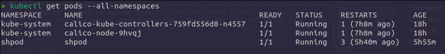<br>
  * A _label selector_, which determines what pods are in the **ReplicationController**'s scope.
  * A _replica count_, which specifies the desired number of pods that should be running.
  * A _pod template_, which is used when creating new pod replicas.

### 4.2.2. Creating a ReplicationController
* **Important**:
  * You need to specify the field `spec.replicas.selector.app` of ReplicationController and the field `metadata.labels.app` of pod template to be the same.
  * Or you just only specify the field `metadata.labels.app` of pod template and the field `spec.replicas.selector` will be automatically created by K8s.

* Create the app with [kubia-rc.yaml](./resources/me/chap04/kubia-rc.yaml) config file.
  ```bash
  kubectl create -f resources/me/chap04/kubia-rc.yaml
  kubectl get all --show-labels
  ```
  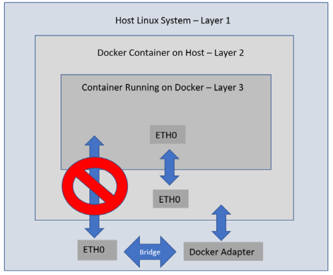

* For example, try to **delete one of the pods manually** to see how ReplicationController spins up a new one **immediately** to replace it, bringing the number of matching pods back to three.
  ```bash
  kubectl delete pod <pod_name>
  ```
  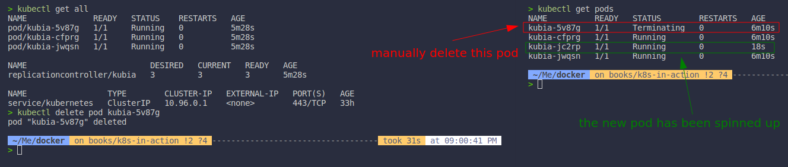

* Getting information about a **ReplicationController**.
  ```bash
  kubectl get rc
  ```
  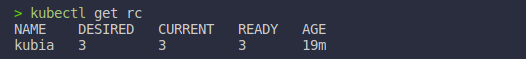

* Or `describe` a **ReplicationController**.
  ```bash
  kubectl describe rc kubia
  ```
  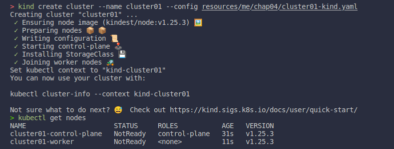

### 4.2.3. Moving pods in and out of the scope of a  **ReplicationController**
* Although a pod is not tied to a ReplicationController, the pod does reference it in the `metadata.ownerReferences` field., which you can use to easily find which ReplicationController a pod belongs to.
* So, if you change the label of a pod, it will be removed from the scope of the ReplicationController. So the ReplicationController will create a new pod to replace it.
  ```bash
  kubectl label pod <pod_name> <label_field>=<new_value> --overwrite
  kubectl get pods -L app
  ```
  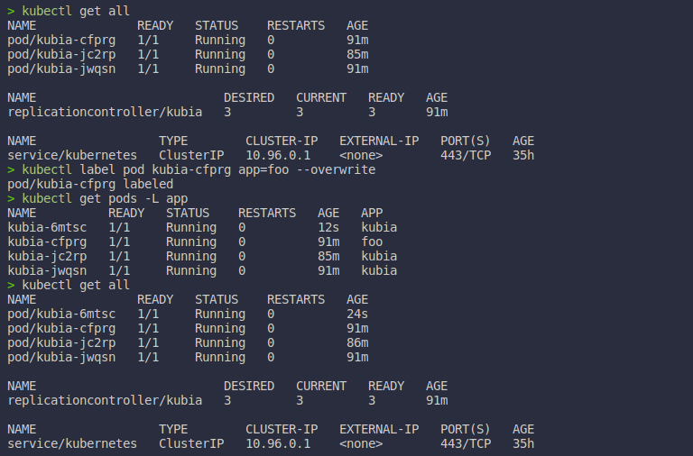
  * So in this case, the pod which not be referenced to will keep be running until you delete it manually.

* Edit a running ReplicationController by the below command:
  ```bash
  kubectl edit rc <replication_controller_name>
  ```
### 4.2.4. Horizontally scalling pods
* Scale the **ReplicationController of Kubia** app up to 10 replicas:
  ```bash
  kubectl scale rc kubia --replicas=10
  kubectl get pods -L app --show-labels
  ```
  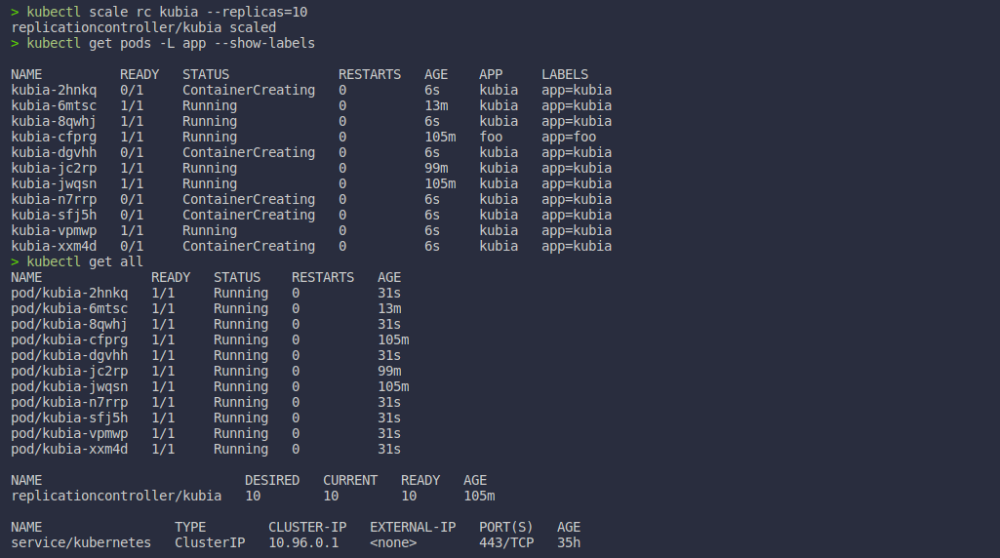

### 4.2.5. Deleting a ReplicationController
* When you delete a ReplicationController, all the pods it manages will be deleted as well.
  ```bash
  kubectl delete rc kubia
  kubectl get pods -L app --show-labels
  ```
  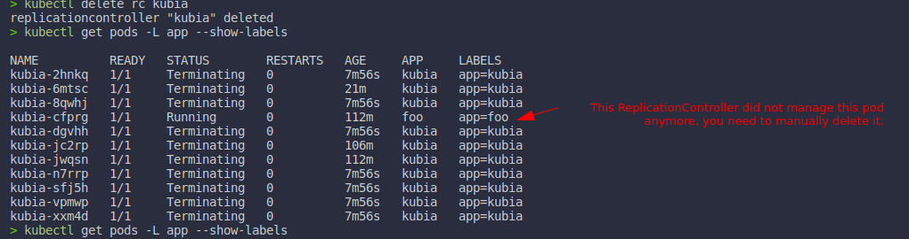

* But when you only want to delete the ReplicationController, and keep its managed pods alive, you the below command:
  ```bash
  kubectl delete rc kubia --cascade=false
  ```

## 4.3. Using ReplicaSets instead of ReplicationControllers
* Similar to **ReplicationController**, it is a new generation of **ReplicationController** and replaces the old one completely _(ReplicationController will eventually be deprecated)_.

### 4.3.1 Comparing a ReplicaSet to a ReplicationController
* A single ReplicationController can not match pods with the label `env=production` and those with the label `env=devel` at the same time. It can only match either pods with the `env=production` label or pods with the `env=devel` label. But a single ReplicaSet can match both sets of pods and treat them as a single group.

### 4.3.2. Defining a ReplicaSet
* Create a ReplicaSet with [kubia-replicaset.yaml](./resources/me/chap04/kubia-replicaset.yaml) config file.
  ```bash
  kubectl create -f resources/me/chap04/kubia-replicaset.yaml
  kubectl get all --show-labels
  ```
  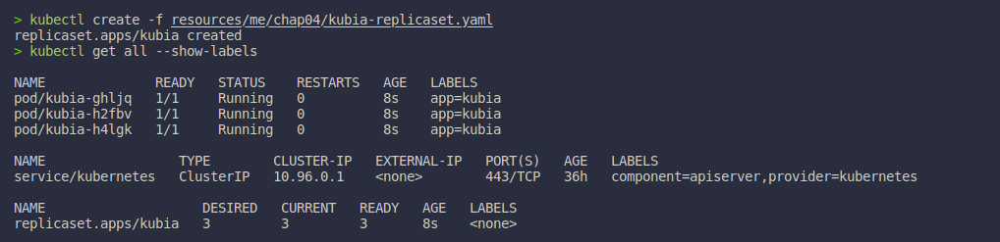
  