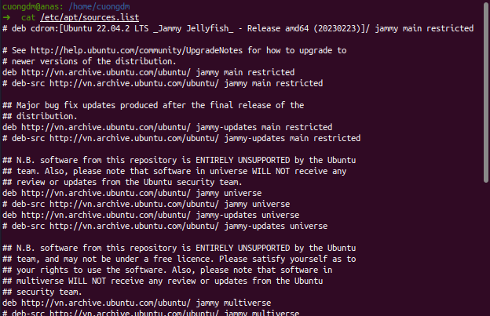
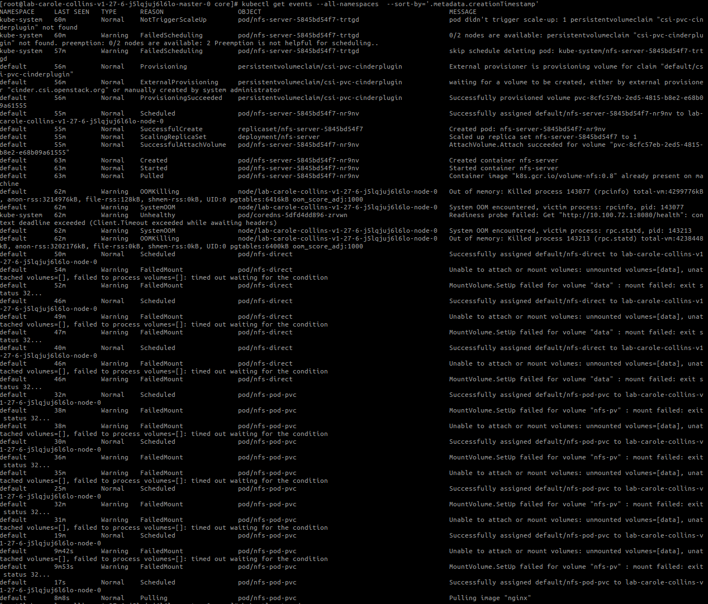
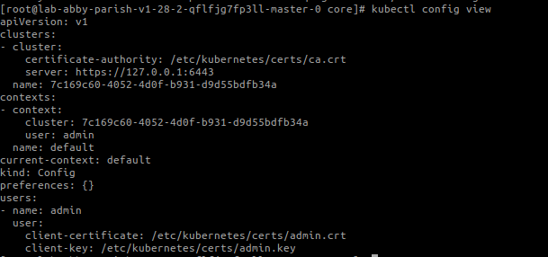
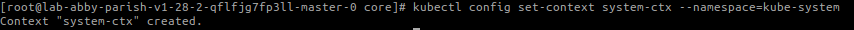

###### [_↩ Back to `main` branch_](https://github.com/cuongpiger/cloud)

# 🐳 Docker
|#|Command|Description|Note|Tag|
|-|-|-|-|-|
|1|`docker run --rm -v /var/run/docker.sock:/var/run/docker.sock:ro manhcuong8499/runlike:v1.0.0 <CONTAINER_ID>`|Get the `docker run` command from the `CONTAINER_ID`|||
|2|`docker restart $(docker ps -q)`|Restart all containers|||
|3|`podman system reset --force`|Restart the `podman` system||`podman`|
|4|`podman search --list-tags $IMAGE_NAME --limit 1000`|List all tags of image `$IMAGE_NAME`|`$IMAGE_NAME` is the name of image without specific tag, eg: `quay.io/cuongdm8499/fedora`|`podman`|

# Git
|#|Command|Description|Note|
|-|-|-|-|
|1|`git remote set-url origin https://<user_name>:<password/token>@github.com/cuongpiger/example.git`|Set up remote access to the repo||
|2|`git push -u https://<user_name>:<password_or_token>@github.com/username/repo_name.git <branch>`|Using authentication to push code||
|3|`eval $(ssh-agent -s) && ssh-add ~/.ssh/<YOUR_PRIVATE_KEY>`|Add exist keys||
|4|`git config --global credential.helper store`|Pull image without asking account/password||
|5|`git checkout -b branch_name $COMMIT_HASH`|Checkout a new branch from the `$COMMIT_HASH`||

# 🐧 Linux
|#|Command|Description|Note|Tag|
|-|-|-|-|-|
|1|`cat /etc/apt/sources.list`|Show the list of repositories. You can add more linux repositories here.|||
|2|`ssh-keygen -f "$HOME/.ssh/known_hosts" -R "<IPv4_ADDRESS>"`|Remove known hosts|||
|3|`curl ifconfig.me`|Get the public IP use to retrieve internet|||
|4|`openssl x509 -noout -enddate -in $CRT_PATH`|View the expiration date of a certificate in a CRT file.||`openssl`, `crt`|

# Kubernetes
|#|Command|Description|Note|
|-|-|-|-|
|1|`kubectl get events --all-namespaces  --sort-by='.metadata.creationTimestamp'`|Retrieves and displays events from all namespaces in a Kubernetes cluster, sorting them based on their creation timestamp in ascending order||
|2|`kubectl config view`|Get current configuration.||
|3|`kubectl config set-context <CONTEXT_NAME> --namespace=<YOUR_NAMESPACE>`|Set default namespace for current context.||
|4|`kubectl exec -it <POD_NAME> -c <CONTAINER_NAME> -- bash`|Get into a container in a pod.||

# Tools
|#|Command|Description|Note|Tag|
|-|-|-|-|-|
|1|`rm -rf $HOME/.config/JetBrains/<IDE_DIR>/.lock`|Fix bugs: `Cannot connect to already running IDE instance. Exception: Process <PROCESS_ID> is still running`|||
