* Course: [https://www.udemy.com/course/docker-mastery/](https://www.udemy.com/course/docker-mastery/)
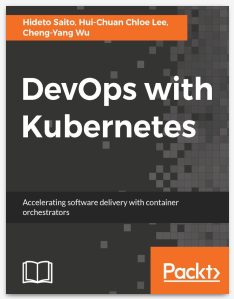
# Section 4. Creating and Using Containers like a Boss
## 1. Check Our Docker Install and Config
|Commands|Description|
|-|-|
|`docker version`|Check your versions and that docker is working.|
|`docker info`|Give some information, such as amount of containers is running, paused, or stopped,... amount of images|
|`docker`|Get the guidelines of commands, flags,... in docker|

### 1.1. Brief
* Check version of our docker CLI and engine.
* Create an **Nginx** (web server) container.
* Learn common container management commands.
* Learn Docker networking basics.

### 1.2. Notes
* There is two style to run commands in docker:
  * [old style] `docker <command> (options)`
  * [new style] `docker <command> <subcommand> (options)`

<hr>

## 2. Starting a Nginx Web Server
|Commands|Description|
|-|-|
|`docker container run --publish 80:80 nginx`|Run **Nginx** server on port **80** of host machine.|
|`docker container run --publish 8080:80 --detach nginx`|Run **Nginx** server on port **8080** of host machine in the background.|
|`docker container ls`|List all the running containers.|
|`docker container stop <container-id>`|Stop contaner which have ID `<container-id>`.|
|`docker container ls -a`|Get all the containers in host machine *(include of **running**, **stopped**, or **exited**)*.|
|`docker container run --publish 80:80 --detach --name webhost nginx`|Run **Nginx** server and named it `webhost` on port 80 of host machine.|
|`docker container logs webhost`|Show the logs of container `webhost`.|
|`docker container top webhost`|List all processes that are running inside container `webhost`.|
|`docker container --help`|Get all the **sub-commands** that docker support for the `command`, such as: `kill`, `logs`, etc...|
|`docker container rm <container-id 1> <container-id 2>`|Remove `<container-id 1>` and `<container-id 2>` out of the docker on host machine. **Note**: _you can not remove running containers_.|
|`docker container rm -f <container-id 1> <container-id 2>`|Remove `<container-id 1>` and `<container-id 2>` without regards to their status _(**running**, **stopped**, or **exited**)_ out of the docker on host machine|
### 2.1. Brief
* **Images** vs **Container**
* `run`/`stop`/`remove` containers.
* Check container logs and processes.

### 2.2. Notes
* **Important**: if using **Docker Toolbox**, type the IP Address `http://192.168.99.100`.
* Docker's default image **registry** is **Docker Hub** _[https://hub.docker.com](https://hub.docker.com)_.

<hr>

## 3. Debrief: What happens when we run a container
### 3.1. Notes:
* These steps will show you how a container is created and run.
  * Step 1: Looks for that image locally in image cache, does not find anything.
  * Step 2: Then looks in remote image repository _(Default to Docker Hub)_.
  * Step 3: Downloads the latest version of the image _(`nginx:latest vby defualt`)_.
  * Step 4: Creates new container based on that image and prepares to start.
  * Step 5: Gives it a virtual IP on a private network inside docker engine.
  * Step 6: Opens up port 80 on host and forwards to port 80 in container.
  * Step 7: Starts container by using the `CMD` in the image Dockerfile.

<hr>

## 4. Container VS. VM: It's just a process
|Commands|Description|
|-|-|
|`docker run --name mongo -d mongo`|Run mongo db in container and then named it `mongo` in docker.|
|`docker top mongo`|Get all the running processes inside container `mongo`.|
|`docker stop mongo`|Stop the container `mongo`|
|`ps aux`|Get all the running processes on your host machine.|
|`ps aux \| grep mongo`|Get all the running processes that contain keyword **mongo** in their name.|

### 4.1. Notes
* Containers are not **Mini VMs**.
  * They are just processes running on your host OS.
  * Limited to what resources they can access.
  * Exit when process stops.

* For example for these above concepts:
  * Run mongoDB inside docker container.
    ```bash
    docker run --name mongo -d mongo
    ```
  * Run `top` command to check processes that are running in container `mongo`.
    ```bash
    docker top mongo
    ```
    * We will see the column `PID`, `PID` is just the process ID of the specific process that is running inside container `mongo`.
      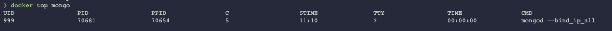

  * To stop the running container `mongo`, use the command:
    ```bash
    docker stop mongo
    ```
  * Run `ps aux` command to check processes that are running on your host machine.
    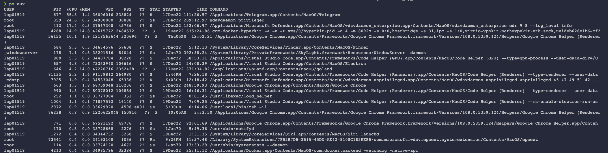
      
  * Use `ps aux | grep mongo` to get the process that contains `mongo` in its name.
    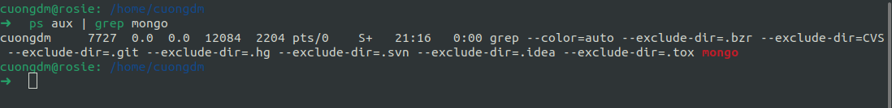

  * To start the stopped container `mongo`, use the command:
    ```bash
    docker start mongo
    ```

<hr>

## 5. Assignment: Manage Multiple Containers

|Commands|Description|
|-|-|
|`docker container run -d -p 3306:3306 --name db -e MYSQL_RANDOM_ROOT_PASSWORD=yes mysql`|Run **MySQL** service inside docker container|
|`docker container logs db 2>&1 | grep GENERATED`|Get generated password of container `db`.|
|`docker container run -d --name webserver -p 8080:80 httpd`|Run `httpd` as docker container.|
|`docker container run -d --name proxy -p 80:80 nginx`|Run `nginx` as container.|
### 5.1. Notes:
* Run a **Nginx** server on port **80:80**.
* Run a **MySQL** on port **3306:3306**.
* Run a **HTTPD** server on port **8080:80**.
* Run all of them with the **detached** mode.
* Run all of them with the **name** mode.
* When running mysql, use `--env` option (or `-e`) to pass `MYSQL_RANDOM_ROOT_PASSWORD=yes` to the container.

### 5.2. Answers:
* Run mysql container:
  ```bash
  docker container run -d -p 3306:3306 --name db -e MYSQL_RANDOM_ROOT_PASSWORD=yes mysql
  ```
* Use this command below to see the password of mysql:
  ```bash
  docker container logs db 2>&1 | grep GENERATED
  ```
  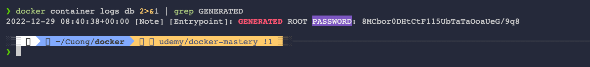
* Run `httpd` container as container.
  ```bash
  docker container run -d --name webserver -p 8080:80 httpd
  ```

* Run `nginx` as container.
  ```bash
  docker container run -d --name proxy -p 80:80 nginx
  ```

* Check all the above containers are running.
  ```bash
  docker container ls
  ```
  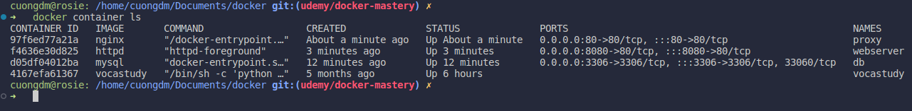

* Using `curl localhost` to check `nginx` is running.
  ```bash
  curl localhost
  ```
  
  
  ```bash
  curl localhost:8080
  ```
  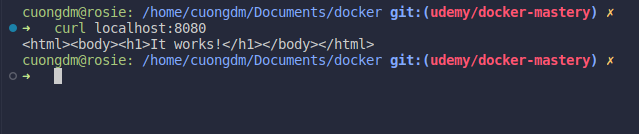

* Stop the all above running containers.
  ```bash
  docker container stop db webserver proxy
  ```
  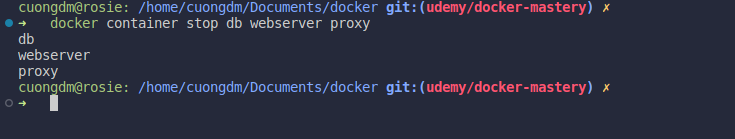

* And then remove them
  ```bash
  docker container rm db webserver proxy
  ```
  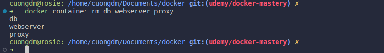

## 6. What's Going On in Containers: CLI process monitoring
|Commands|Description|
|-|-|
|`docker container top <container>`|Get all the process list in one container|
|`docker container inspect <container>`|Get details of one container configuration|
|`docker container stats [<container>]`|Get real-time performance stats of all/specific container(s)|

### 6.1. Notes:
* Run **Nginx** as container.
  ```bash
  docker container run -d --name nginx nginx
  ```

* Run **MySQL** as container.
  ```bash
  docker container run -d --name mysql -e MYSQL_RANDOM_ROOT_PASSWORD=yes mysql
  ```

* Get all the process list in container `mysql`.
  ```bash
  docker container top mysql
  ```
  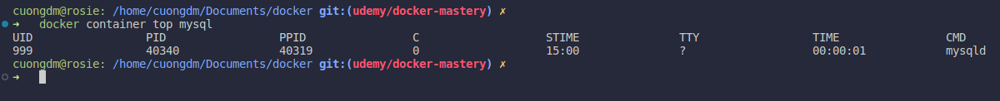

* Get details of container `mysql`.
  ```bash
  docker container inspect mysql
  ```
  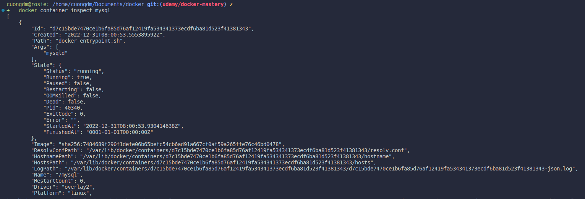

* Monitor the all containers.
  ```bash
  docker container stats
  ```
  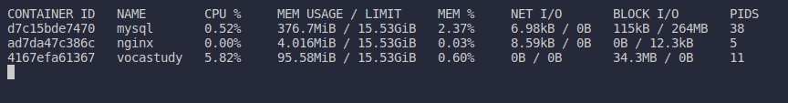

## 7. Getting a shell inside containers: No Need for SSH
|Commands|Description|
|-|-|
|`docker container run -it`|Start new container **interactively**|
|`docker container exec -it`|Run additional command in existing container|
|`docker container start -ai proxy`|Start again a stopped container and then open bash shell|

### 7.1. Notes:
* Run **Nginx** as container and then open **bash shell**.
  ```bash
  docker container run -it --name proxy nginx bash
  ```
  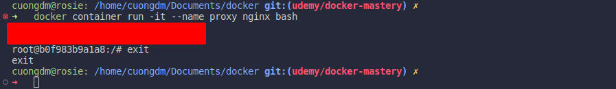

* To start again a stopped container and then open **bash shell**.
  ```bash
  docker container start -ai proxy
  ```
  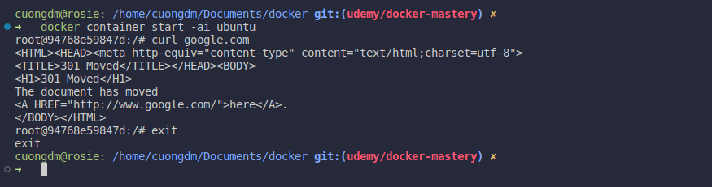

* To interact with shell of a running container, for example `mysql` container.
  ```bash
  docker container exec -it mysql bash
  ```
  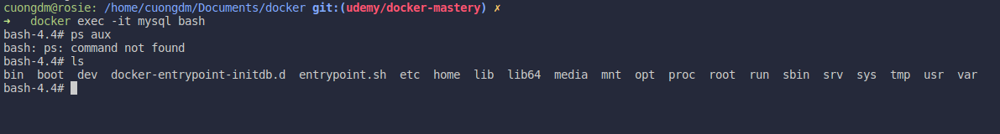

* Distribution of linux:
  * Alpine: very small, less than 5MB.

## 8. Docker Networks: Concepts for Privte and Public Comms in Containers
|Commands|Description|
|-|-|
|`docker container port webhost`|Get port of the container `webhost`|
|`docker container inspect --format '{{ .NetworkSettings.IPAddress }}' webhost`|Get the IPAddress of container `webhost`.|

### 8.1. Notes:
* Docker networks defaults:
  * Each container connected to a private virtual network **bridge**.
  * Each virtual network routes through NAT firewall on host IP.
  * All containers on a virtual network can talk to each other without `-p`.
  * Best practice is to create a new virtual network for each app:
    * Network `my_web_app` for **MySQL** and **PHP/Apache** containers.
    * Network `my_api` for **Mongo** and **NodeJS** containers.
  * "Batteries included, but removable"
    * Defaults work well in many, but easy to swap out parts to customize it.
  * Make new virtual networks.
  * Attach containers to more then one virtual network (or none).
  * Skip virtual networks and use **host IP** (--net=host).
  * Use different Docker networks driver to gain new abilities.
  * For local dev/testing, networks usually **"just work"**.

* Run `nginx` container.
  ```bash
  docker container run -p 80:80 --name webhost -d nginx
  ```

* Get the port of `nginx` container.
  ```bash
  docker container port webhost
  ```
  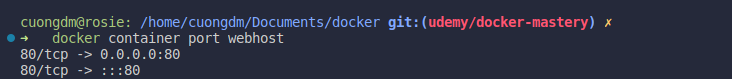

* Get the IP Address con container **webhost**.
  ```bash
  docker container inspect --format '{{ .NetworkSettings.IPAddress }}' webhost
  ```
  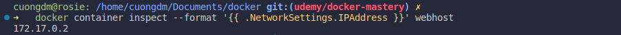

* How virtual networks work in containers
  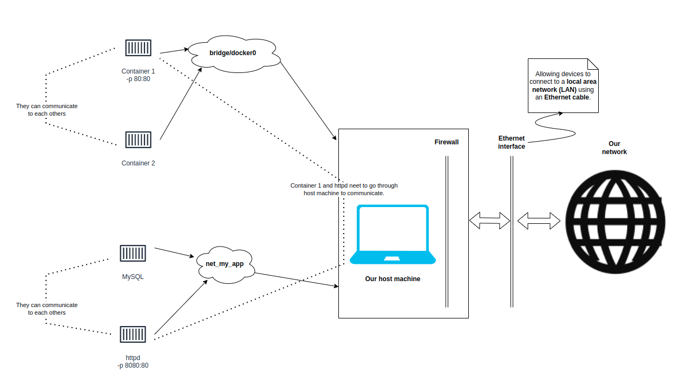