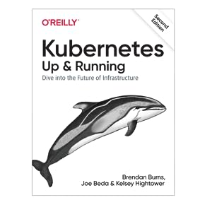

###### [_↩ Back to `main` branch_](https://github.com/cuongpiger/cloud)

###### 🌈 Table of Contents

- ##### [Chapter 2. Creating and running containers](./docs/chap02/README.md#chapter-2-creating-and-running-containers)
  - ##### 1. [Building application images with Docker](./docs/chap02/README.md#1-building-application-images-with-docker-1)
    - ##### 1.1. [Run simple NodeJs application](./docs/chap02/README.md#11-run-simple-nodejs-application-1)
    - ##### 1.2. [Multistage image builds](./docs/chap02/README.md#12-multistage-image-builds-1)
    - ##### 1.3. [Limit resource usage](./docs/chap02/README.md#13-limit-resource-usage-1)

- ##### [Chapter 3. Deploying a Kubernetes Cluster](./docs/chap03/README.md#chapter-3-deploying-a-kubernetes-cluster)
  - ##### 1. [Running Kubernetes in Docker](./docs/chap03/README.md#1-running-kubernetes-in-docker-1)
  - ##### 2. [Cluster Components](./docs/chap03/README.md#2-cluster-components-1)
    - ##### 2.1. [Kubernetes Proxy](./docs/chap03/README.md#21-kubernetes-proxy-1)
    - ##### 2.2. [Kubernetes DNS](./docs/chap03/README.md#22-kubernetes-dns-1)
    - ##### 2.3. [Kubernetes UI](./docs/chap03/README.md#23-kubernetes-ui-1)

- ##### [Chapter 4. Common `kubectl` commands](./docs/chap04/README.md#chapter-4-common-kubectl-commands)
  - ##### 1. [Namespaces](./docs/chap04/README.md#1-namespaces-1)
  - ##### 2. [Contexts](./docs/chap04/README.md#2-contexts-1)
  - ##### 3. [Creating, updating, and destroying K8s objects](./docs/chap04/README.md#3-creating-updating-and-destroying-k8s-objects-1)
- ##### Chapter 5. Pods
  - Learn about Pod manifest (`*.yaml` file).
  - Interact with Pods:
    - Creating a Pod using `kubectl run` command.
    - Creating a Pod from `*.yaml` file using `kubectl apply` command.
    - Listing pods in the cluster using `kubectl get` commands.
    - Get the detailed information about a Pod using `kubectl describe` command.
    - Deleting a Pod using `kubectl delete` command.
    - Forwarding a local port to a port in the Pod using `kubectl port-forward` command.
    - Get logs from a Pod using `kubectl logs` command.
    - Executing a command in a Pod using `kubectl exec (-it) [pod] -- ` command.
    - Copying files to and from a Pod using `kubectl cp` command.
  - Health checks:
    - Liveness probes.
    - Readiness probes.
  - Resource management:
    - Resource requests and limits using `*.yaml` file.
  - Persisting data with **Volumes**:
    - Using `hostPath` volume for persisting data.
    - Using `emptyDir` volume for ephemeral data.
    - Introducing the remote disk, such as `nfs` volume.

