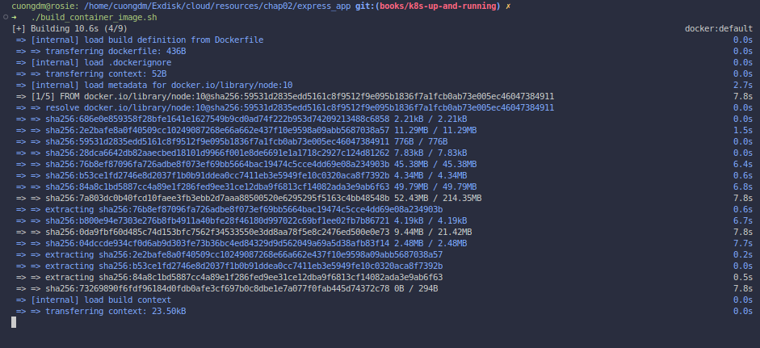
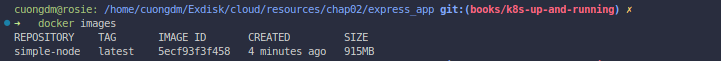

# Chapter 2. Creating and running containers

###### 🌈 Table of Contents
  - ##### 1. [Building application images with Docker](#1-building-application-images-with-docker-1)
    - ###### 1.1. [Run simple NodeJs application](#11-run-simple-nodejs-application-1)

# [1. Building application images with Docker](#1-building-application-images-with-docker)
## [1.1. Run simple NodeJs application](#11-run-simple-nodejs-application)
- **IMPORTANT**: Working directory [`express_app`](./../../resources/chap02/express_app/).
- This section teachs you how to build a simple NodeJs application and run it in a container.
- Following the below steps:
  - Step 1:
    - Build the image from the Dockerfile, run the command:
      ```bash
      # working directory: express_app
      ./build_container_image.sh
      ```
      

  - Step 2 (Optional):
    - Check the container image has been built successfully, run the command:
      ```bash=
      docker images
      ```
      
