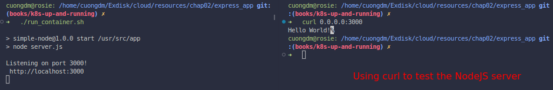
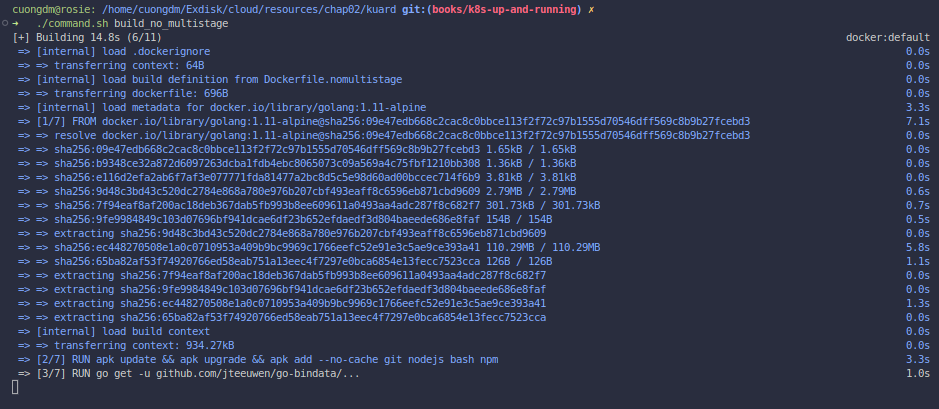
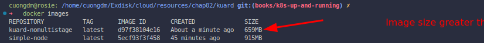
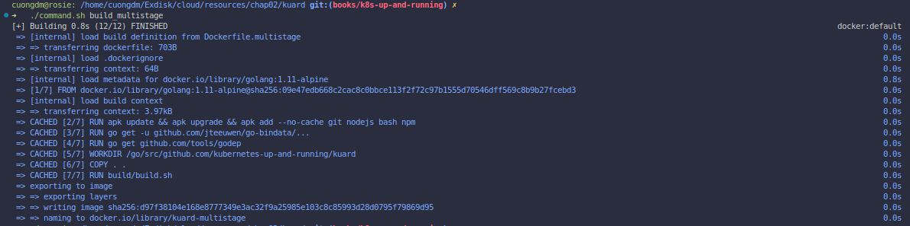
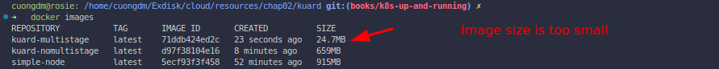
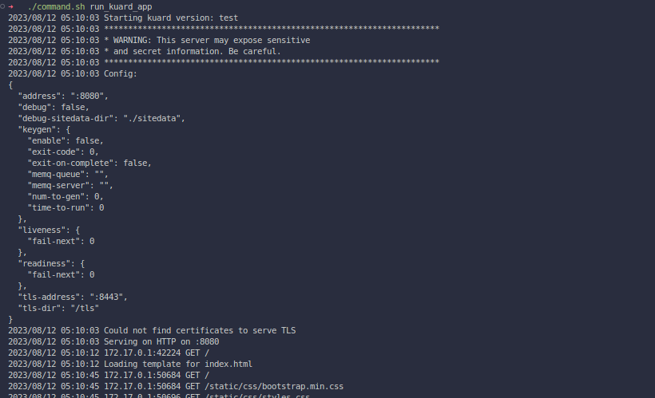
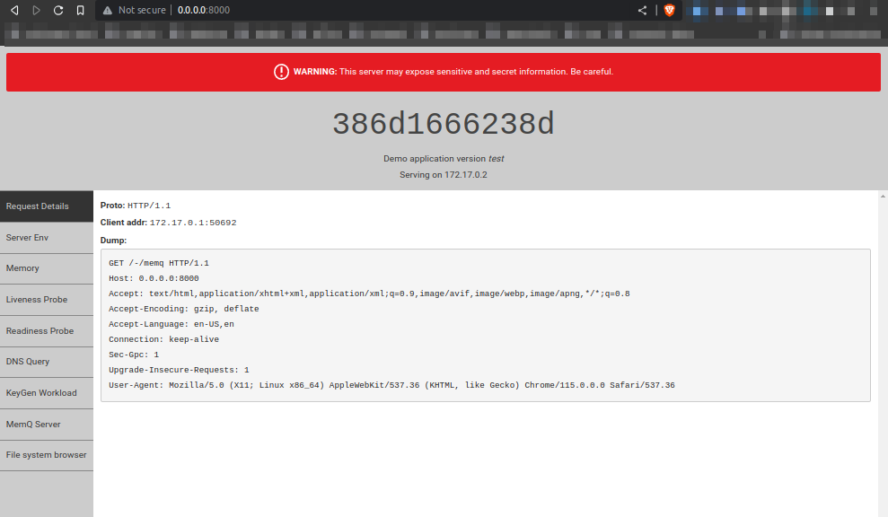
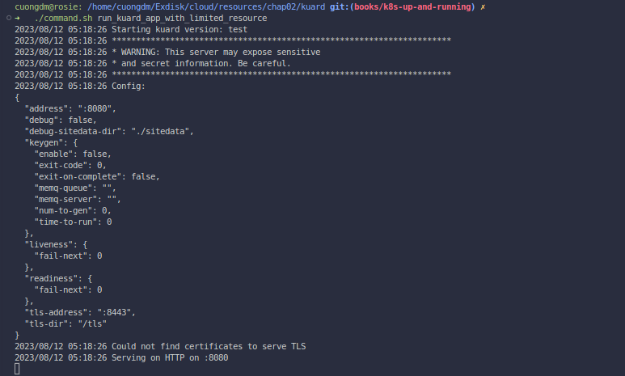

# Chapter 2. Creating and running containers

###### 🌈 Table of Contents
  - ##### 1. [Building application images with Docker](#1-building-application-images-with-docker-1)
    - ##### 1.1. [Run simple NodeJs application](#11-run-simple-nodejs-application-1)
    - ##### 1.2. [Multistage image builds](#12-multistage-image-builds-1)

# [1. Building application images with Docker](#1-building-application-images-with-docker)
## [1.1. Run simple NodeJs application](#11-run-simple-nodejs-application)
- **IMPORTANT**: Working directory [`express_app`](./../../resources/chap02/express_app/).
- This section teachs you how to build a simple NodeJs application and run it in a container.
- Following the below steps:
  - Step 1:
    - Build the image from the Dockerfile, run the command:
      ```bash
      # working directory: express_app
      ./build_container_image.sh
      ```
      

  - Step 2 (Optional):
    - Check the container image has been built successfully, run the command:
      ```bash
      # working directory: express_app
      docker images
      ```
      
  - Step 3:
    - Run the container, run the command:
      ```bash
      # working directory: express_app
      ./run_container.sh
      ```
    - Open a new terminal and run the below command to test NodeJS server:
      ```bash
      curl 0.0.0.0:3000
      ```
      

## [1.2. Multistage image builds](#12-multistage-image-builds)
- **IMPORTANT**: Working directory: [`kuard`](./../../resources/chap02/kuard/).
- This section teachs you how to build a simple Go application and run it in a container.
- Usually, the container image after the build will be pretty large, maybe more than 500MB. To solve this, Docker introduces **multistage builds** to reduce the size of images in production environments.
- With **multistage builds**, rather than producing a single image, a `Dockerfile` file can actually produce ***multiple images***. Each image is considered a **stage**.
- Firstly, let's build the image without multistage builds. I use the file [`Dockerfile.nomultistage`](./../../resources/chap02/kuard/Dockerfile.nomultistage), following the below steps:
  - Step 1:
    - Build the image
      ```bash
      # working directory: kuard
      ./command.sh build_no_multistage
      ```
      

  - Step 2 (Optional):
    - Verify the image has been built successfully, you can realize that the image `kuard-nomultistage` has the size greater than 500MB.
      ```bash
      docker images
      ```
      

- Now, let's build the image using **multistage builds**. I use the file [`Dockerfile.multistage`](./../../resources/chap02/kuard/Dockerfile.multistage), following these steps:
  - Step 1:
    - Build the image
      ```bash
      # working directory: kuard
      ./command.sh build_multistage
      ```
      

  - Step 2 (Optional):
    - Verify the image has been built successfully, you can realize that the image `kuard-multistage` has the size less than 100MB.
      ```bash
      docker images
      ```
      

- The file [`Dockerfile.multistage`](./../../resources/chap02/kuard/Dockerfile.multistage) has 2 stages:
  - Stage 1: Build the Go application
  - Stage 2: Copy the Go application from stage 1 and run it in a container, so the image size is pretty small.

- Let's run the `kuard` application:
  ```bash
  # working directory: kuard
  ./command.sh run_kuard_app
  ```
  
  

## 1.3. Limit resource usage
- To below command will run the `kuard` application with the limited resource usage of 200m RAM, 1GB memory-swap and 1024 cpu-shares:
  ```bash
  # working directory: kuard
  ./command.sh run_kuard_app_with_limited_resource
  ```
  
