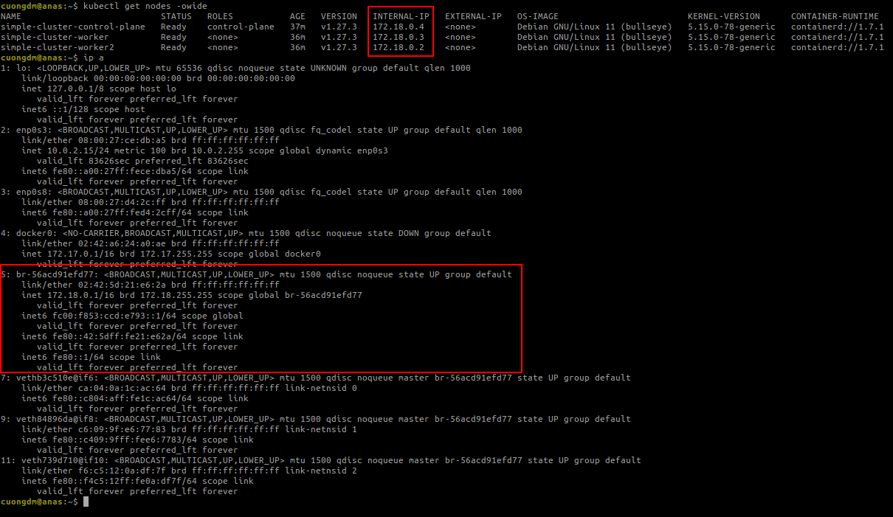
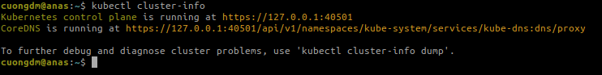
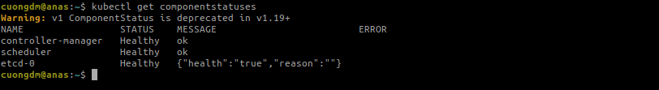
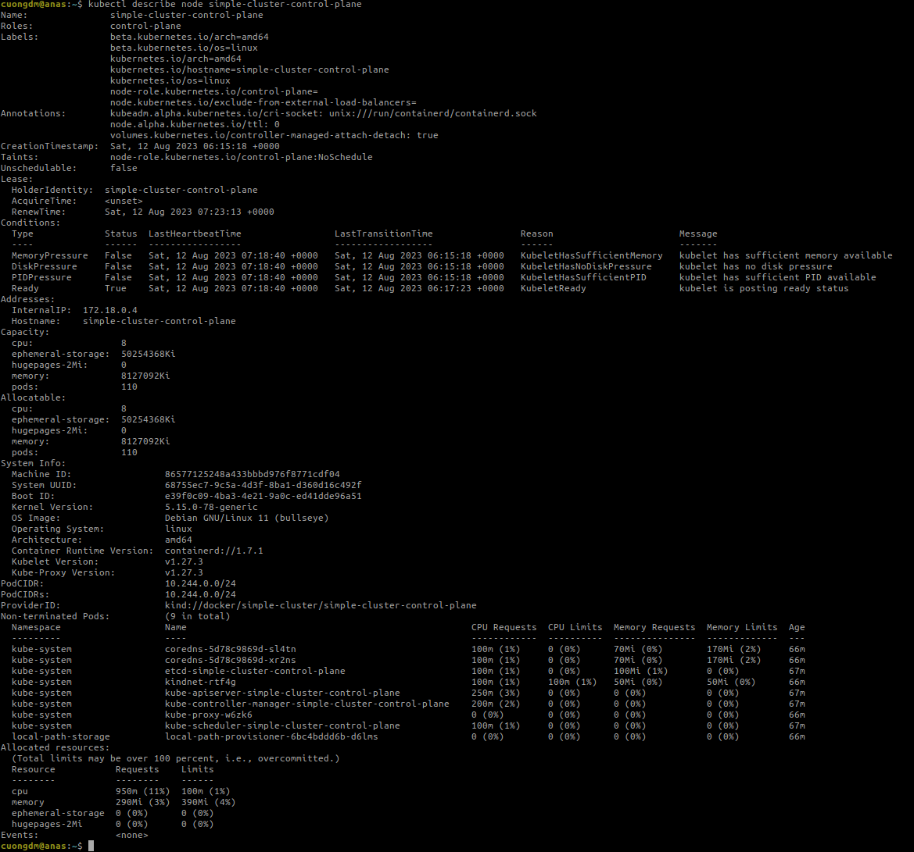

###### [_↩ Back to `homepage`_](./../../README.md)

# Chapter 3. Deploying a Kubernetes Cluster

###### 🌈 Table of Contents
  - ##### 1. [Running Kubernetes in Docker](#1-running-kubernetes-in-docker-1)
    - ##### 1.1. [Run simple NodeJs application](#11-run-simple-nodejs-application-1)
    - ##### 1.2. [Multistage image builds](#12-multistage-image-builds-1)
    - ##### 1.3. [Limit resource usage](#13-limit-resource-usage-1)

# [1. Running Kubernetes in Docker](#1-running-kubernetes-in-docker)
- Entire this section is performed in the VirtualBox VM.
- To create a local K8s cluster using KinD, following the below steps:
  - Step 1:
    - Run a VM with Ubuntu 22.04.3 LTS with VirtualBox.
  
  - Step 2:
    - Installing Docker using this shellscript [https://github.com/cuongpiger/warehouse/blob/main/ubuntu/shell_commands/11_install_docker.sh](https://github.com/cuongpiger/warehouse/blob/main/ubuntu/shell_commands/11_install_docker.sh).
    
  - Step 3:
    - Copy entire directory [`kind`](./../../resources/chap03/kind) to the VM and change directory to `kind`.

  - Step 4:
    - Run the following commands in turn.
      ```bash
      # working directory: kind
      ./command.sh install_kind
      ./command.sh install_kubectl
      ./command.sh create_simple_cluster <kind_config_path>
      ```
    - The `<kind_config_path>` is the path to the file [`kind-config.yaml`](./../../resources/chap03/kind/kind-config.yaml).

  - Step 5:
    - Get nodes in the cluster, run the command:
      ```bash

      ```
      

- Get `cluster-info`:
  ```bash=
  kubectl cluster-info
  ```
  

- Check cluster is generally healthy:
  ```bash=
  kubectl get componentstatuses
  ```
  

- Describe the cluster node:
  ```bash=
  kubectl describe node <node_name>
  ```
  
  