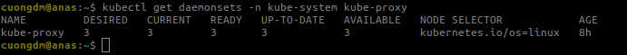
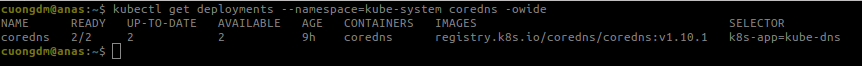
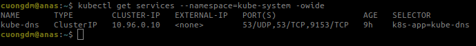
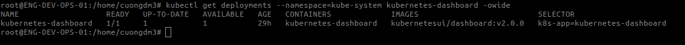
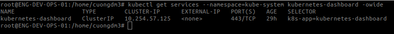

###### [_↩ Back to `homepage`_](./../../README.md)

# Chapter 3. Deploying a Kubernetes Cluster

###### 🌈 Table of Contents
  - ##### 1. [Running Kubernetes in Docker](#1-running-kubernetes-in-docker-1)
  - ##### 2. [Cluster Components](#2-cluster-components-1)
    - ##### 2.1. [Kubernetes Proxy](#21-kubernetes-proxy-1)
    - ##### 2.2. [Kubernetes DNS](#22-kubernetes-dns-1)
    - ##### 2.3. [Kubernetes UI](#23-kubernetes-ui-1)

# [1. Running Kubernetes in Docker](#1-running-kubernetes-in-docker)
- Entire this section is performed in the VirtualBox VM.
- To create a local K8s cluster using KinD, following the below steps:
  - Step 1:
    - Run a VM with Ubuntu 22.04.3 LTS with VirtualBox.
  
  - Step 2:
    - Installing Docker using this shellscript [https://github.com/cuongpiger/warehouse/blob/main/ubuntu/shell_commands/11_install_docker.sh](https://github.com/cuongpiger/warehouse/blob/main/ubuntu/shell_commands/11_install_docker.sh).
    
  - Step 3:
    - Copy entire directory [`kind`](./../../resources/chap03/kind) to the VM and change directory to `kind`.

  - Step 4:
    - Run the following commands in turn.
      ```bash
      # working directory: kind
      ./command.sh install_kind
      ./command.sh install_kubectl
      ./command.sh create_simple_cluster <kind_config_path>
      ```
    - The `<kind_config_path>` is the path to the file [`kind-config.yaml`](./../../resources/chap03/kind/kind-config.yaml).

  - Step 5:
    - Get nodes in the cluster, run the command:
      ```bash

      ```
      

- Get `cluster-info`:
  ```bash=
  kubectl cluster-info
  ```
  

- Check cluster is generally healthy:
  ```bash=
  kubectl get componentstatuses
  ```
  

- Describe the cluster node:
  ```bash=
  kubectl describe node <node_name>
  ```
  

# [2. Cluster Components](#2-cluster-components)
## [2.1. Kubernetes Proxy](#21-kubernetes-proxy)
- K8s proxy is responsible for routing network traffic to load-balanced services in the K8s cluster.
- The proxy must be present on **every node in the cluster**.
  ```bash
  kubectl get daemonsets -n kube-system kube-proxy
  ```
  

## [2.2. Kubernetes DNS](#21-kubernetes-proxy)
- K8s also runs a DNS server, which provides naming and discovery for the services that are defined in the cluster.
- This DNS server also runs as a replicated service on the cluster.
- Depending on the size of your cluster, you may have one or more replicas of the DNS service running.
- The DNS service is run as a K8s deployment, which manages these replicas.
  ```bash
  kubectl get deployments --namespace=kube-system coredns -owide
  ```
  
  ```bash
  kubectl get services --namespace=kube-system -owide
  ```
  

## [2.3. Kubernetes UI](#23-kubernetes-ui)
- K8s also provides a web-based UI for managing the cluster.
  ```bash
  kubectl get deployments --namespace=kube-system kubernetes-dashboard -owide
  ```
  
  ```bash
  kubectl get services --namespace=kube-system kubernetes-dashboard -owide
  ```
  