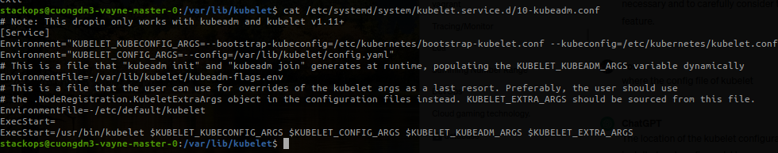

# `kubelet`
- The location of the kubelet configuration file varies depending on how Kubernetes was installed and configured. Here are some common locations where you might find the kubelet configuration file:
 
  - **Systemd Unit File**:
    - If Kubernetes was installed using a package manager or a tool like kubeadm, the kubelet configuration might be passed via systemd unit files. You can typically find these unit files under `/etc/systemd/system/` directory. The kubelet configuration parameters can be specified in the systemd unit file, often located at `/etc/systemd/system/kubelet.service.d/10-kubeadm.conf` or similar.

  - **Kubelet Configuration File**:
    - Sometimes, kubelet can be configured directly through a configuration file. The default location for this file is often `/etc/kubernetes/kubelet.conf`. However, this file might not exist if kubelet is being configured via systemd unit files or command-line flags.

  - **Environment Variables**:
    - Alternatively, kubelet configuration parameters can also be set via environment variables. These environment variables might be defined in systemd unit files or in scripts used to start kubelet.

  - **Command-Line Flags**:
    - Finally, kubelet configuration parameters can also be passed directly via command-line flags when starting the kubelet process. This is commonly done when kubelet is started by systemd unit files or other initialization scripts.

-To find the specific location and method used for configuring kubelet in your environment, you may need to inspect the systemd unit file(s) used to start kubelet, check the Kubernetes configuration directory (`/etc/kubernetes/`), or refer to the documentation or installation instructions provided by your Kubernetes distribution or installation method.
- Other configuration files can be:
  

# `kube-apiserver`
- Located at `/etc/kubernetes/manifests/kube-apiserver.yaml`