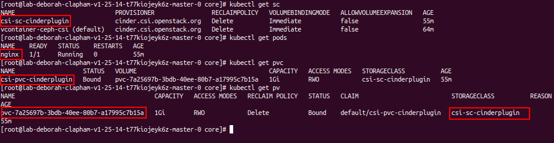

**NOTE**: This is a ***LAB*** document, it is NOT for production use.

# 1. Block
- The K8s manifest. This manifest will create a `StorageClass`, a `PersistentVolumeClaim` and a `Pod`, the `Pod` will mount the `PersistentVolumeClaim` as a volume.
- The values of `<PUT_VOLUME_TYPE_UUID_OR_NAME>` can be:
  - `vContainer-RWM-blockstorage`
  - `test`
  - `ceph`
  - `vol_type_common`

- File [block.yaml](./manifest/block/block.yaml).
  ```yaml
  apiVersion: storage.k8s.io/v1
  kind: StorageClass
  metadata:
    name: csi-sc-cinderplugin  # [1] The StorageClass name, CAN be changed
  provisioner: cinder.csi.openstack.org
  parameters:
    type: <PUT_VOLUME_TYPE_UUID_OR_NAME>  # Change it to your volume type UUID or name

  ---
  apiVersion: v1
  kind: PersistentVolumeClaim
  metadata:
    name: csi-pvc-cinderplugin  # [2] The PVC name, CAN be changed
  spec:
    accessModes:
    - ReadWriteOnce  # MUST set this value, currently only support RWO
    resources:
      requests:
        storage: 1Gi  # [3] The PVC size, CAN be changed
    storageClassName: csi-sc-cinderplugin  # MUST be same value with [1]

  ---
  apiVersion: v1
  kind: Pod
  metadata:
    name: nginx
  spec:
    containers:
    - image: nginx
      imagePullPolicy: Always
      name: nginx
      ports:
      - containerPort: 80
        protocol: TCP
      volumeMounts:
        - mountPath: /var/lib/www/html  # The mount path in container, CAN be changed
          name: csi-data-cinderplugin  # MUST be same value with [4]
    volumes:
    - name: csi-data-cinderplugin  # [4] The volume mount name, CAN be changed
      persistentVolumeClaim:
        claimName: csi-pvc-cinderplugin  # MUST be same value with [2]
        readOnly: false
  ```
- Logs of controller node.
  ```bash
  I1031 04:26:30.758150       1 utils.go:88] [ID:36] GRPC call: /csi.v1.Controller/CreateVolume
  I1031 04:26:30.758201       1 utils.go:89] [ID:36] GRPC request: {"accessibility_requirements":{"preferred":[{"segments":{"topology.cinder.csi.openstack.org/zone":"nova"}}],"requisite":[{"segments":{"topology.cinder.csi.openstack.org/zone":"nova"}}]},"capacity_range":{"required_bytes":1073741824},"name":"pvc-7a25697b-3bdb-40ee-80b7-a17995c7b15a","parameters":{"csi.storage.k8s.io/pv/name":"pvc-7a25697b-3bdb-40ee-80b7-a17995c7b15a","csi.storage.k8s.io/pvc/name":"csi-pvc-cinderplugin","csi.storage.k8s.io/pvc/namespace":"default","type":"7816bad1-7f5b-4400-b2fd-b6334dc32d4b"},"volume_capabilities":[{"AccessType":{"Mount":{"fs_type":"ext4"}},"access_mode":{"mode":1}}]}
  I1031 04:26:30.758704       1 controllerserver.go:49] CreateVolume: called with args {"accessibility_requirements":{"preferred":[{"segments":{"topology.cinder.csi.openstack.org/zone":"nova"}}],"requisite":[{"segments":{"topology.cinder.csi.openstack.org/zone":"nova"}}]},"capacity_range":{"required_bytes":1073741824},"name":"pvc-7a25697b-3bdb-40ee-80b7-a17995c7b15a","parameters":{"csi.storage.k8s.io/pv/name":"pvc-7a25697b-3bdb-40ee-80b7-a17995c7b15a","csi.storage.k8s.io/pvc/name":"csi-pvc-cinderplugin","csi.storage.k8s.io/pvc/namespace":"default","type":"7816bad1-7f5b-4400-b2fd-b6334dc32d4b"},"volume_capabilities":[{"AccessType":{"Mount":{"fs_type":"ext4"}},"access_mode":{"mode":1}}]}
  I1031 04:26:31.465832       1 controllerserver.go:150] CreateVolume: Successfully created volume 23698f4e-3558-4efe-9a74-440f7fc7cd74 in Availability Zone: nova of size 1 GiB
  I1031 04:26:31.465937       1 utils.go:94] [ID:36] GRPC response: {"volume":{"accessible_topology":[{"segments":{"topology.cinder.csi.openstack.org/zone":"nova"}}],"capacity_bytes":1073741824,"volume_id":"23698f4e-3558-4efe-9a74-440f7fc7cd74"}}
  ```

- Expected output:
  