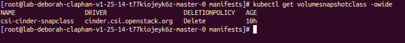
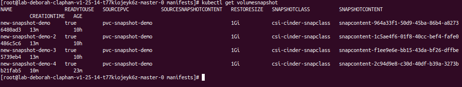
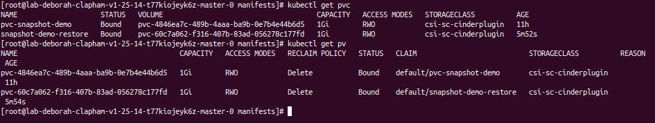

###### [↩ Back to `README`](./../README.md)

# 5. Snapshot
## 5.1. Setup
- Snapshot allows you to create a point-in-time copy of a volume.
- It will create a snapshot of the volume in the OpenStack Cinder.
  
- I am currently using the snapshot version 4.2, the documentation can be found [here](https://github.com/kubernetes-csi/external-snapshotter/tree/release-4.2#usage).
- To use snapshot, you need to perform the following steps:
  - Apply the CRDs for snapshot, including of `VolumeSnapshotClass`, `VolumeSnapshotContent` and `VolumeSnapshot`, the manifest can be found here [volume_snapshot_class.yaml](./../manifest/snapshot/volume_snapshot_class.yaml), [volume_snapshot_content.yaml](./../manifest/snapshot/volume_snapshot_content.yaml), [volume_snapshot.yaml](./../manifest/snapshot/volume_snapshot.yaml).
    ```bash
    kubectl apply -f volume_snapshot_class.yaml  # apply the CRD for VolumeSnapshotClass
    kubectl apply -f volume_snapshot_content.yaml  # apply the CRD for VolumeSnapshotContent
    kubectl apply -f volume_snapshot.yaml  # apply the CRD for VolumeSnapshot
    ```
  - Create the snapshot controller, the manifest can be found here [snapshot_controller.yaml](./../manifest/snapshot/snapshot_controller.yaml)
    ```bash
    kubeclt apply -f snapshot_controller.yaml  # apply the snapshot controller
    ```
  
  - Reapply the manifest `cinder-csi.yaml` file _(depends on your cloud provider)_:
    ```bash
    kubectl apply -f cinder-csi.yaml
    ```

## 5.2. Create a `VolumeSnapshot`
- Now, you can create a snapshot by using file [snapshot.yaml](./../manifest/snapshot/snapshot.yaml):
  ```bash
  kubectl apply -f snapshot.yaml
  ```

- This is the content of [snapshot.yaml](./../manifest/snapshot/snapshot.yaml):
  ```yaml
  apiVersion: storage.k8s.io/v1
  kind: StorageClass
  metadata:
    name: csi-sc-cinderplugin  # [1] The name of the storage class, CAN be changed
  provisioner: cinder.csi.openstack.org
  ---

  apiVersion: snapshot.storage.k8s.io/v1
  kind: VolumeSnapshotClass
  metadata:
    name: csi-cinder-snapclass  # [2] The name of the volume snapshot class, CAN be changed
  driver: cinder.csi.openstack.org
  deletionPolicy: Delete
  parameters:
    force-create: "false"
  ---

  apiVersion: v1
  kind: PersistentVolumeClaim
  metadata:
    name: pvc-snapshot-demo  # [3] The name of the PVC, CAN be changed
  spec:
    accessModes:
    - ReadWriteOnce
    resources:
      requests:
        storage: 1Gi
    storageClassName: csi-sc-cinderplugin  # MUST match with [1]
  ---

  apiVersion: snapshot.storage.k8s.io/v1
  kind: VolumeSnapshot
  metadata:
    name: new-snapshot-demo-4  # [4] The name of the snapshot, CAN be changed
  spec:
    volumeSnapshotClassName: csi-cinder-snapclass  # MUST match with [2]
    source:
      persistentVolumeClaimName: pvc-snapshot-demo  # MUST match with [3]
  ``` 

- If your actions are performed successfully, you will see your snapshot in the OpenStack Cinder:
- Now, because of `VolumeSnapshot` and its related resources are Kubernetes CRDs, so to:
  - List `VolumeSnapshotClass`, execute:
    ```bash
    kubectl get volumesnapshotclass
    ```
    
  - List `VolumeSnapshotContent`, execute:
    ```bash
    kubectl get volumesnapshotcontent
    ```
    
  - And list `VolumeSnapshot`, execute:
    ```bash
    kubectl get volumesnapshot
    ```
    


- The logs of the **controller server**:
  ```bash
  I1106 01:37:57.146346       1 utils.go:88] [ID:23] GRPC call: /csi.v1.Controller/CreateSnapshot
  I1106 01:37:57.146372       1 utils.go:89] [ID:23] GRPC request: {"name":"snapshot-2c94d9e8-c30d-40df-b39a-3273bb21fab5","parameters":{"csi.storage.k8s.io/volumesnapshot/name":"new-snapshot-demo-4","csi.storage.k8s.io/volumesnapshot/namespace":"default","csi.storage.k8s.io/volumesnapshotcontent/name":"snapcontent-2c94d9e8-c30d-40df-b39a-3273bb21fab5","force-create":"false"},"source_volume_id":"8766d416-72c5-4732-a717-72d9c2d05e70"}
  I1106 01:37:57.146507       1 controllerserver.go:327] CreateSnapshot: called with args {"name":"snapshot-2c94d9e8-c30d-40df-b39a-3273bb21fab5","parameters":{"csi.storage.k8s.io/volumesnapshot/name":"new-snapshot-demo-4","csi.storage.k8s.io/volumesnapshot/namespace":"default","csi.storage.k8s.io/volumesnapshotcontent/name":"snapcontent-2c94d9e8-c30d-40df-b39a-3273bb21fab5","force-create":"false"},"source_volume_id":"8766d416-72c5-4732-a717-72d9c2d05e70"}
  I1106 01:37:57.581668       1 controllerserver.go:381] CreateSnapshot snapshot-2c94d9e8-c30d-40df-b39a-3273bb21fab5 on 8766d416-72c5-4732-a717-72d9c2d05e70
  I1106 01:37:58.719137       1 utils.go:94] [ID:23] GRPC response: {"snapshot":{"creation_time":{"nanos":75511000,"seconds":1699235471},"ready_to_use":true,"size_bytes":1073741824,"snapshot_id":"80261d7b-f513-43a4-bd95-e5e07e7c5a71","source_volume_id":"8766d416-72c5-4732-a717-72d9c2d05e70"}}
  ```

## 5.3. Restore volume from snapshot
- To restore `PersistentVolumeClaim` from the `VolumeSnapshot`, use the file [snapsot_restore.yaml](./../manifest/snapshot/snapsot_restore.yaml).
- The content of file is:
  ```yaml
  apiVersion: v1
  kind: PersistentVolumeClaim
  metadata:
    name: snapshot-demo-restore  # The name of the PVC, CAN be changed
  spec:
    storageClassName: csi-sc-cinderplugin  # MUST match with [1] from the section 5.2
    dataSource:
      name: new-snapshot-demo-4 # MUST match with [4] from the section 5.2
      kind: VolumeSnapshot
      apiGroup: snapshot.storage.k8s.io
    accessModes:
      - ReadWriteOnce
    resources:
      requests:
        storage: 1Gi
  ```
- When you list `PersistentVolumeClaim`, you can also see the one that has been created:
  

- The logs from the **controller server**:
  ```bash
  I1106 02:30:10.337800       1 utils.go:88] [ID:129] GRPC call: /csi.v1.Controller/CreateVolume
  I1106 02:30:10.337863       1 utils.go:89] [ID:129] GRPC request: {"accessibility_requirements":{"preferred":[{"segments":{"topology.cinder.csi.openstack.org/zone":"nova"}}],"requisite":[{"segments":{"topology.cinder.csi.openstack.org/zone":"nova"}}]},"capacity_range":{"required_bytes":1073741824},"name":"pvc-60c7a062-f316-407b-83ad-056278c177fd","parameters":{"csi.storage.k8s.io/pv/name":"pvc-60c7a062-f316-407b-83ad-056278c177fd","csi.storage.k8s.io/pvc/name":"snapshot-demo-restore","csi.storage.k8s.io/pvc/namespace":"default"},"volume_capabilities":[{"AccessType":{"Mount":{"fs_type":"ext4"}},"access_mode":{"mode":1}}],"volume_content_source":{"Type":{"Snapshot":{"snapshot_id":"80261d7b-f513-43a4-bd95-e5e07e7c5a71"}}}}
  I1106 02:30:10.338730       1 controllerserver.go:49] CreateVolume: called with args {"accessibility_requirements":{"preferred":[{"segments":{"topology.cinder.csi.openstack.org/zone":"nova"}}],"requisite":[{"segments":{"topology.cinder.csi.openstack.org/zone":"nova"}}]},"capacity_range":{"required_bytes":1073741824},"name":"pvc-60c7a062-f316-407b-83ad-056278c177fd","parameters":{"csi.storage.k8s.io/pv/name":"pvc-60c7a062-f316-407b-83ad-056278c177fd","csi.storage.k8s.io/pvc/name":"snapshot-demo-restore","csi.storage.k8s.io/pvc/namespace":"default"},"volume_capabilities":[{"AccessType":{"Mount":{"fs_type":"ext4"}},"access_mode":{"mode":1}}],"volume_content_source":{"Type":{"Snapshot":{"snapshot_id":"80261d7b-f513-43a4-bd95-e5e07e7c5a71"}}}}
  I1106 02:30:11.410087       1 controllerserver.go:150] CreateVolume: Successfully created volume 4cd004de-8640-445b-b6e2-91b8d52ef1ef in Availability Zone: nova of size 1 GiB
  I1106 02:30:11.410162       1 utils.go:94] [ID:129] GRPC response: {"volume":{"accessible_topology":[{"segments":{"topology.cinder.csi.openstack.org/zone":"nova"}}],"capacity_bytes":1073741824,"content_source":{"Type":{"Snapshot":{"snapshot_id":"80261d7b-f513-43a4-bd95-e5e07e7c5a71"}}},"volume_id":"4cd004de-8640-445b-b6e2-91b8d52ef1ef"}}
  ```