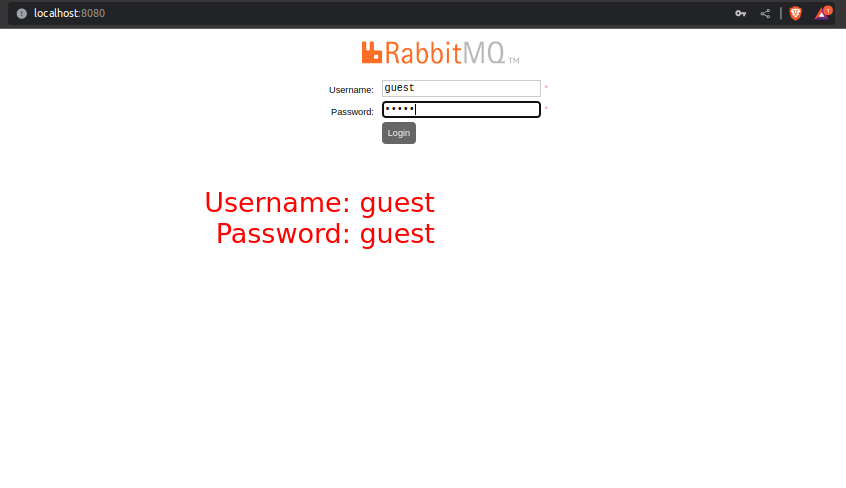
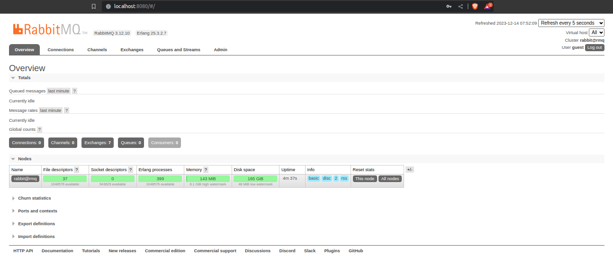
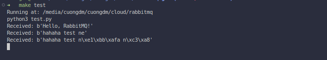
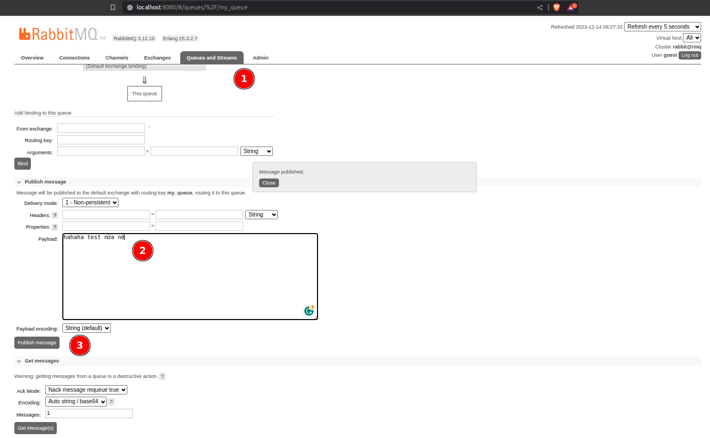

- Run the following command to start the RabbitMQ server:
  ```bash
  make up
  ```
  > ```bash
  > ➜   make up  
  > Running at: /media/cuongdm/cuongdm/cloud/rabbitmq
  > docker compose up -d
  > [+] Running 1/0
  >  ✔ Container rabbit-server  Running  
  > ```
- Access the RabbitMQ management console at [http://localhost:8080](http://localhost:8080) with the default credentials:
  - Username: `guest`
  - Password: `guest`
  
  

- Run the following command to stop the RabbitMQ server:
  ```bash
  make down
  ```
  > ```bash
  > ➜   make down
  > Running at: /media/cuongdm/cuongdm/cloud/rabbitmq
  > Shutdown the services is in process...
  > docker compose down
  > [+] Running 2/2
  >  ✔ Container rabbit-server   Removed                                                                                                                                                                                                                                           6.5s 
  >  ✔ Network rabbitmq_default  Removed                                                                                                                                                                                                                                           0.4s 
  > Completed
  > ```

- Run `make test` to test the RabbitMQ server:
  

- Using the dashboard to test publish messages.
  