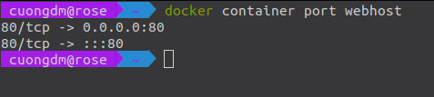
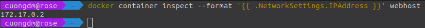
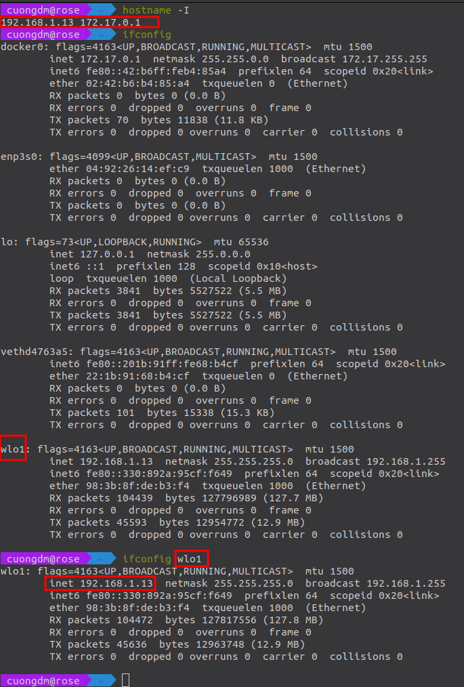

* `docker info` to list the configurations of your docker.
* `docker` to list the commands of docker.

# 1. Run nginx container
* `docker container run --publish 80:80 nginx`
* `docker container run --publish 80:80 --detach nginx`
* `docker container ls`
* `docker container stop <container id>`
* `docker container ls -a`
* `docker container run --publish 80:80 --detach --name webhost nginx`
* `docker container logs <container id|container name>`
* `docker container top <container id|container name>` (use to check the processes running inside the container)
* `docker container --help` (to list the commands of docker container)
* `docker container rm <container id|container name>` (to remove the container)
* `docker container rm -f <container id|container name>` (to remove the container forcefully without stopping it)

# 2. Run **MongoDB** inside docker container
```bash
docker run --name mongo -d mongo
```
* Then run the below command to list the process
```bash
docker top mongo
```

* Use the command below to see all the process running on your host.
```bash
ps aux
```

* Ise the command below to list process which match with filter
```bash
ps aux | grep mongo
```

* The command is used to check logs
```bash
docker logs <container id|name> 
```

* The command used to remove the container
```bash
docker rm <container id|name>
```

# 3. Run MySQL container
```bash
docker container run -d -p 3306:3306 -- name db -e MYSQL_RANDOM_ROOT_PASSWORD=yes mysql
```
* Use the command to get the password of the container:
```bash
docker logs db
```
* Then find the key word `GENERATED ROOT PASSWORD` and copy the password. At here, my password is `zv53STso+dwz+V4vQISGhZrVAm4y/OV3`

* Run the web server
```bash
docker container run -d --name webserver -p 8080:80 httpd
```

* Run Nginx container
```bash
docker container run -d --name proxy -p 80:80 nginx
```

* Process list in one container
```bash
docker container top <container id|name>
```

* Details of one container config
```bash
docker container inspect <container id|name>
```

* Performance stats of one container
```bash
docker container stats <container id|name>
```

<hr>

* Run nginx container
```bash
docker container run -d --name nginx nginx
```

* Run MySQL container
```bash
docker container run -d --name mysql -e MYSQL_RANDOM_ROOT_PASSWORD=true mysql
```

* Go inside the terminal of container ubuntu
```bash
docker container run --name ubuntu -it ubuntu
```

* Run the container again within terminal
```bash
docker container start -ai ubuntu
```

* See the shell of running container
```bash
docker container exec -it mysql bash
```

# 4. Docker networking
* Run the **Nginx** container at port **80** and then name it **webhost**
```bash
docker container run -p 80:80 --name webhost -d nginx
```

* Check the port of the `webhost` container<br>


* Check the **actual IPAddress** of the `webhost` container<br>



* Get the IP-Address of the **host machine**<br>

