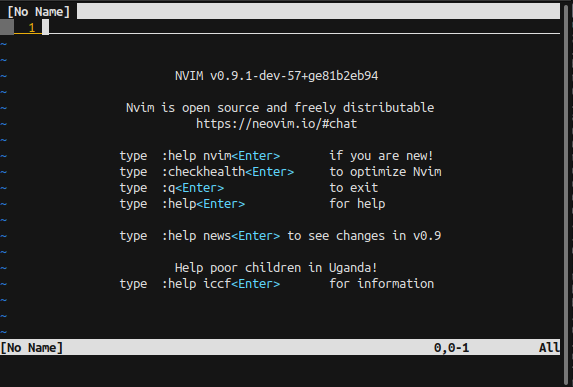
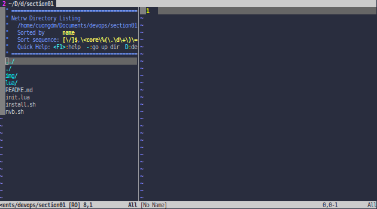

# Options
---

# 1. How to use this section
* Make sure that you need to be at this section directory, check it:
  ```bash=
  pwd
  ```
  

* Now `source` the `install.sh` file.
  ```bash=
  source ./install.sh
  ```

* Finally, run the `nvb` comment, all NeoVim settings only operates at your current terminal.
  ```bash=
  nvb
  ```
  

# 2. Some commands of this section
|Command|Description|Presentation|
|-|-|-|
|`:Lexplore`|Open the file explorer||