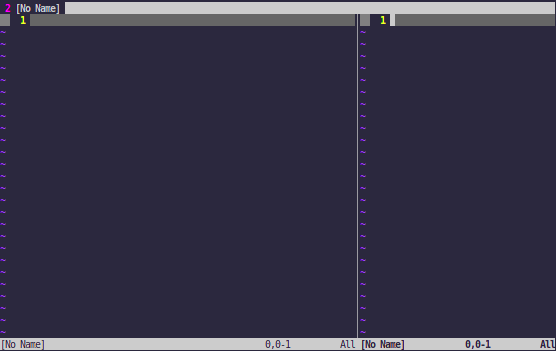
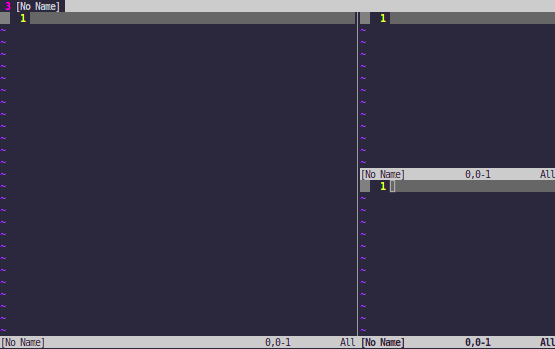

# Keys mapping
---

# 1. Popular commands
|Command|Description|Presentation|
|-|-|-|
|`:vsplit`|Split the current window vertically||
|`:split`|Split the current window horizontally||
|`Ctrl + <h/j/k/l>`|Move to the window in the directions|
|`Ctrl + <arrow_key>`|Expand the window in the directions|