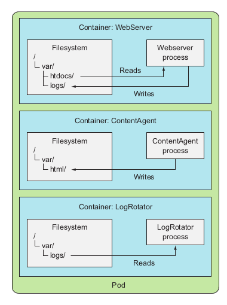
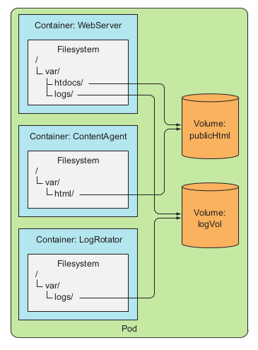
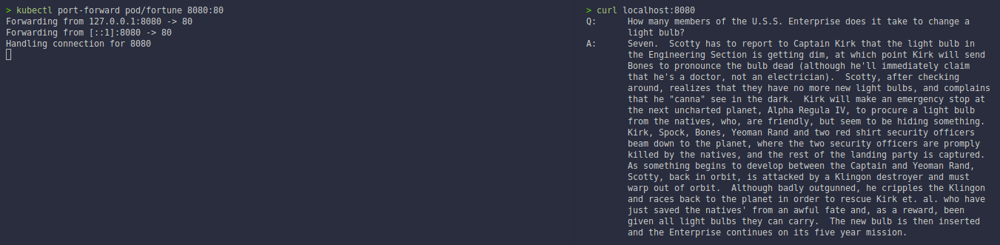

# Chapter 6. Volumes: attching disk storage to containers
## 6.1. Introducing volumes
* K8s volumes are a component of a pod and are defined in the pod's specification.
* A volume is available to all containers in a pod, but it must be mounted in each container that needs to access it.
### 6.1.1. Explaining volumes in an example
* Imagine you have a pod with three containers:
    * **Web server**: servers HTML pages from the `/var/htdocs` directory and stores the access log to `/var/logs`.
    * **Content Agent**: runs an agent that creates HTML files and stores them in `/var/html` directory.
    * **Log Rotator**: processes the logs it finds in the `/var/logs` directory and rotates them.
    * The below image shows three containers of the same pod without shared storage.<br>
    <br>
    * The below image shows three containers sharing two volumes mounted at various mount paths.<br>
    <br>

### 6.1.2. Introducing available volume types
* Here is a list of several of the available volume types:
    * `emptyDir`: A simple empty directory used for storing transient data.
    * `hostPath`: Used for mounting directories from the worker node's filesystem into the pod.
    * `gitRepo`: A volume initialized by checking out the contents of a Git repository.
    * `nfs`: An NFS share mounted into the pod.
    * Cloud provider volumes used for mounting cloud provider-specific storage into the pod:
        * `gcePersistentDisk`: Google Compute Engine Persistent Disk.
        * `awsElasticBlockStore`: Amazon Elastic Block Store.
        * `azureDIsk`: Microsoft Azure Disk.
    * `cinder`, `cephfs`, `iscsi`, `flocker`, `glusterfs`, `quobyte`, `rbd`, `flexVolume`, `vsphereVolume`, `photonPersistentDisk`, `scaleIO`: used for mounting other types of network storage.
    * `configMap`, `secret`, `downwardAPI`: special types of volumes used to expose certain K8s resources and cluster information to the pod.
    * `persistentVolumeClaim`: used for mounting persistent storage into the pod.
    * ... and others.
## 6.2. Using volumes to share data between containers
* This section discusses how to use volumes to share data between containers in a pod.
### 6.2.1. Using `emptyDir` volumes
* The app running inside the pod can then write any files it needs to it.
* The volume's lifetime is tied to the pod's lifetime, the volume's contents are deleted when the pod is deleted.
* An `emptyDir` volume is especially useful for sharing files between containers running in the same pod.
* It can also be used be a **single container** for when a container needs top write data to disk temporarily, such as when performing a sort operation on a large dataset, which can not fit into the available memory.

###### Using an `emptyDir` volume in a pod
* Using the previous example where a **web server**, a **content agent**, and a **log rotator** share two volumes, but let's simplify a bit.
* You will build a pod with **only the web server container** and **the content agent** and a **single volume** for the HTML.
* We use Nginx as the web serverm and the and the UNIX `fortune` _(this command will print out a random quote every time you run it)_ command to generate HTML content. You will create a script that invokes the `fortune` command every 10 seconds and stores its output in `index.html`.
* The first step, let's build the `fortune` container image using [this Dockerfile](./resources/me/chap06/fortune/Dockerfile).
    ```bash
    docker image build -t manhcuong8499/fortune -f ./resources/me/chap06/fortune/Dockerfile ./resources/me/chap06/fortune/
    docker image push manhcuong8499/fortune
    ```

###### Creating a pod
* Working file [fortune-pod.yaml](./resources/me/chap06/fortune-pod.yaml).
* Create the pod:
    ```bash
    kubectl apply -f ./resources/me/chap06/fortune-pod.yaml
    ```
    
    * The pod contains two containers and a single volume.

###### Seeing the pod in action
* To see the fortune message, you need to access to the pod. You will do that by forwarding a port from your local machine to the pod.
* Forward port 8080 on your local machine to port 80 on the pod:
    ```bash
    kubectl port-forward pod/fortune 8080:80
    ```
    
    
    