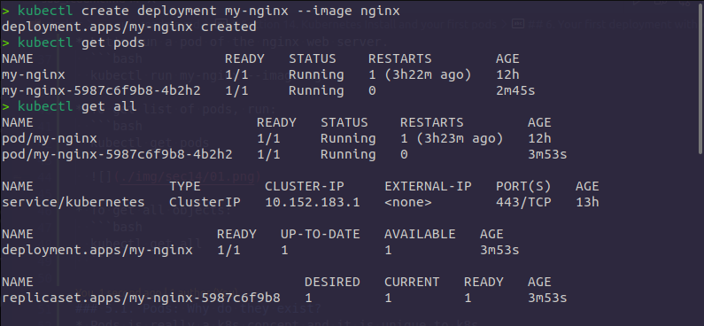

# Section 14. Kubernetes Install and your first pods
## 1. Kubernetes Architecture Terminology
### 1.1. Basic Terms
* **Kubectl**: CLI to configure k8s and manage apps.
* **Node**: single server in the k8s cluster.
* **Kubelet**: k8s agent running on nodes.
* **Control plane**: set of containers that manage the cluster.
  * Inlcudes API server, scheduler, controller manager, etcd, and more.
  * Sometimes called the **master**.

## 2. Kubenetes Local Install
### 2.1. Install K8S
* Try on the browser
  * http://play-with-k8s.com
  * katacoda.com

## 3. Kubernetes Containers Abstractions
* **Pod**: one or more containers running together on one node.
  * Basic unit of deployment, containers are always in pods.
* **Controller**: for creating/updating pods and other objects.
  * Many types of Controllers inc. Deployment, ReplicaSet, StatefulSet, Job, CronJob, etc.
* **Service**: network endpoint to connect to a pod.
* **Namespace**: filtered group of objects in cluster.
* Secrets, ConfigMaps, and more.

## 4. Kubectl run, create, and apply
* K8s is evolving, and so is the CLI.
* We get three ways to create pods from the kubectl CLI.
  * `kubectl run` (single pod per command)
  * `kubectl create` (create some resources via CLI or YAML)
  * `kubectl apply` (create/update anything via YAML)

## 5. Your first pod with kubectl run
* Creating a pod with `kubectl`.
* Two ways to deplot Pods (containers), via commands, or via YAML.
* Let's run a pod of the nginx web server.
  ```bash
  kubectl run my-nginx --image nginx
  ```
* To get list of pods, run:
  ```bash
  kubectl get pods
  ```
  

* To get all objects:
  ```bash
  kubectl get all
  ```

### 5.1. Pods: Why do they exist?
* Pods is really a k8s concept and it is unique to k8s.
* The idea of pod is a layer of abstraction and that is all it is.
* It is not a real thing, it is just the idea of a resour type that wraps around one or more containers that all share the same IP address and the same deployment machanism.
* All containers in a pod will deplot together on the same node.
* They all have access to each other over localhost and a few other things like IP-addresses.
* The idea of pods mean that Docker run containers, just like that.
* Unlike Docker, you can not create a container directly in k8s.
* You create Pod (via CLI, YAML, or API).
  * K8s then creates the container(s) inside the pod.
* `kubelet` tells the **container runtime** to create containers for you.
* Every type of resource to run containers uses Pods.
* K8s cheatsheet: [https://kubernetes.io/docs/reference/kubectl/cheatsheet/](https://kubernetes.io/docs/reference/kubectl/cheatsheet/)
* K8s for Docker users: [https://kubernetes.io/docs/reference/kubectl/docker-cli-to-kubectl/](https://kubernetes.io/docs/reference/kubectl/docker-cli-to-kubectl/).

## 6. Your first deployment with kubectl create
* Let's crrate a deployment of the nginx web server.
  ```bash
  kubectl create deployment my-nginx --image nginx
  kubectl get pods
  kubectl get all
  ```
  

* Remove the single pod and the deployment.
  ```bash
  kubectl delete pod my-nginx
  kubectl delete deployment my-nginx
  ```

## 7. Scaling ReplicaSets
* Start a new deployment for one replica/pod
  ```bash
  kubectl create deployment my-apache --image httpd
  kubectl get all
  ```