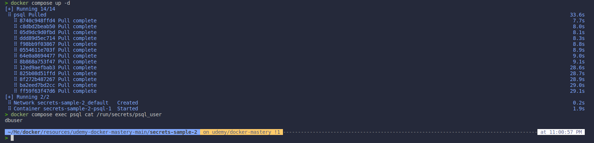

# Section 10. Swarm App Lifecycle
## 1. Using Secrets with local docker compose
* In this section, I do not use docker swarm, I focus on how to use the secrets with docker compose. I use the directory `secrets-sample-2` to guide you through the process.
* Move on the `secrets-sample-2` directory and run the following command to create the secrets:
  ```bash
  cd resources/udemy-docker-mastery-main/secrets-sample-2
  docker compose up -d
  docker compose exec psql cat /run/secrets/psql_user
  ```
  
    * We can see our secret, why? Because of not as **Docker Swarm**, the secrets are not encrypted in the **Docker Compose**. So we can see out secrets. These secrets are not stored in **Raft Database**.