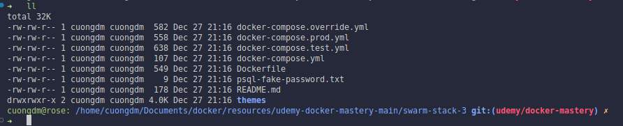
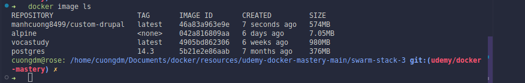
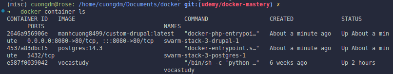
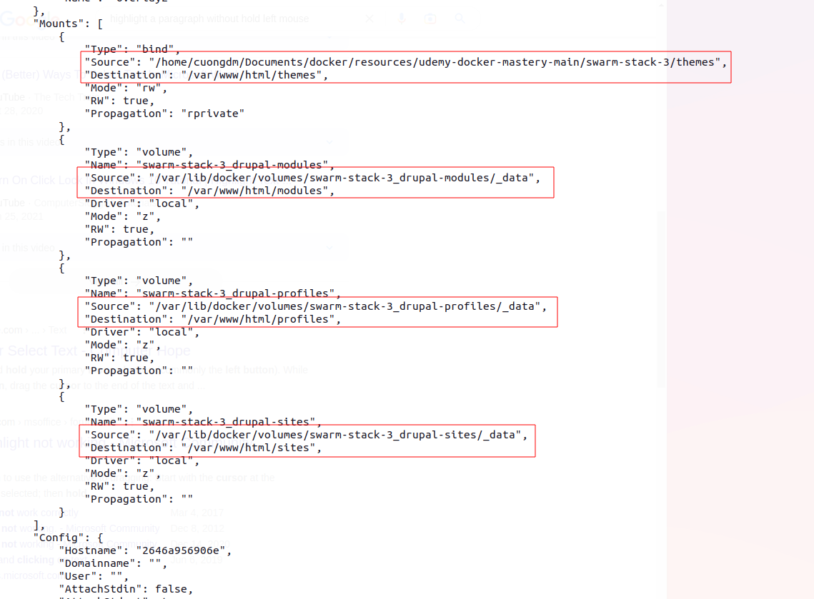
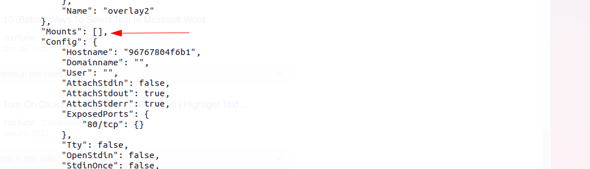

# Section 10. Swarm App Lifecycle
## 1. Using Secrets with local docker compose
* In this section, I do not use docker swarm, I focus on how to use the secrets with docker compose. I use the directory `secrets-sample-2` to guide you through the process.
* Move on the `secrets-sample-2` directory and run the following command to create the secrets:
  ```bash
  cd resources/udemy-docker-mastery-main/secrets-sample-2
  docker compose up -d
  docker compose exec psql cat /run/secrets/psql_user
  ```
  
    * We can see our secret, why? Because of not as **Docker Swarm**, the secrets are not encrypted in the **Docker Compose**. So we can see out secrets. These secrets are not stored in **Raft Database**.

## 2. Full App Lifecycle: Dev, Build and Deploy with a Single Compose Design
* Sometimes your complexity grows and you are going to need multiple compose files.
* In this scenario, we are going to use `docker compose up` for:
  * Local development environment.
  * Use a **docker compose up config** and file for our CI environment to do integration testing.
  * In production, we are going to use those files for docker stack deploy our app.

### 2.1. Example
* In this guideline, I use the directory `swarm-stack-3`.
  ```bash
  cd resources/udemy-docker-mastery-main/swarm-stack-3
  ll
  ```
  
    * Here, we have several docker compose files.
      * `docker-compose.yml`: this is the default compose file. This is called an override.
        * An override is where I have the standard docker compose file, and it sets the defaults that are the same across all my environments.
      * other compose files: these alse called override files. If these files is named with exact prefix name of the default compose file _(such as `docker-compose.test.yml`)_, it will automatically bring this in whenever I do a docker compose up.
        * The cool thing is docker compose will read these files automatically and it will apply this over top, or override, any settings in the `docker-compose.yml` file.

* Now let's run the `docker-compose.yml` file.
  ```bash
  docker compose up -d
  docker image ls
  ```
  
  
* Get list of the running containers:
  ```bash
  docker container ls
  ```
  
    * We can see, the `drupal` service is currently running.

* Let's inspect the `drupal` service.
  ```bash
  docker container inspect swarm-stack-3-drupal-1
  ```
  
    * Focusing on the red square borders, in the file `docker-compose.yml` file, we did not define these volumes, we only defined them in the `docker-compose.override.yml` file, which means when we run `docker compose up`, docker override the `docker-compose.override.yml` file on the top of `docker-compose.yml` file.

* Ya, this is the way that overriding works in docker. Let's down one for further discovery.
  ```bash
  docker compose down
  ```

* Specify `docker-compose.test.yml` file to run the `docker compose up` command.
  ```bash
  docker compose -f docker-compose.yml -f docker-compose.test.yml up -d
  docker container inspect swarm-stack-3-drupal-1
  ```
  
    * There is nothing in the `mounts` config because we did not define any volumes in the `docker-compose.test.yml` file.

* Now let's down one.
  ```bash
  docker compose down
  ```

* In production environment, If I run the below command:
  ```bash
  docker compose -f docker-compose.yml -f docker-compose.prod.yml config > output.yml
  ```
    * Docker automatically merges these relevant files with their configuration options into one single `*.yml` file.
    * This is similar to `extends` in **Docker compose**, but keep in your mind that `extends` does not work in **Stacks**.

## 3. Service updates: changing things in flight
### 3.1. Service updates
* Provide rolling replacement of tasks/containers in a service.
* Limits downtime (be careful with **prevents** downtime).
* Will replace containers for most changes.
* Has many, many CLI options to contrl the update.
* Create options will usually change, adding `-add` or `-rm` to them.
* Includes rollback and healthcheck options.
* Also has scale & rollback subcommand for quicker access.
  * `docker service scale web=4` and
  * `docker service roolback web`.

* A stack deploy when pre-existing will issue service update.

### 3.2. Swarm update examples
* Just update the image used to a newer version.
  ```bash
  docker service update --image nginx:1.19.0 web
  ```

* Adding an environment variable and remove a port.
  ```bash
  docker service update --env-add NODE_ENV=production --publish-rm 8080 web
  ```

* Change number of replicas of two service.
  ```bash
  docker service scale web=8 api=6
  ```

* If you update the `*.yml` file, then:
  ```bash
  docker stack deploy -c <*.yml file> <stack name>
  ```

### 3.3. Practice
* Firstly, run nginx service.
  ```bash
  docker service create -p 8088:80 --name web nginx:1.13.7
  ```

* Scale up our service with 5 replicas
  ```bash
  docker service scale web=5
  ```

* Changer version of `nginx` into `nginx:1.13.6`.
  ```bash
  docker service update --image nginx:1.13.6 web
  ```

* Change the publish port.
  ```bash
  docker service update --publish-rm 8088 --publish-add 9090:80 web
  ```

* In the case, you do not change anything, you just update external secrets, you can use the below command:
  ```bash
  docker service update --force web
  ```