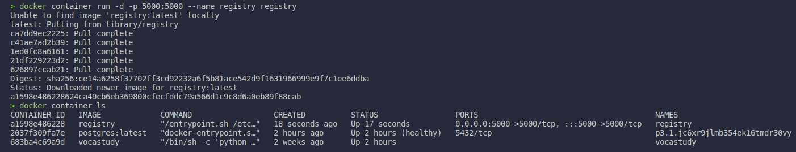
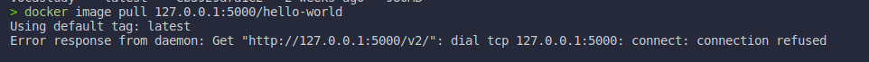
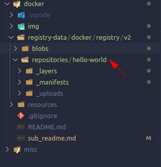

# Section 11. Container Registries: Image Storage and Distribution
## 1. Docker Hub: Digging Deeper
* Docker Hub is the most popular public image registry in the world.
* It also includes image building, you can link Github/BitBucket to Docker Hub and auto-build images on commit.

## 2. Understanding Docker Registry
* A private image registry for your network.
* Part of the docker/distribution Gthub repo.
* Not as full featured as Hub or others, no web UI, basic auth only.
* At its core: a web API and storage system, written in Go.
* Storage supports local, S3/Azure/Alibaba/Google Cloud, and OpenStack Swift.
* Some attention to security, but not as much as Hub.
  * Set up with TLS so that you will not have to enable insecure registries.
  * Storage cleanup via Garbage Collection.
  * Enable Hub caching via "--registry-mirror".

## 3. Run a private docker registry
* Run the registry image on default port 5000.
* Re-tag an existing image and push it to your new registry.
* Remove that image from local cache and pull it from new registry.
* Re-create registry using bind mount and see how it stores data.

### 3.1. Registry and Proper TLS
* Secure by dedfault: docker will not talk to registry without HTTPS except `localhost (127.0.0.1/8)`.
* For remote self-signed TLS, enable "insecure registry" in engine.
* Now let's run your own registry with TLS.
  ```bash
  docker container run -d -p 5000:5000 --name registry registry
  docker container ls
  ```
  

* Pull the `hello-world` image from Hub.
  ```bash
  docker image pull hello-world
  ```

* Re-tag the `hello-world` image.
  ```bash
  docker tag hello-world 127.0.0.1:5000/hello-world
  ```

* Now, let's push it to local registry.
  ```bash
  docker image push 127.0.0.1:5000/hello-world
  ```

* Now, remove the `hello-world` and `127.0.0.1:5000/hello-world` from local cache.
  ```bash
  docker image rm hello-world
  docker image rm 127.0.0.1:5000/hello-world
  ```
* Pull the `127.0.0.1:5000/hello-world` image from local registry
  ```bash
  docker image pull 127.0.0.1:5000/hello-world
  ```

* Remove the local registry
  ```bash
  docker container rm -f registry
  ```

* Remove the `127.0.0.1:5000/hello-world` image and pull it back.
  ```bash
  docker image rm 127.0.0.1:5000/hello-world
  docker image pull 127.0.0.1:5000/hello-world
  ```
  
    * We can not pull the image from local registry because the registry is not running.

* Sometimes, you need to set the volume for the registry, so you do not lose all pushed images.
  ```bash
  docker container run -d -p 5000:5000 --name registry -v $(pwd)/registry-data:/var/lib/registry registry
  ```

* Now, let's push the `127.0.0.1:5000/hello-world` to local registry again.
  ```bash
  docker image push 127.0.0.1:5000/hello-world
  ```
  * Now when we see the `registry-data` directory, we can see our `hello-world` image. <br>
    <br>

* Fore further, read them:
  * [https://training.play-with-docker.com/linux-registry-part2/](https://training.play-with-docker.com/linux-registry-part2/)
  * [https://training.play-with-docker.com/](https://training.play-with-docker.com/)
  