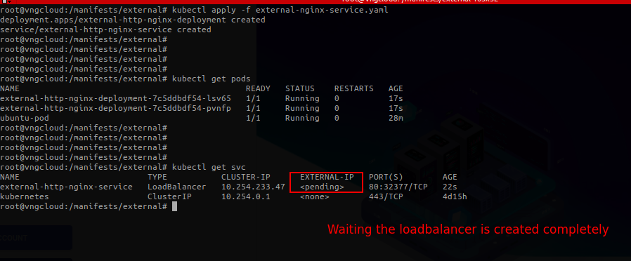
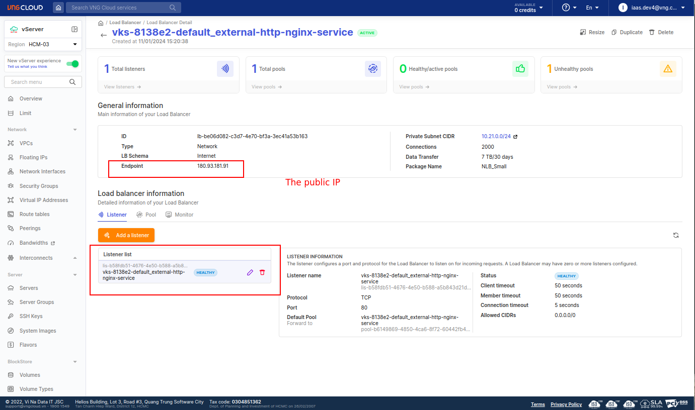
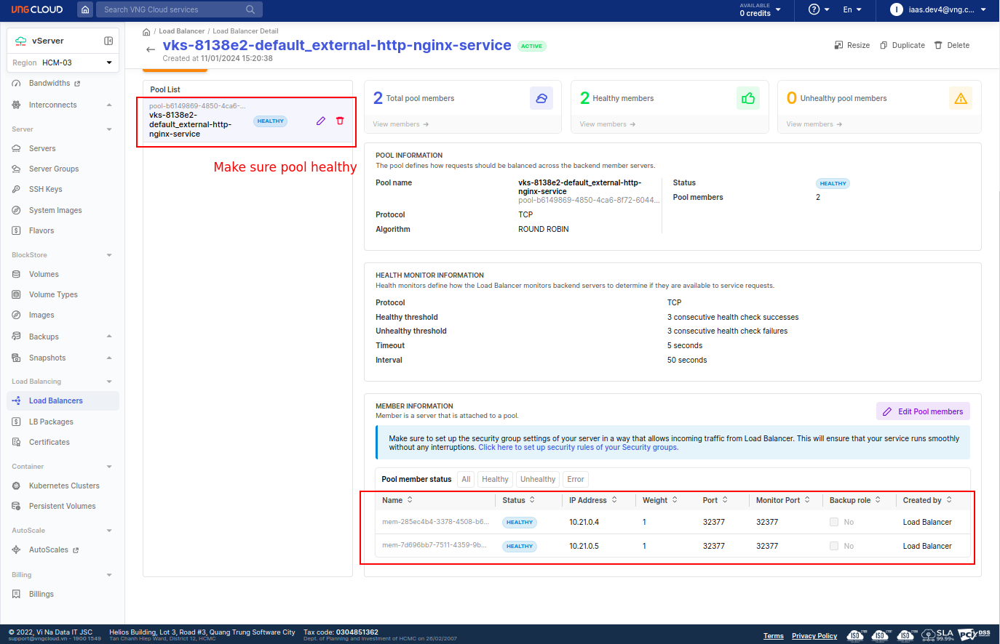
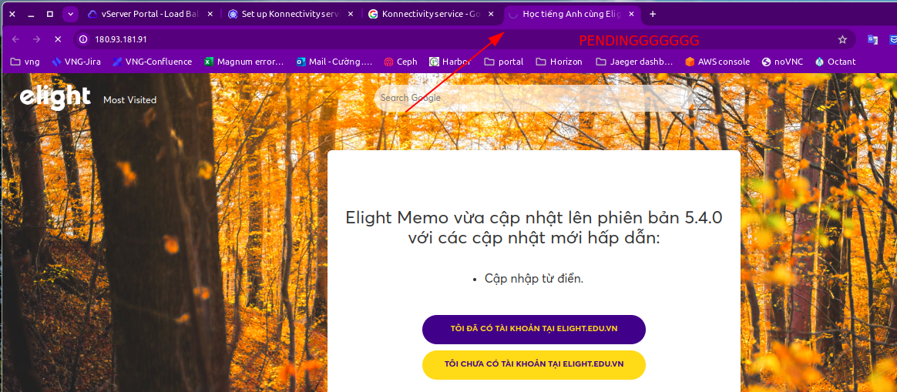
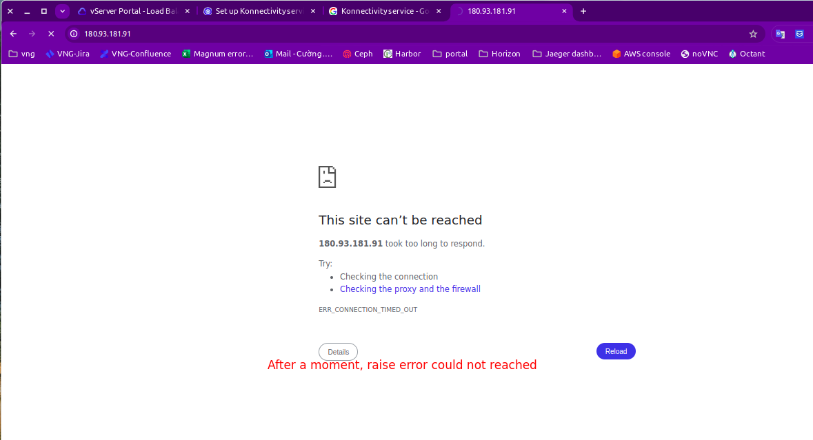
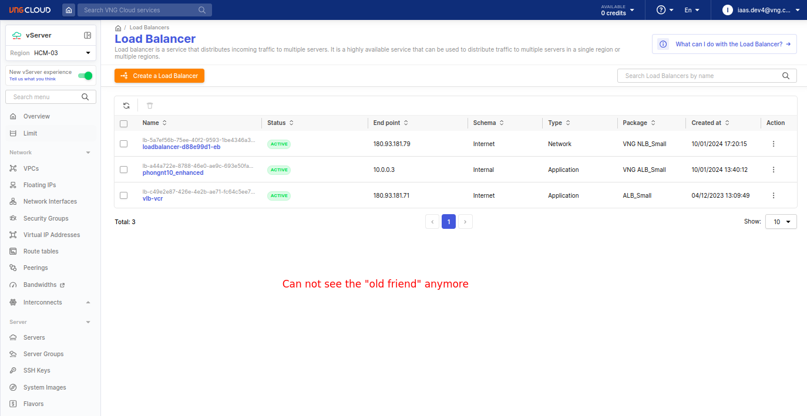
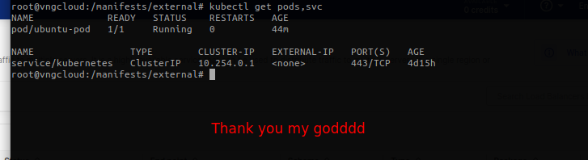

# 1. Scenario
- File [external-nginx-service.yaml](./../manifests/external/external-nginx-service.yaml)
- This testcase creates an `Nginx` deployment, and then create an **EXTERNAL** loadbalancer service to expose the deployment.

- Apply the manifest
```bash
kubectl apply -f external-nginx-service.yaml
```

# 2. Test
After applying the manifest, we will have a deployment and a service as below:
- Get Nginx deployment with 2 replicas
  ```bash
  kubectl apply -f external-nginx-service.yaml
  kubectl get pods
  kubectl get svc
  ```
  


- Waiting until the load balancer is `ACTIVE` on the VNG CLOUD portal
  

- Check the pool
  

- Let browse to to public IP address of the load balancer
  

- Yeahhhhhhhhhhh, it worked
  

## 2.1. test delete the above service
- Delete the service
  ```bash
  kubectl delete -f external-nginx-service.yaml
  ```
  


- Now when you access the previous public IP address, you will be pending forever
  
  

- Test from the portal, the loadbalancer must be disappeared
  

- From the inside k8s, let try
```bash
kubectl get pods,svc
```
