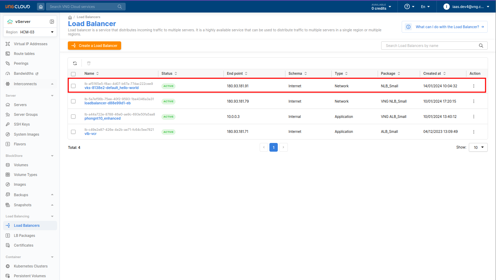
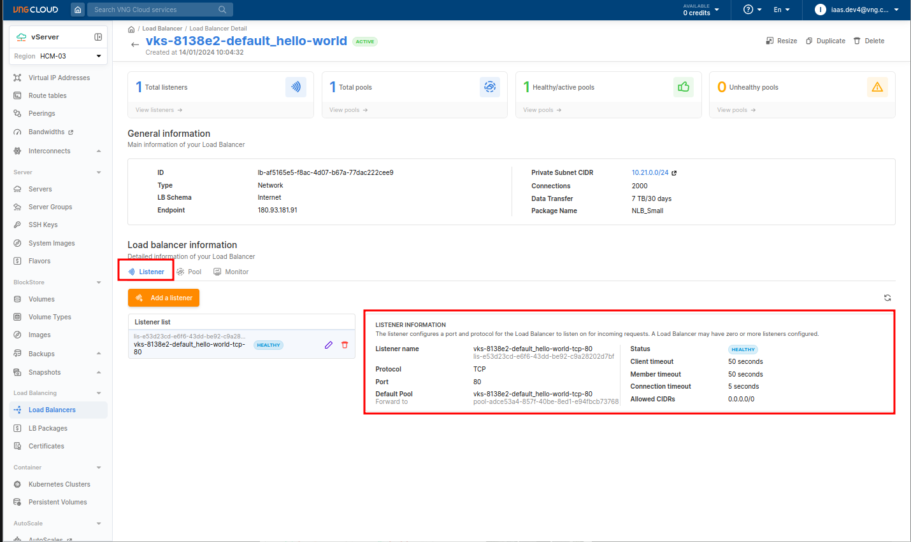
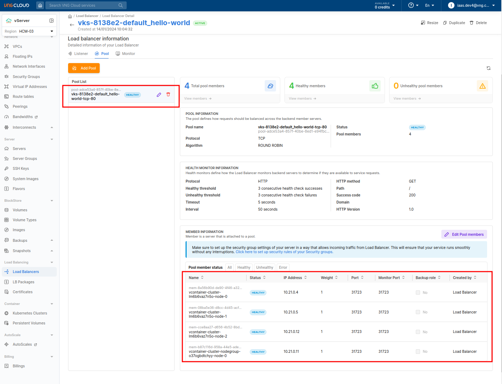
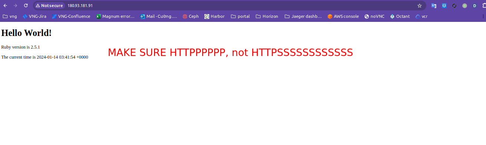

# 1. Scenario
- File [hello-node.yaml](./../manifests/http-healthcheck/hello-node.yaml)
- This testcase creates an `Hello World` deployment, expose this service to the internet, to healthcheck the application, access the url "/" with success code is `200`.

- Apply the manifest
```bash
kubectl apply -f hello-node.yaml
```


# 2. Test
After applying the manifest, we will have a deployment and a service as below:
- Get Apache2 deployment with 2 replicas
```bash
kubectl get pods
```


```bash
kubectl get svc
```

> - The public IP address of the load balancer is `180.93.181.91`.
> - You need to wait about 3 minutes for the load balancer to be ready.

- Check from the portal UI




- Access the above public endpoint on the browser


- Delete the entire resource
```bash
kubectl delete -f hello-node.yaml
```
