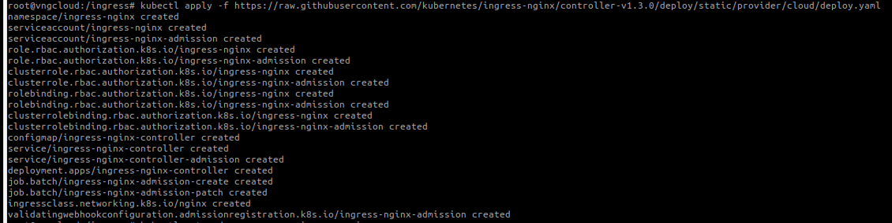
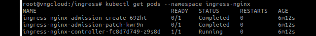
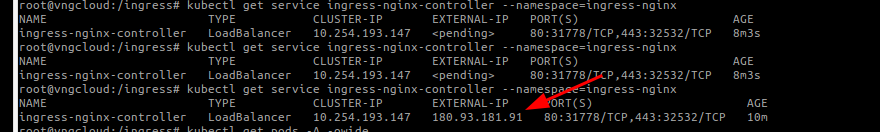
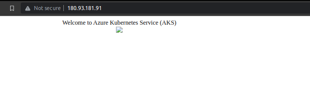
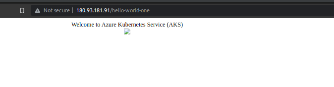
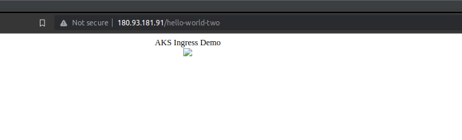
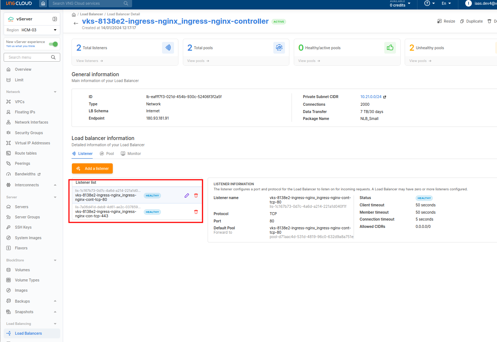
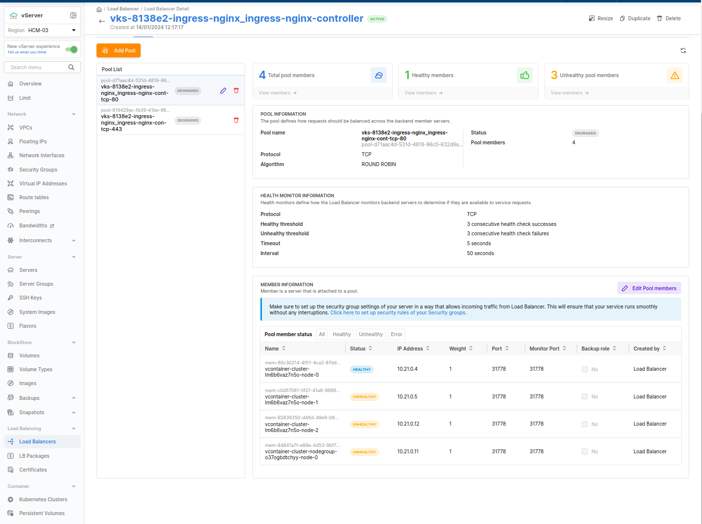

- Apply ingress CRD, file [ingress.yaml](./../manifests/ingress/ingress.yaml)
  ```bash
  kubectl apply -f ingress.yaml
  ```
  

- Check the Ingress controller pod is running
  ```bash
  kubectl get pods --namespace ingress-nginx
  ```
  

- Check the NGINX Ingress controller has been assigned a public Ip address _(waiting about 5 mins)_
  ```bash
  kubectl get service ingress-nginx-controller --namespace=ingress-nginx
  ```
  

- Browsing to this IP address will show you the NGINX 404 page. This is because we have not set up any routing rules for our services yet.
  

- Set up a basic web app for testing our new Ingress controller _(remember add host with the below domain and public IP address)_
  ```
  kubectl create ingress demo --class=nginx --rule cuongdm3-domain.io/=demo:80
  ```

- I think you will need:
  ```bash=
  kubectl get validatingwebhookconfigurations
  kubectl delete validatingwebhookconfigurations vcontainer-ingress-nginx-admission
  kubectl delete -n kube-system deploy vcontainer-ingress-nginx-controller
  kubectl delete -n kube-system deploy vcontainer-ingress-nginx-default-backend
  ```

- Set up two more web apps. Now we will set up two more web apps, and route traffic between them using NGINX, file [app-1.yaml](./../manifests/ingress/app-1.yaml) and [app-2.yaml](./../manifests/ingress/app-2.yaml)
  ```bash
  kubectl apply -f app-1.yaml --namespace ingress-nginx
  kubectl apply -f app-2.yaml --namespace ingress-nginx
  ```

- Check the new pods are running (you should see two aks-helloworld pods running):
  ```bash
  kubectl get pods --namespace ingress-nginx
  ```
  


- Setup the Ingress to route traffic between the two apps, file [hello-world-ingress.yaml](./../manifests/ingress/hello-world-ingress.yaml)
  ```bash
  kubectl apply -f hello-world-ingress.yaml --namespace ingress-nginx
  ```
  


- Browse to the `<EXTERNAL_IP>/hello-world-one` and `<EXTERNAL_IP>/hello-world-two`:
  
  
  


- From the UI
  
  