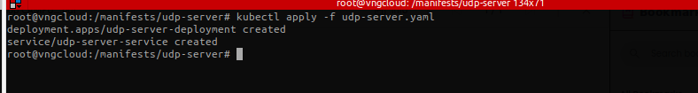
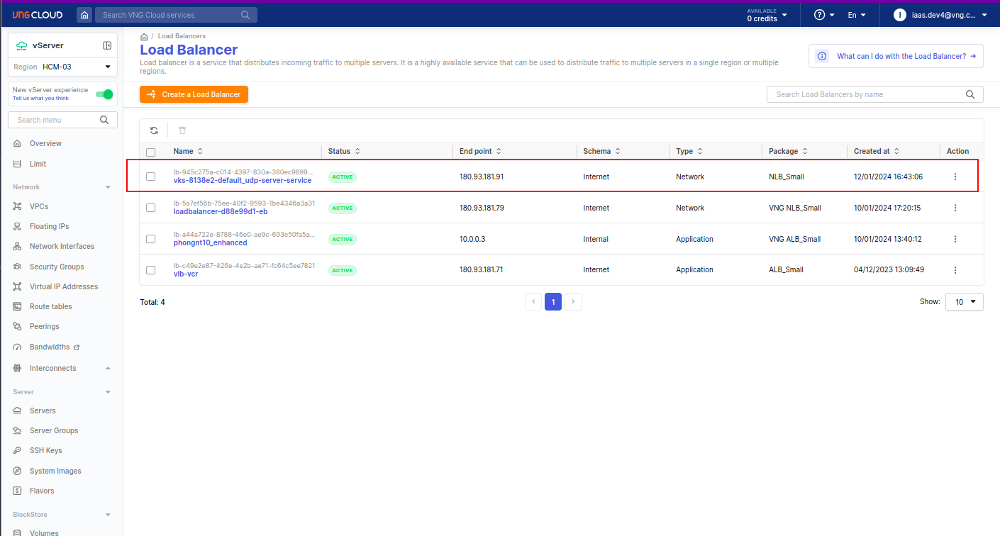
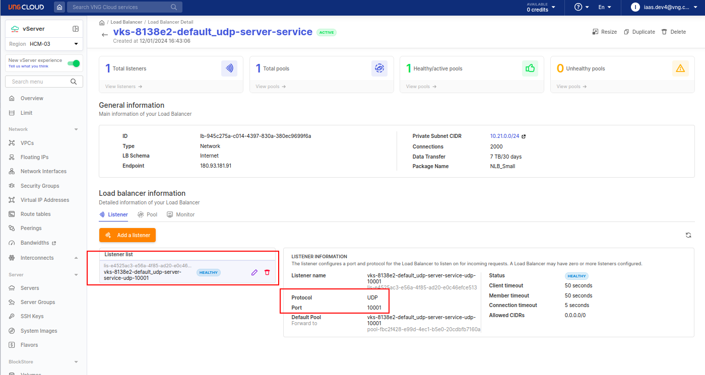
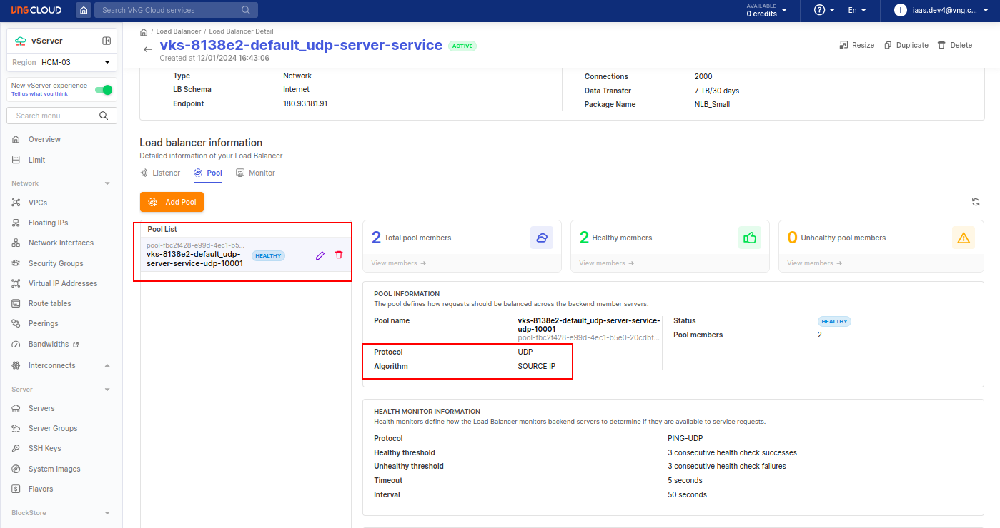
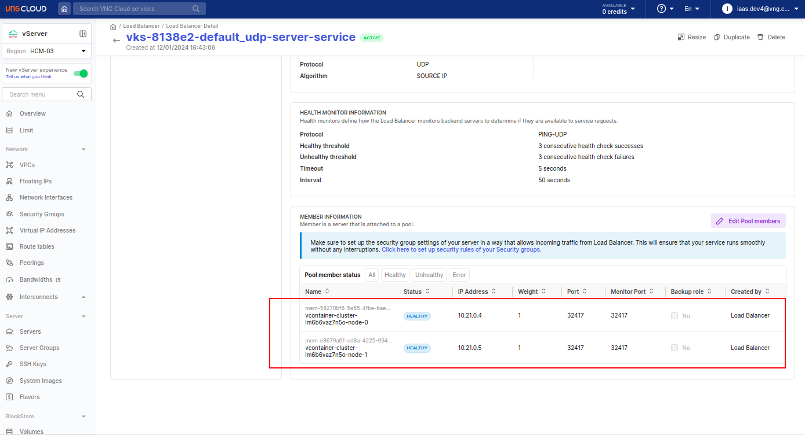
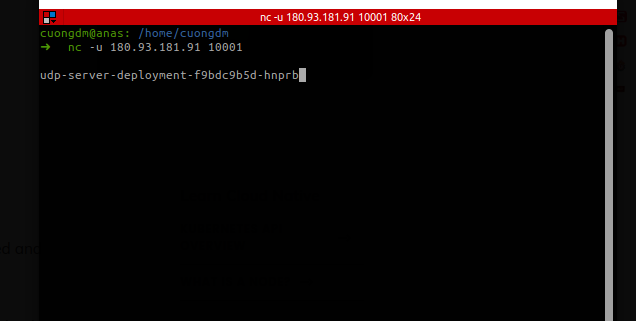

# 1. Scenario
- This testcase creates a UPD server and then expose it to the internet using **EXTERNAL** loadbalancer service.
- The load balancer listener protocal **MUST** be `UDP`.
- The load balancer listener port **MUST** be `10001`.

- Apply the manifest [udp-server.yaml](./../manifests/udp-server/udp-server.yaml)
  ```bash
  kubectl apply -f udp-server.yaml
  ```
  

- Waiting until the load balancer is `ACTIVE` on the VNG CLOUD portal
  
  
  
  

- test that can access UDP server
  ```bash
  nc -u <PUBLIC_IP> 10001
  ```
  and press ENTER two times
  

- Delete the service
  ```bash
  kubectl delete -f udp-server.yaml
  ```