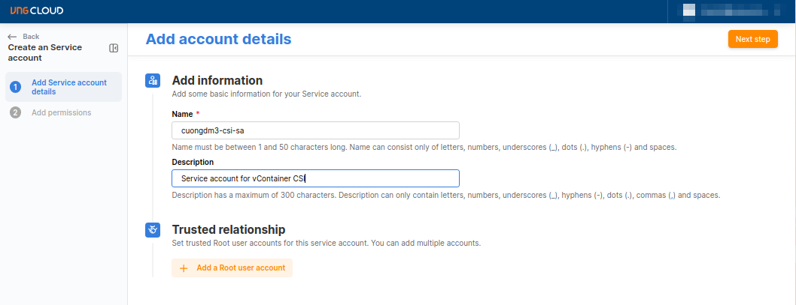
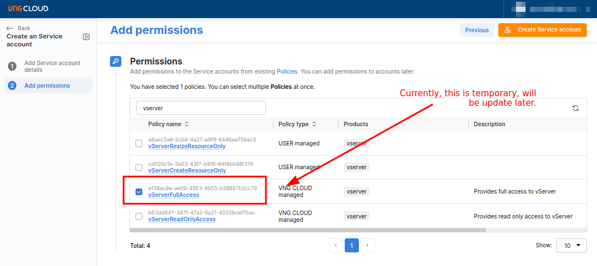
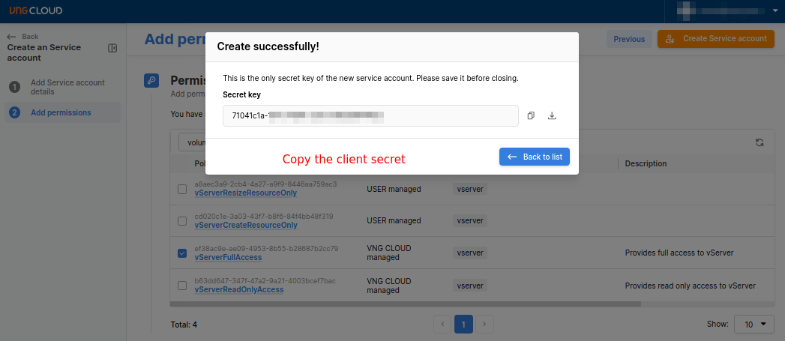
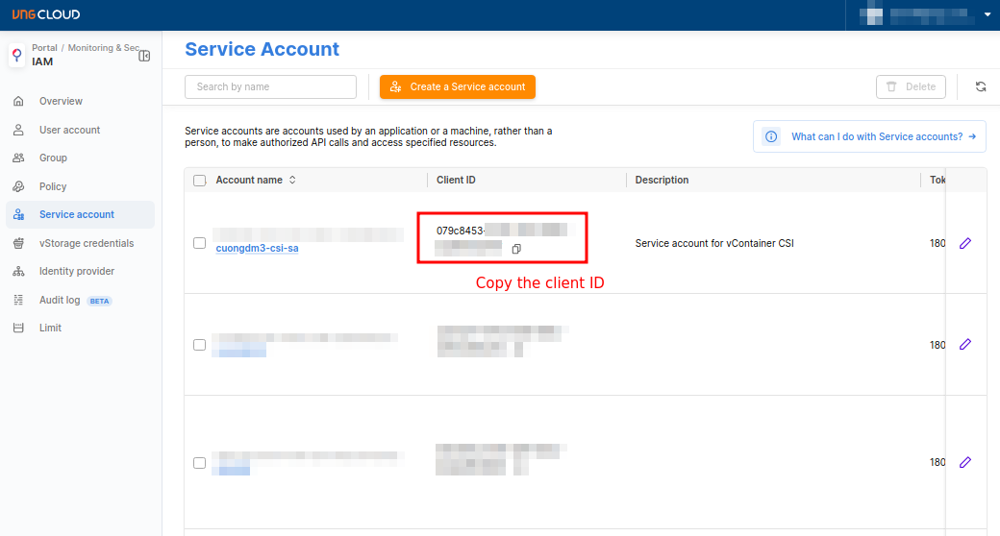
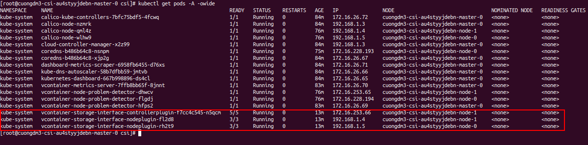

###### [↩ Back to `README`](./../README.md)

# 2. Install `vcontainer-storage-interface` plugin
## 2.1. Create your service account
- Go to [https://hcm-03.console.vngcloud.tech/iam/service-accounts](https://hcm-03.console.vngcloud.tech/iam/service-accounts) to create your service account.
  > 
  > 

- Copy the **CLIENT_ID** and **CLIENT_SECRET** of your service account.
  > 
  > 

- The pair of **CLIENT_ID** and **CLIENT_SECRET** will be used to configure the `vcontainer-storage-interface` plugin.

## 2.2. Prepare dependencies
- Prepare the [`values.yaml`](./script/values.yaml) file with the below content:
  ```yaml
  csi:
    plugin:
      image:
        repository: quay.io/cuongdm8499/vcontainer-storage-interface
        tag: latest
        pullPolicy: Always

  logVerbosityLevel: 5


  vcontainerConfig:
    create: true
    identityURL: "https://hcm-3.api.vngcloud.tech/iam/accounts-api"
    vserverURL: "https://hcm-3.api.vngcloud.tech/new-vserver-gateway"
    clientID: "<PUT_YOUR_CLIENT_ID>"
    clientSecret: "<PUT_YOUR_CLIENT_SECRET>"
  ```

- Create the [`main.sh`](./script/main.sh) file with the below content:
  ```bash
  #!/bin/bash

  rehelm() {
      helm uninstall -n kube-system vcontainer-storage-interface

      rm -rf vcontainer-helm-infra

      git clone https://github.com/vngcloud/vcontainer-helm-infra.git --branch dev --depth 1

      helm install -n kube-system vcontainer-storage-interface vcontainer-helm-infra/vcontainer-storage-interface --values values.yaml

      rm -rf vcontainer-helm-infra
  }

  loghelm() {
      pod_id=$(kubectl get pods -n kube-system | grep vcontainer-storage-interface-controllerplugin | awk '{print $1}')
      kubectl logs -n kube-system -f $pod_id vcontainer-storage-interface
  }

  opt=$1
  case $opt in
  rehelm)
      rehelm
      ;;
  loghelm)
      loghelm
      ;;
  *)
      echo "Usage: $0 {rehelm|loghelm}"
      exit 1
      ;;
  esac
  ```

- Grant the execution permission for the `main.sh` file:
  ```bash
  chmod +x main.sh
  ```

## 2.3. Install plugin
- Install the `vcontainer-storage-interface`:
  ```bash
  ./main.sh rehelm
  ```
  > ```console
  > [root@cuongdm3-csi-au4styyjdebn-master-0 csi]# ./main.sh rehelm
  > Error: uninstall: Release not loaded: vcontainer-storage-interface: release: not found
  > Cloning into 'vcontainer-helm-infra'...
  > remote: Enumerating objects: 21, done.
  > remote: Counting objects: 100% (21/21), done.
  > remote: Compressing objects: 100% (20/20), done.
  > remote: Total 21 (delta 4), reused 8 (delta 1), pack-reused 0
  > Receiving objects: 100% (21/21), 17.45 KiB | 558.00 KiB/s, done.
  > Resolving deltas: 100% (4/4), done.
  > W1121 06:29:11.025127   47899 warnings.go:70] unknown field "spec.template.spec.containers[2].hostAliases"
  > NAME: vcontainer-storage-interface
  > LAST DEPLOYED: Tue Nov 21 06:29:09 2023
  > NAMESPACE: kube-system
  > STATUS: deployed
  > REVISION: 1
  > TEST SUITE: None
  > ```

- Verify the `vcontainer-storage-interface` is installed successfully.
  ```bash
  kubectl get pods -A -owide
  ```
  > 
  - **⛔ NOTE**
    - All the pods of `vcontainer-storage-interface` **MUST** be deployed on the workers nodes.
    - The number of pods of `vcontainer-storage-interface-nodeplugin` is equal to the number of worker nodes.
    - Only one pod of `vcontainer-storage-interface-controllerplugin` is deployed on one of the worker nodes.