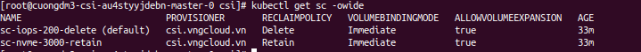

###### [↩ Back to `README`](./../README.md)

# 3. Default resources
- After installing the `vcontainer-storage-interface`, there are 2 `StorageClass` that are installed by default.
- The `PROVISIONER` value **MUST** be `csi.vngcloud.vn`.
  ```bash
  kubectl get sc -owide
  ```
  > 

- And there are no `PersistentVolume` or `PersistentVolumeClaim` that are created by default.
  ```bash
  kubectl get pvc
  kubectl get pv
  ```
  > 

## 3.1. Detail about controller plugin
- Describe the controller-plugin
  ```bash
  kubectl describe -n kube-system pod/vcontainer-storage-interface-controllerplugin-f7cc4c545-n5qcm
  ```
  > ```console
  > Name:             vcontainer-storage-interface-controllerplugin-f7cc4c545-n5qcm
  > Namespace:        kube-system
  > Priority:         0
  > Service Account:  vcontainer-csi-controller-sa
  > Node:             cuongdm3-csi-au4styyjdebn-node-1/192.168.1.4
  > Start Time:       Tue, 21 Nov 2023 06:29:11 +0000
  > Labels:           app=vcontainer-storage-interface
  >                   chart=vcontainer-storage-interface-0.0.1
  >                   component=controllerplugin
  >                   heritage=Helm
  >                   pod-template-hash=f7cc4c545
  >                   release=vcontainer-storage-interface
  > Annotations:      cni.projectcalico.org/containerID: 96d15ad4a1338a0c7430905c8c0fb6b61a9cadc18b464612d0503419c4d9efc4
  >                   cni.projectcalico.org/podIP: 172.16.253.66/32
  >                   cni.projectcalico.org/podIPs: 172.16.253.66/32
  > Status:           Running
  > IP:               172.16.253.66
  > IPs:
  >   IP:           172.16.253.66
  > Controlled By:  ReplicaSet/vcontainer-storage-interface-controllerplugin-f7cc4c545
  > Containers:
  >   csi-attacher:
  >     Container ID:  containerd://ea158cd0dbff264818a2249e4a297771780722b6958bc357060f8e78e4a1da8f
  >     Image:         registry.vngcloud.vn/public/csi-attacher:v4.2.0
  >     Image ID:      registry.vngcloud.vn/public/csi-attacher@sha256:f5fb8b820169ac6d53a8513c5537f60da6a154e908ffaa5f5aab3e5b3586f4a1
  >     Port:          <none>
  >     Host Port:     <none>
  >     Args:
  >       -v=5
  >       --csi-address=$(ADDRESS)
  >       --timeout=3m
  >       --leader-election=true
  >       --default-fstype=ext4
  >     State:          Running
  >       Started:      Tue, 21 Nov 2023 06:29:22 +0000
  >     Ready:          True
  >     Restart Count:  0
  >     Environment:
  >       ADDRESS:  /var/lib/csi/sockets/pluginproxy/csi.sock
  >     Mounts:
  >       /var/lib/csi/sockets/pluginproxy/ from socket-dir (rw)
  >       /var/run/secrets/kubernetes.io/serviceaccount from kube-api-access-46tkc (ro)
  >   csi-provisioner:
  >     Container ID:  containerd://0ba6a54ac03142d5739aea5a62e5b36406c13e4cfb8a21ea5720bed0ca5b22bf
  >     Image:         registry.vngcloud.vn/public/csi-provisioner:v3.4.1
  >     Image ID:      registry.vngcloud.vn/public/csi-provisioner@sha256:c73c0a5376a8efe99f287e8f6f40bc653c187b920f96f17400cb85021d1f19db
  >     Port:          <none>
  >     Host Port:     <none>
  >     Args:
  >       -v=5
  >       --csi-address=$(ADDRESS)
  >       --timeout=3m
  >       --leader-election=true
  >       --default-fstype=ext4
  >       --feature-gates=Topology=true
  >       --extra-create-metadata
  >     State:          Running
  >       Started:      Tue, 21 Nov 2023 06:29:30 +0000
  >     Ready:          True
  >     Restart Count:  0
  >     Environment:
  >       ADDRESS:  /var/lib/csi/sockets/pluginproxy/csi.sock
  >     Mounts:
  >       /var/lib/csi/sockets/pluginproxy/ from socket-dir (rw)
  >       /var/run/secrets/kubernetes.io/serviceaccount from kube-api-access-46tkc (ro)
  >   csi-resizer:
  >     Container ID:  containerd://48de8cb3840cc81830b73e00f2671d8902567d595cb9cba1b2c09ee967117a1d
  >     Image:         registry.vngcloud.vn/public/csi-resizer:v1.8.0
  >     Image ID:      registry.vngcloud.vn/public/csi-resizer@sha256:819f68a4daf75acec336302843f303cf360d4941249f9f5019ffbb690c8ac7c0
  >     Port:          <none>
  >     Host Port:     <none>
  >     Args:
  >       -v=5
  >       --csi-address=$(ADDRESS)
  >       --timeout=3m
  >       --handle-volume-inuse-error=false
  >       --leader-election=true
  >     State:          Running
  >       Started:      Tue, 21 Nov 2023 06:29:36 +0000
  >     Ready:          True
  >     Restart Count:  0
  >     Environment:
  >       ADDRESS:  /var/lib/csi/sockets/pluginproxy/csi.sock
  >     Mounts:
  >       /var/lib/csi/sockets/pluginproxy/ from socket-dir (rw)
  >       /var/run/secrets/kubernetes.io/serviceaccount from kube-api-access-46tkc (ro)
  >   liveness-probe:
  >     Container ID:  containerd://0a57e00f730037538f9c40f62ae130f1d4c2509fb9e2921953dd0400e7709e1b
  >     Image:         registry.vngcloud.vn/public/csi-livenessprobe:v2.9.0
  >     Image ID:      registry.vngcloud.vn/public/csi-livenessprobe@sha256:0522eff1d8e9269655080500c1f6388fe2573978e8a74e08beaf3452cd575c2e
  >     Port:          <none>
  >     Host Port:     <none>
  >     Args:
  >       -v=5
  >       --csi-address=$(ADDRESS)
  >     State:          Running
  >       Started:      Tue, 21 Nov 2023 06:29:36 +0000
  >     Ready:          True
  >     Restart Count:  0
  >     Environment:
  >       ADDRESS:  /var/lib/csi/sockets/pluginproxy/csi.sock
  >     Mounts:
  >       /var/lib/csi/sockets/pluginproxy/ from socket-dir (rw)
  >       /var/run/secrets/kubernetes.io/serviceaccount from kube-api-access-46tkc (ro)
  >   vcontainer-storage-interface:
  >     Container ID:  containerd://3b19a90809d0ebc8e8b95c6feb22274b9443579fecd799ced6fe5873dc8ff2e5
  >     Image:         docker.io/manhcuong8499/vcontainer-storage-interface:latest
  >     Image ID:      docker.io/manhcuong8499/vcontainer-storage-interface@sha256:91216172d5f4e0f4f74ea83d854e578bf0e9ae1888480cd4c8529aa4a59bebb3
  >     Port:          9808/TCP
  >     Host Port:     0/TCP
  >     Args:
  >       /bin/vcontainer-storage-interface
  >       -v=5
  >       --endpoint=$(CSI_ENDPOINT)
  >       --vcontainer-config=$(VCONTAINER_CONFIG)
  >     State:          Running
  >       Started:      Tue, 21 Nov 2023 06:29:39 +0000
  >     Ready:          True
  >     Restart Count:  0
  >     Liveness:       http-get http://:healthz/healthz delay=10s timeout=10s period=60s #success=1 #failure=5
  >     Environment:
  >       CSI_ENDPOINT:       unix://csi/csi.sock
  >       VCONTAINER_CONFIG:  /etc/config/vcontainer-config.conf
  >       CLUSTER_NAME:       kubernetes
  >     Mounts:
  >       /csi from socket-dir (rw)
  >       /etc/config from vcontainer-config (ro)
  >       /etc/kubernetes/ca-bundle.crt from cacert (ro)
  >       /var/run/secrets/kubernetes.io/serviceaccount from kube-api-access-46tkc (ro)
  > Conditions:
  >   Type              Status
  >   Initialized       True 
  >   Ready             True 
  >   ContainersReady   True 
  >   PodScheduled      True 
  > Volumes:
  >   socket-dir:
  >     Type:       EmptyDir (a temporary directory that shares a pod's lifetime)
  >     Medium:     
  >     SizeLimit:  <unset>
  >   vcontainer-config:
  >     Type:        Secret (a volume populated by a Secret)
  >     SecretName:  vcontainer-config-secret
  >     Optional:    false
  >   cacert:
  >     Type:          HostPath (bare host directory volume)
  >     Path:          /etc/kubernetes/ca-bundle.crt
  >     HostPathType:  File
  >   kube-api-access-46tkc:
  >     Type:                    Projected (a volume that contains injected data from multiple sources)
  >     TokenExpirationSeconds:  3607
  >     ConfigMapName:           kube-root-ca.crt
  >     ConfigMapOptional:       <nil>
  >     DownwardAPI:             true
  > QoS Class:                   BestEffort
  > Node-Selectors:              <none>
  > Tolerations:                 node.kubernetes.io/not-ready:NoExecute op=Exists for 300s
  >                              node.kubernetes.io/unreachable:NoExecute op=Exists for 300s
  > Events:                      <none>
  > ```


## 3.2. Detail about node plugin
- Describe the node-plugin
  ```bash
  kubectl describe -n kube-system pod/vcontainer-storage-interface-nodeplugin-fl2d8
  ```
  > ```console
  > Name:             vcontainer-storage-interface-nodeplugin-fl2d8
  > Namespace:        kube-system
  > Priority:         0
  > Service Account:  vcontainer-csi-node-sa
  > Node:             cuongdm3-csi-au4styyjdebn-node-1/192.168.1.4
  > Start Time:       Tue, 21 Nov 2023 06:29:11 +0000
  > Labels:           app=vcontainer-storage-interface
  >                   chart=vcontainer-storage-interface-0.0.1
  >                   component=nodeplugin
  >                   controller-revision-hash=79cddcd9f7
  >                   heritage=Helm
  >                   pod-template-generation=1
  >                   release=vcontainer-storage-interface
  > Annotations:      <none>
  > Status:           Running
  > IP:               192.168.1.4
  > IPs:
  >   IP:           192.168.1.4
  > Controlled By:  DaemonSet/vcontainer-storage-interface-nodeplugin
  > Containers:
  >   node-driver-registrar:
  >     Container ID:  containerd://cf13ea4a4de28467f07e51c0263a9b7a743370fb7ebfe3b559bce28680f118af
  >     Image:         registry.vngcloud.vn/public/csi-node-driver-registrar:v2.6.2
  >     Image ID:      registry.vngcloud.vn/public/csi-node-driver-registrar@sha256:93e47a790265784f8d1d5617efe25b8164a95093329990b6437f51cbc71df85d
  >     Port:          <none>
  >     Host Port:     <none>
  >     Args:
  >       -v=5
  >       --csi-address=$(ADDRESS)
  >       --kubelet-registration-path=$(DRIVER_REG_SOCK_PATH)
  >     State:          Running
  >       Started:      Tue, 21 Nov 2023 06:29:12 +0000
  >     Ready:          True
  >     Restart Count:  0
  >     Environment:
  >       ADDRESS:               /csi/csi.sock
  >       DRIVER_REG_SOCK_PATH:  /var/lib/kubelet/plugins/csi.vngcloud.vn/csi.sock
  >       KUBE_NODE_NAME:         (v1:spec.nodeName)
  >     Mounts:
  >       /csi from socket-dir (rw)
  >       /registration from registration-dir (rw)
  >       /var/run/secrets/kubernetes.io/serviceaccount from kube-api-access-fczr6 (ro)
  >   liveness-probe:
  >     Container ID:  containerd://26df32bf8a90c9cd4c626561f0426e170bf7cbafa3a6c0c3a55d80adf72d6111
  >     Image:         registry.vngcloud.vn/public/csi-livenessprobe:v2.9.0
  >     Image ID:      registry.vngcloud.vn/public/csi-livenessprobe@sha256:0522eff1d8e9269655080500c1f6388fe2573978e8a74e08beaf3452cd575c2e
  >     Port:          <none>
  >     Host Port:     <none>
  >     Args:
  >       -v=5
  >       --csi-address=/csi/csi.sock
  >     State:          Running
  >       Started:      Tue, 21 Nov 2023 06:29:13 +0000
  >     Ready:          True
  >     Restart Count:  0
  >     Environment:    <none>
  >     Mounts:
  >       /csi from socket-dir (rw)
  >       /var/run/secrets/kubernetes.io/serviceaccount from kube-api-access-fczr6 (ro)
  >   vcontainer-storage-interface:
  >     Container ID:  containerd://4653cd2af5326712086f2e3279ff53a97c97eafc8812b42defb5fd3c70403f11
  >     Image:         docker.io/manhcuong8499/vcontainer-storage-interface:latest
  >     Image ID:      docker.io/manhcuong8499/vcontainer-storage-interface@sha256:91216172d5f4e0f4f74ea83d854e578bf0e9ae1888480cd4c8529aa4a59bebb3
  >     Port:          9808/TCP
  >     Host Port:     9808/TCP
  >     Args:
  >       /bin/vcontainer-storage-interface
  >       -v=5
  >       --endpoint=$(CSI_ENDPOINT)
  >       --vcontainer-config=$(VCONTAINER_CONFIG)
  >     State:          Running
  >       Started:      Tue, 21 Nov 2023 06:29:24 +0000
  >     Ready:          True
  >     Restart Count:  0
  >     Liveness:       http-get http://:healthz/healthz delay=10s timeout=10s period=60s #success=1 #failure=5
  >     Environment:
  >       CSI_ENDPOINT:       unix://csi/csi.sock
  >       VCONTAINER_CONFIG:  /etc/config/vcontainer-config.conf
  >     Mounts:
  >       /csi from socket-dir (rw)
  >       /dev from pods-probe-dir (rw)
  >       /etc/config from vcontainer-config (ro)
  >       /etc/kubernetes/ca-bundle.crt from cacert (ro)
  >       /var/lib/kubelet from kubelet-dir (rw)
  >       /var/run/secrets/kubernetes.io/serviceaccount from kube-api-access-fczr6 (ro)
  > Conditions:
  >   Type              Status
  >   Initialized       True 
  >   Ready             True 
  >   ContainersReady   True 
  >   PodScheduled      True 
  > Volumes:
  >   socket-dir:
  >     Type:          HostPath (bare host directory volume)
  >     Path:          /var/lib/kubelet/plugins/csi.vngcloud.vn
  >     HostPathType:  DirectoryOrCreate
  >   registration-dir:
  >     Type:          HostPath (bare host directory volume)
  >     Path:          /var/lib/kubelet/plugins_registry/
  >     HostPathType:  Directory
  >   kubelet-dir:
  >     Type:          HostPath (bare host directory volume)
  >     Path:          /var/lib/kubelet
  >     HostPathType:  Directory
  >   pods-probe-dir:
  >     Type:          HostPath (bare host directory volume)
  >     Path:          /dev
  >     HostPathType:  Directory
  >   vcontainer-config:
  >     Type:        Secret (a volume populated by a Secret)
  >     SecretName:  vcontainer-config-secret
  >     Optional:    false
  >   cacert:
  >     Type:          HostPath (bare host directory volume)
  >     Path:          /etc/kubernetes/ca-bundle.crt
  >     HostPathType:  File
  >   kube-api-access-fczr6:
  >     Type:                    Projected (a volume that contains injected data from multiple sources)
  >     TokenExpirationSeconds:  3607
  >     ConfigMapName:           kube-root-ca.crt
  >     ConfigMapOptional:       <nil>
  >     DownwardAPI:             true
  > QoS Class:                   BestEffort
  > Node-Selectors:              <none>
  > Tolerations:                 op=Exists
  >                              node.kubernetes.io/disk-pressure:NoSchedule op=Exists
  >                              node.kubernetes.io/memory-pressure:NoSchedule op=Exists
  >                              node.kubernetes.io/network-unavailable:NoSchedule op=Exists
  >                              node.kubernetes.io/not-ready:NoExecute op=Exists
  >                              node.kubernetes.io/pid-pressure:NoSchedule op=Exists
  >                              node.kubernetes.io/unreachable:NoExecute op=Exists
  >                              node.kubernetes.io/unschedulable:NoSchedule op=Exists
  > Events:                      <none>
  > ```