###### [↩ Back to `README`](./../README.md)

# 5. Demo resizing

## 5.1. Resize when the volume is mounted to a pod _(aka Online Expansion)_

- Apply the file [`resize.yaml`](./../manifest/resize/resize.yaml) to create a `StorageClass` `my-expansion-sc`, a `PersistentVolumeClaim` `my-expansion-pvc` and a `Pod` `nginx`.
- To use expand volume, you **MUST** set the option `allowVolumeExpansion` in the `StorageClass` manifest file to `true`.
- File [`resize.yaml`](./../manifest/resize/resize.yaml)

  ```yaml
  apiVersion: storage.k8s.io/v1
  kind: StorageClass
  metadata:
    name: my-expansion-storage-class # [1] The StorageClass name, CAN be changed
  provisioner: csi.vngcloud.vn # The VNG-CLOUD CSI driver name
  parameters:
    type: <PUT_YOUR_VOLUME_TYPE> # Change it to your volume type ID
  allowVolumeExpansion: true # MUST set this value to turn on volume expansion feature

  ---
  apiVersion: v1
  kind: PersistentVolumeClaim
  metadata:
    name: my-expansion-pvc # [2] The PVC name, CAN be changed
  spec:
    accessModes:
      - ReadWriteOnce
    resources:
      requests:
        storage: 20Gi # [3] The PVC size, CAN be changed, this value MUST be in the valid range of the proper volume type
    storageClassName: my-expansion-storage-class # [4] The StorageClass name, MUST be the same as [1]

  ---
  apiVersion: v1
  kind: Pod
  metadata:
    name: nginx # [5] The Pod name, CAN be changed
  spec:
    containers:
      - image: nginx
        imagePullPolicy: IfNotPresent
        name: nginx
        ports:
          - containerPort: 80
            protocol: TCP
        volumeMounts:
          - mountPath: /var/lib/www/html
            name: my-volume-name # MUST be the same as [6]
    volumes:
      - name: my-volume-name # [6] The volume name, CAN be changed
        persistentVolumeClaim:
          claimName: my-expansion-pvc # MUST be the same as [2]
          readOnly: false
  ```

- Apply the above file:

  ```bash
  kubectl apply -f resize.yaml
  ```

  > 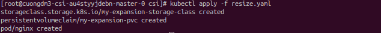

- Vertify the necessary resources that are deployed:

  ```bash
  kubectl get sc,pvc,pv -owide
  ```

  > 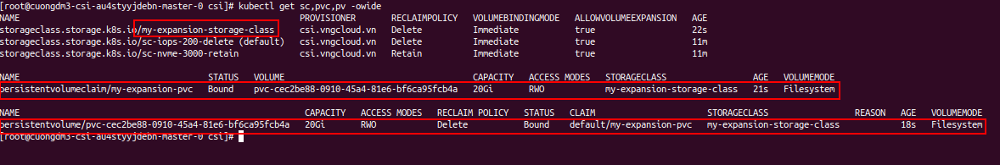

- Check the `nginx` is running:

  ```bash
  kubectl get pod -owide
  ```

  > 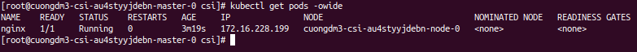

- Exec into the `nginx` pod:

  ```bash
  kubectl exec -it nginx -- bash

  # inside the pod `nginx`
  lsblk
  ```

  > 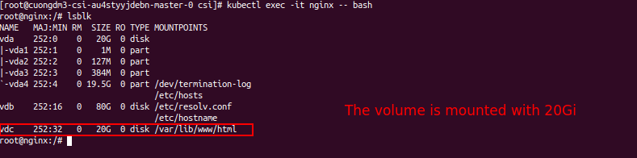

- Get detail of the `PersistentVolumeClaim` `my-expansion-pvc` to verify the storage size if `20Gi`:

  ```bash
  kubectl get pvc my-expansion-pvc -o yaml
  ```

  > 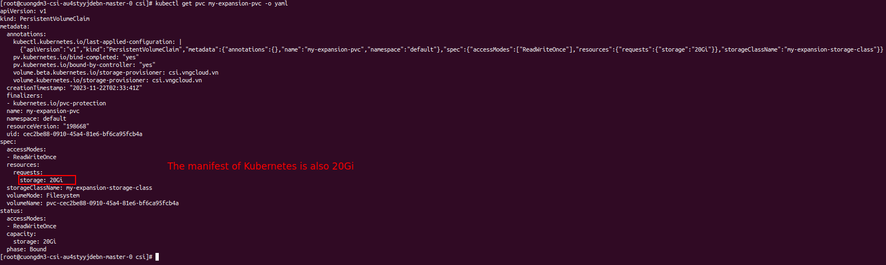

- Run the below command to expland `PersistentVolumeClaim` from $\text{20Gi}$ to $\text{30Gi}$.

  ```bash
  kubectl patch pvc my-expansion-pvc -p '{"spec":{"resources":{"requests":{"storage":"30Gi"}}}}'
  kubectl get pvc my-expansion-pvc -o yaml
  ```

  > 

- Exec into the `nginx` pod to confirm the size is truly expanded:

  ```bash
  kubectl exec -it pod/nginx -- bash

  # inside the pod `nginx`
  lsnlk
  ```

  > 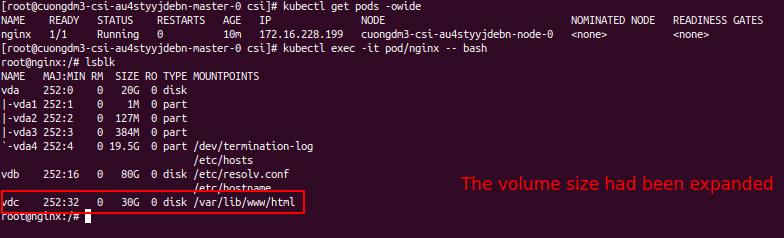

- The volume is also synchronized to the portal:
  > 

## 5.2. Resize when the volume is NOT mounted to any pod *(aka Offline Expansion)*

- Apply the below manifest to prepare the nesscessary resources.

  ```yaml
  apiVersion: storage.k8s.io/v1
  kind: StorageClass
  metadata:
    name: my-expansion-storage-class-2 # [1] The StorageClass name, CAN be changed
  provisioner: csi.vngcloud.vn # The VNG-CLOUD CSI driver name
  parameters:
    type: <PUT_YOUR_VOLUME_TYPE_ID> # Change it to your volume type UUID or name
  allowVolumeExpansion: true # MUST set this value to turn on volume expansion feature

  ---
  apiVersion: v1
  kind: PersistentVolumeClaim
  metadata:
    name: my-expansion-pvc-2 # [2] The PVC name, CAN be changed
  spec:
    accessModes:
      - ReadWriteOnce
    resources:
      requests:
        storage: 20Gi # [3] The PVC size, CAN be changed, this value MUST be in the valid range of the proper volume type
    storageClassName: my-expansion-storage-class-2 # MUST be same with [1]
  ```

- File [`offline_resize.yaml`](./../manifest/resize/offline_resize.yaml):
  ```bash
  kubectl apply -f offline_resize.yaml
  ```
  > 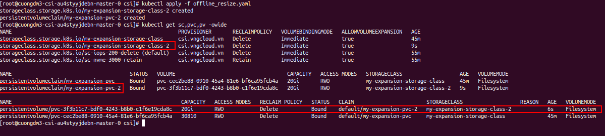

- Verify the volume size is $\text{20Gi}$:

  ```bash
  kubectl get pvc my-expansion-pvc-2 -o yaml
  ```

  > 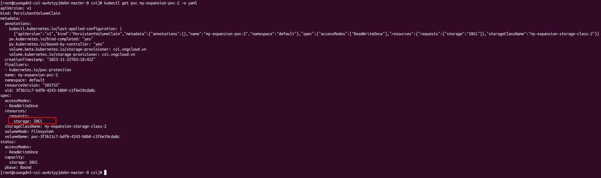

- Resize the volume to $\text{40Gi}$ and re-check the volume size:
  ```bash
  kubectl patch pvc my-expansion-pvc-2 -p '{"spec":{"resources":{"requests":{"storage":"40Gi"}}}}'
  kubectl get pvc my-expansion-pvc-2 -oyaml
  ```
  > 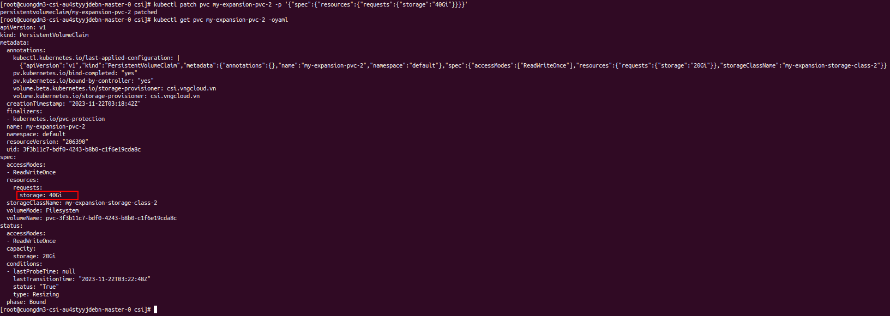

- Deploy pod `nginx-2` using the `PersistentVolumeClaim` `my-expansion-pvc-2` to check volume size inside the pod.
- File [`pod_use_offline_resize.yaml`](./../manifest/resize/pod_use_offline_resize.yaml):
  ```yaml
  apiVersion: v1
  kind: Pod
  metadata:
    name: nginx-2  # [1] The Pod name, CAN be changed
  spec:
    containers:
    - image: nginx
      imagePullPolicy: IfNotPresent
      name: nginx-2  # [2] The container name, CAN be changed
      ports:
      - containerPort: 80
        protocol: TCP
      volumeMounts:
        - mountPath: /var/lib/www/html
          name: my-volume-name-2  # MUST be the same as [3]
    volumes:
    - name: my-volume-name-2  # [3] The volume name, CAN be changed
      persistentVolumeClaim:
        claimName: my-expansion-pvc-2  # MUST be the same as [2@offline_resize.yaml]
        readOnly: false
  ```
- Apply the above manifest:
  ```bash
  kubectl get pods -owide
  ```
  > 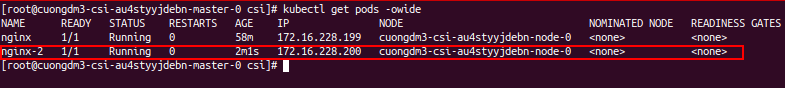

- Exec into the pod `nginx-2` to check the volume size:
  ```bash
  kubectl exec -it nginx-2 -- bash

  # inside the pod `nginx-2`
  lsblk
  ```
  > 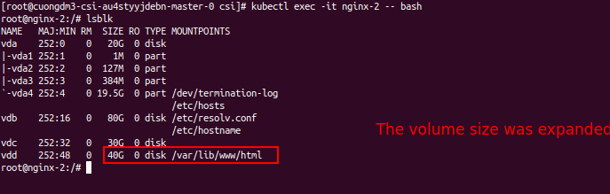

- The volume is also synchronized to the portal:
  > 