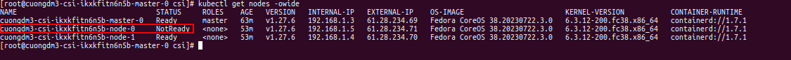
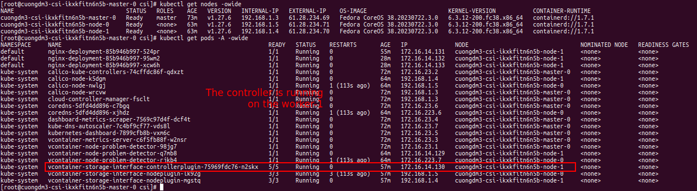
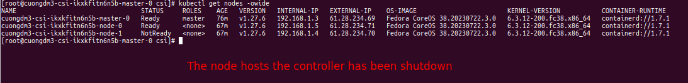
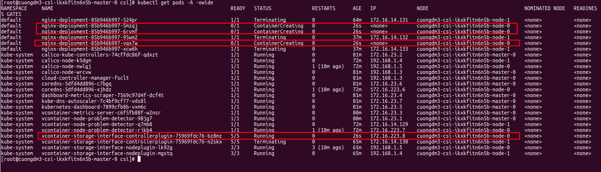

###### [↩ Back to `README`](./../README.md)

# 6. Demo availability
## 6.1. Shutdown node plugin
- Create a cluster with 2 workers and 1 master. And then applying the [`deployment-nginx.yaml`](./../manifest/ha/deployment-nginx.yaml) file to the cluster.
- File [`deployment-nginx.yaml`](./../manifest/ha/deployment-nginx.yaml):
  ```yaml
  apiVersion: storage.k8s.io/v1
  kind: StorageClass
  metadata:
    name: my-storage-class  # [1] The StorageClass name, CAN be changed
  provisioner: csi.vngcloud.vn  # The CSI driver name
  parameters:
    type: <PUT_YOUR_VOLUME_TYPE_ID>  # Change it to your volume type UUID or name

  ---
  apiVersion: v1
  kind: PersistentVolumeClaim
  metadata:
    name: my-pvc  # [2] The PVC name, CAN be changed
  spec:
    accessModes:
    - ReadWriteMany  # MUST set this value, currently only support RWO
    resources:
      requests:
        storage: 20Gi   # [3] The PVC size, CAN be changed, this value MUST be in the valid range of the proper volume type
    storageClassName: my-storage-class 
  ---

  apiVersion: apps/v1
  kind: Deployment
  metadata:
    name: nginx-deployment
    labels:
      app: nginx
  spec:
    replicas: 3
    selector:
      matchLabels:
        app: nginx
    template:
      metadata:
        labels:
          app: nginx
      spec:
        containers:
        - name: nginx
          image: nginx
          ports:
          - containerPort: 80
          volumeMounts:
            - mountPath: /var/lib/www/html  # The mount path in container, CAN be changed
              name: my-volume-name  # MUST be same value with [4]
        volumes:
        - name: my-volume-name  # [4] The volume mount name, CAN be changed
          persistentVolumeClaim:
            claimName: my-pvc  # MUST be same value with [2]
            readOnly: false
  ```

- After applying the above manifest, waiting for the pods to be running, then turn off one of the worker nodes. Until the one of them is in `NotReady` state, the pods of `nginx-deployment` will be rescheduled to the other worker nodes.
  > 

- After the pods are rescheduled, we can see that the data in the volume is still there.
  > 

## 6.2. Shutdown controller plugin
- Have a quick glance about the cluster before shutdown the controller plugin.
  > 

- Shutdown the `worker-1` node, and waiting for this node is in `NotReady` state.
  > 

- After a while, entire the resources from the `worker-1` were moved to the `worker-2` node.
  > 